## 相关资料

表单前端对接：[泛微在线文档](https://e-cloudstore.com/doc.html?appId=546e5534977941d1b01a3edaf15c4e34)

表单引擎对接文档：[e-cology.com.cn/sp/form/components/FormSwitch](https://www.e-cology.com.cn/sp/form/components/FormSwitch)

## ecode 开发

### 编写组件

示例：在门户显示组件

1.编写连个组件，一个父组件和一个子组件


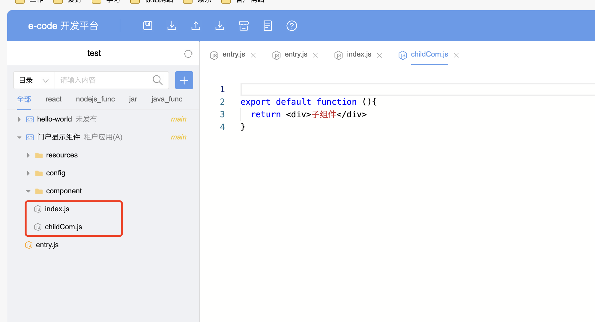


index.js

```javascript
import ChildCom from './childCom';
    
export default function(){
  return <div>
    父组件
    <ChildCom />
  </div>
}
```

childCom.js

```javascript
export default function (){
  return <div>子组件</div>
}
```

2.在 entry.js 里引入组件

在 entry.js 引入模块组件必需使用异步的方式

异步获取的组件必需放在 Suspense 元素中

```javascript
const MyCom = lazy(() => asyncImport('${appId}', 'component/index'));
```

entry.js

```javascript
import {render} from "react-dom";
import { useState, Suspense, lazy } from 'react';
import { asyncImport } from '@weapp/ecodesdk';
    
// 创建 App 挂载元素
const root = document.createElement('div');
document.body.appendChild(root);
    
// 样式处理，也可以新建 css 文件
const style = {
  position: 'absolute',
  zIndex: 9999,
  top: 100,
  left: '50%',
  transform: 'translate(-50%, 0)',
  fontSize: 60,
  fontWeight: 600,
  backgroundColor: 'rgba(255, 255, 255, 0.8)',
  boxShadow: '0 0 20px rgba(0, 0, 0, 0.5)'
};
    
const MyCom = lazy(() => asyncImport('${appId}', 'component/index'));
    
function App () {
  return (
    <Suspense fallback={<span>waiting</span>}>
      <div style={style}>
        <MyCom />
      </div>
    </Suspense>
    
  );
}
    
render(<App />, root);
```

效果：


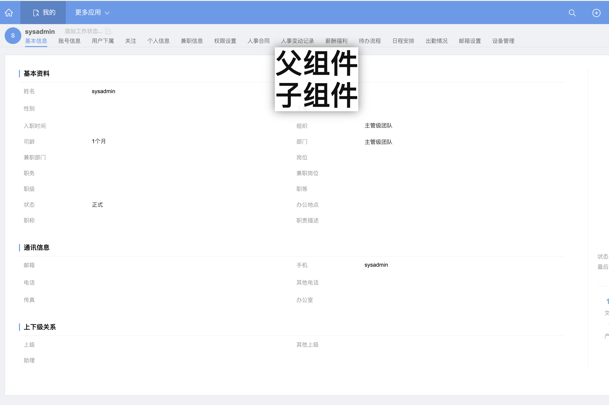


### 组件获取、导入导出

#### 在 entry.js 入口文件获取标准ui组件

比如我需要在标题中添加一个按钮，需要用 Button 组件，而入口文件是不能直接导入ui组件的，应该要怎么做

##### 方法：新建一个组件，在组件内使用UI组件

```javascript
import {Button } from '@weapp/ui';
    
function ExportButton (props) {
    return <Button {...props} type="primary">导出流程表单</Button>
}
    
export default ExportButton;
    
```

然后在入口文件导入新建的组件

```javascript
import {useState, Suspense, lazy} from 'react';
    
const ExportButton = lazy(() => asyncImport('${appId}',
    'components/exportButton'));
    
function Button() {
    let {buttonName} = config;
    if(!buttonName){
        buttonName = '导出流程表单';
    }
    
    return (
        <Suspense fallback={<span>waiting</span>}>
            <div>
                <ExportButton onClick={() => handleClick()}>导出流程表单</ExportButton>
            </div>
        </Suspense>
    
    );
}
```

这样就可以使用 UI 组件了

```javascript
/**
 * 添加顶部按钮
 */
regOvProps('weappUi', 'Title', (props) => {
    if (!location.href.includes('sp/workflow/report/customReportResult') || !currentPageEnable()) {
        return;
    }
    props.buttons.push(<Button/>)
    
}, 1);
```

##### 方法：在非入口文件导出UI组件

非入口文件导出组件，可通过window.uiComs获取到导出的组件

```javascript
import {Button,Dialog } from '@weapp/ui';
    
const coms = {
    Button,
    Dialog
}
    
window.uiComs = coms;
    
export  default coms;
    
```

要让导出组件生效，需要在另一个非入口文件中进行引入

```javascript
import {Button } from '@weapp/ui';
import getComs from './getComs';
    
function ExportButton (props) {
    // 引入组件，使导出组件生效
    const coms = getComs;
    return <Button {...props} type="primary">导出流程表单</Button>
}
    
export default ExportButton;
```

在 entry.js 入口文件使用导出的UI组件

注意：确保先要让导出组件生效，比如 ExportButton 组件需要先执行

```javascript
async function showMessage(type, content, delay) {
    if (!window.uiComs) {
        console.error('无法找到 uiComs');
        return;
    }
    const {Dialog} = window.uiComs;
    const obj = Dialog.message({type, content, delay});
    return obj.destroy;
}
```

#### asyncImport 和  jsonp 导入的区别

asyncImport 是异步导入组件，而 jsonp.require 是导入前置文件(entry.js) 中的对象

### 获取配置文件

配置编写在 /config/config.js 文件内，例如配置文件有以下内容：

```javascript
const config = {
  width:'30%'
}
    
export default config;
```

需要使用`export`导出配置文件

获取配置文件：

使用`import`导入配置文件，注意 from 后面的路径，是相对于当前文件的路径，当前文件路径是根目录，所以使用 ./ ,./ 表示当前路径。

```
import config from './config/config'
// 使用配置文件
config.width;
```

### 组件参数复写

示例：将编辑按钮的文字改为红色


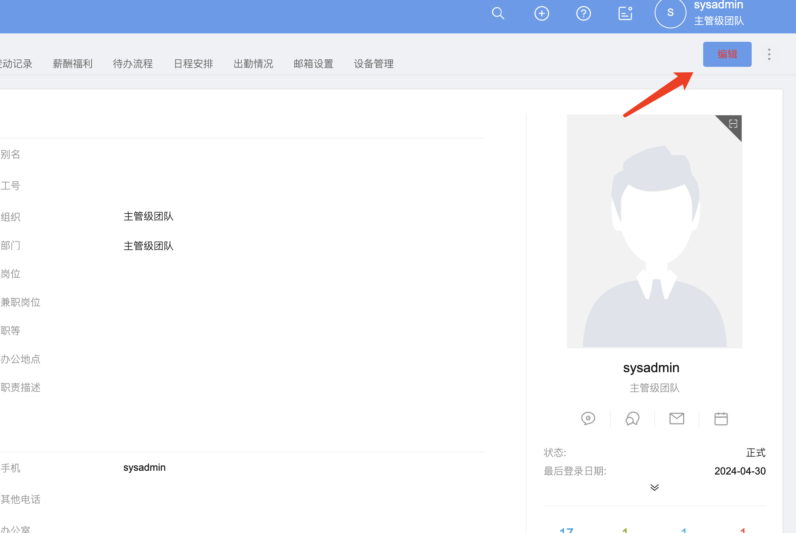


entry.js

```javascript
import { regOvProps } from '@weapp/utils';
    
regOvProps('weappUi','Button',(props)=>{
  if(props.weId.endsWith('_tm0row')){
    
    props.style={
      ...props.style,
      color:'red'
    }
  }
  return props;
},1)
```

### 组件替换

示例：在门户添加一个菜单


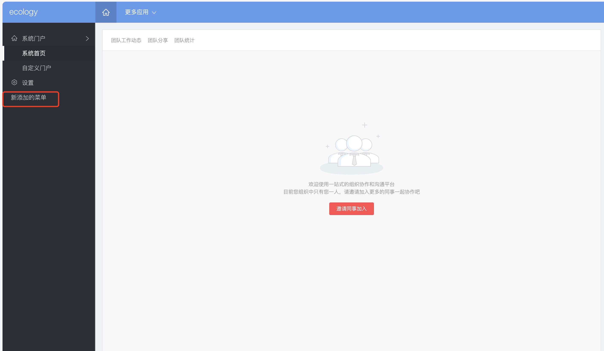


entry.js 文件：

```javascript
import React from 'react';
import { regOvComponent } from '@weapp/utils';
import { asyncImport } from '@weapp/ecodesdk';
    
const NewButton = React.lazy(() => asyncImport('${appId}', 'newMenu'));
    
regOvComponent('weappUi', 'Menu', (Com) => {
  return React.forwardRef((props, ref) => {
    // 需要根据 weId 去判断是否是要替换的组件，根据 noOverwrite 判断是否可重写，否则会无限循环造成卡死
    if (props.weId.endsWith('_39u13z')  && !props.noOverwrite) {
      return (
        <React.Suspense fallback={() => { }}>
          <NewButton ref={ref} {...props} OriginCom={Com} />
        </React.Suspense>
      )
    }
    // 如果不是要替换的组件需要返回原组件
    return <React.Suspense fallback={() => { }}>
          <Com ref={ref} {...props} />
        </React.Suspense>;
    });
}, 1)
```

newMenu.js

```javascript
    
import { Menu } from '@weapp/ui';
    
const newMenu =(props,ref)=>{
  const { OriginCom } = props;
  // 添加新菜单
  const data = props.data;
  data.push({ id: 'custom-tab', content: '新添加的菜单' })
    
  // 可以使用别的组件，也可以用 <OriginCom /> 使用原组件
  return(
    <Menu {...props} data={data} noOverwrite={true} ref={ref}/>
  )
}
    
export default newMenu;
    
```


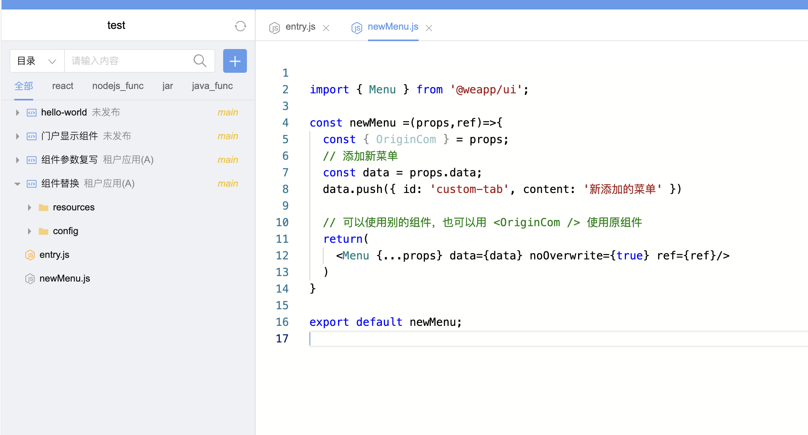


#### 注意事项

在使用ecode复写组件时，如果需要限定复写某个组件时，区分weId时，请不要使用全路径匹配，weId是多级父子组件的weId拼接而成，不同场景，不同页面weId可能不一样。

正确做法是取weId最后一段以下划线结尾的字符串作为该组件的唯一标识符。

示例：

table组件weId值：`f56o40_9d1m87_ktrfwy_su9cgs_8d2ywu_i83sct`

正确判断方法：

```javascript
regOvProps('weappUi',    'Table',    (props)    =>    {
        const    {weId=''}    =    props;
        if(weId    &&    weId.endsWith("_i83sct")){
                //逻辑处理
        }
        return    props;
},    0);
```

错误判断方法：

```javascript
regOvProps('weappUi',    'Table',    (props)    =>    {
        const    {weId=''}    =    props;
        if(weId==='f56o40_9d1m87_ktrfwy_su9cgs_8d2ywu_i83sct'){
                //逻辑处理
        }
        return    props;
},    0);
```

### 接口拦截

#### 使用 axios 进行拦截

有标准的拦截接口，如无必要不要使用 axios 拦截

##### 请求拦截

```javascript
// 前置拦截，获取请求数据
axios.interceptors.request.use(
  config =>{
    // config 包含所有请求信息
    const {url,params} = config;
    if(url.includes('api/hrm/employee/getTopMenu')){
      // 添加参数
      params.isTest = 1;
    }
    return config;
  },
  error =>{
    // 对请求错误做些什么
    return Promise.reject(error);
  }
)
```

##### 响应拦截

```javascript
// 后置拦截，获取接口返回数据
axios.interceptors.response.use(
  response =>{
    // response 里包含了响应信息，以及 config，使用 config 可以获取请求信息，data可以获取响应数据
    const {data,config:{url,params}} = response;
    if(url.includes('api/hrm/employee/getTopMenu')){
      // 能够获取到上面请求拦截中添加的参数
     const {isTest} = params;
      // 修改返回数据，添加一个按钮
      if(data.data){
        data.data.push({
          content:'新增按钮',
          id:'devBt'
        });
      }
    }
    return response;
  },
  error =>{
    // 对请求错误做些什么
    return Promise.reject(error);
  }
)
```

##### 效果

添加了一个页签


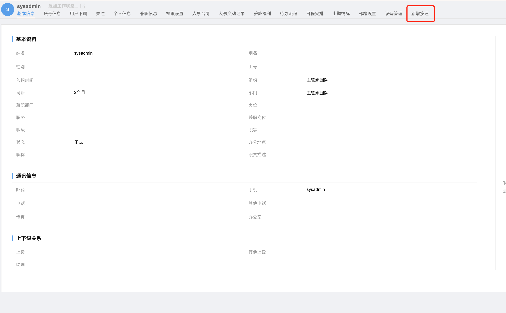


##### 注意事项

如果拦截有写 error 函数，则需要返回 Promise.reject(error)

### 公告插件

#### 创建公共插件

公共插件组件 index.js：

```javascript
import { Button,List} from '@weapp/ui';
const data=[
  {
    title:'内容1',
    id:1
  },
  {
    title:'内容2',
    id:2
  },
  {
    title:'内容3',
    id:3
  }
]
    
const MyPublicCom =()=>{
  return(
    <div>
      <div>
        <Button type={'primary'}>提交</Button>
      </div>
      <List
          sortable={true}
          direction="column"
          data={data}
          bordered={true}
          isStopMouseDown={true}
        />
    </div>
  )
}
    
export default MyPublicCom;
```

entry.js文件，导入上面的组件，并导出组件

在导出组件前要将组件放到 React.Suspense 内，因为组件是通过懒加载获取的

```javascript
import { asyncImport } from '@weapp/ecodesdk';
    
const MyPublicCom = React.lazy(() => asyncImport('${appId}', 'index'));
    
function LazyMyPublicCom (props) {
  return (
    <React.Suspense fallback={() => {}}>
      <MyPublicCom {...props} />
    </React.Suspense>
  );
}
    
export {LazyMyPublicCom as MyPublicCom}
```

#### 引入公共插件

##### 方式一：使用 @weapp/ecodesdk.asyncImport 导入

在另外一个应用内，建立一个新页面，在页面内引入公共插件

使用 asyncImport 引入公共插件，asyncImport 可以引入其它模块非入口文件的组件，需要在 asyncImport 函数的第二个参数输入组件的文件路径

引入公共插件后需要将组件放入到 React.Suspense 元素内

```javascript
import React from 'react';
import { Route } from 'react-router-dom';
import { regOvProps, appInfo, regReactChildren } from '@weapp/utils';
import { asyncImport, jsonp } from '@weapp/ecodesdk';
    
// 懒加载获取 index.js 里的组件，1002205076591648770 为应用id，index 为组件相对应用的路径
const MyPublicCom = React.lazy(() => asyncImport('1002205076591648770', 'index'));
    
const { publicUrl } = appInfo('@weapp/ecodesdk');
    
const newPage = (
  // publicUrl可能为空，前缀必需包含 /sp/custom/
  <Route path={`${publicUrl}/sp/custom/` + '${appId}/public-component-demo'}>
    <React.Suspense fallback= {() => { }}>
      <MyPublicCom />
    </React.Suspense>
  </Route>
);
    
// 注册路由
regOvProps('weappEcodesdk', 'Switch', (props) => {
  regReactChildren(props, newPage);
  return props;
}, 0);
```

##### 方式二：使用@weapp/ecodesdk 的 jsonp.require 方法引用

使用 jsonp.require 方法引用时，只能引用入口文件导出的组件，所以在公共插件应用内必需在入口文件内导出组件。引用的组件不需要放入 React.Suspense 元素内，直接使用即可

```javascript
import { jsonp } from '@weapp/ecodesdk';
import { regOvProps, appInfo, regReactChildren } from '@weapp/utils';
import { Route } from 'react-router-dom';
    
const { publicUrl } = appInfo('@weapp/ecodesdk');
    
// 导入公共插件，只能从入口文件导入
const {MyPublicCom} = jsonp.require('1002205076591648770','entry.js');
const newPage = (
  // publicUrl可能为空，前缀必需包含 /sp/custom/
  <Route path={`${publicUrl}/sp/custom/` + '${appId}/public-component-demo'}>
    <MyPublicCom />
  </Route>
);
    
// 注册路由
regOvProps('weappEcodesdk', 'Switch', (props) => {
  regReactChildren(props, newPage);
  return props;
}, 0);
```

### 新页面开发

entry.js 文件

```javascript
import React from 'react';
import { Route } from 'react-router-dom';
import { regOvProps, appInfo, regReactChildren } from '@weapp/utils';
import { asyncImport, jsonp } from '@weapp/ecodesdk';
    
const NewPage = React.lazy(() => asyncImport('${appId}', 'newPage'));
    
const { publicUrl } = appInfo('@weapp/ecodesdk');
    
const newPage = (
  // publicUrl可能为空，前缀必需包含 /sp/custom/
  <Route path={`${publicUrl}/sp/custom/` + '${appId}/newPage'}>
    <React.Suspense fallback= {() => { }}>
      <NewPage />
    </React.Suspense>
  </Route>
);
    
// 注册路由
regOvProps('weappEcodesdk', 'Switch', (props) => {
  regReactChildren(props, newPage);
  return props;
}, 0);
```

newPage.js 文件

```javascript
const NewPage = ()=>{
  return <div>新页面</div>
}
    
export default NewPage;
```


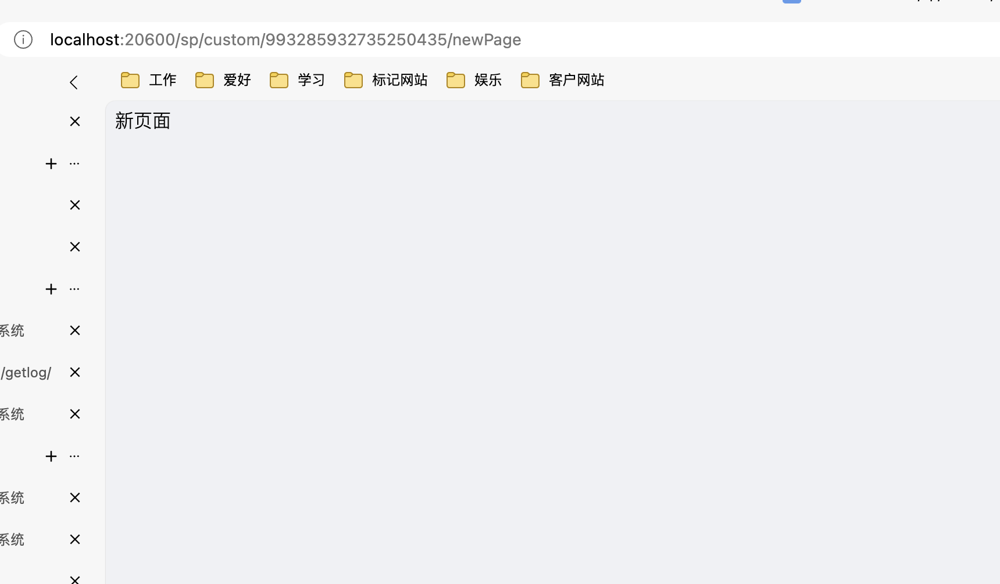


## E-builder 开发

### 重写ebuilder组件

1.需要获取页面ID，页面id在链接中可以找到


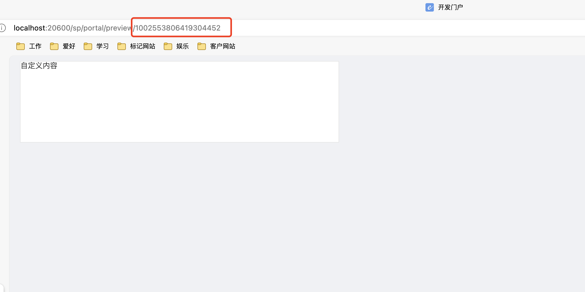


2.获取要重写的ebuilder组件id


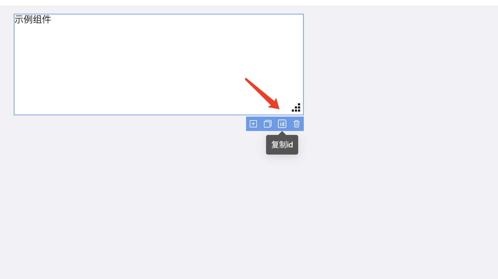


3.获取 weappEBpage 库的 PageView 组件参数，PageView 组件就是 ebuilder 页面里的容器组件，在里面做一个定时器，直到找到我们要的组件为止

```javascript
import { asyncImport, jsonp } from '@weapp/ecodesdk';
import { regOvProps } from '@weapp/utils';
import ReactDOM from 'react-dom';
    
const CustomConentLazy = React.lazy(()=> asyncImport('${appId}','CustomContent'));
const CustomConent = <React.Suspense fallback={() => {}}>
    <CustomConentLazy />
  </React.Suspense>
    
// 组件id
const comId = 'ed08ca238c59466fb7a4f6b0103ab77e';
// 页面id
const pageId = '1002553806419304452';
    
function renderCom(dom){
  ReactDOM.render(CustomConent ,dom);
}
    
regOvProps('weappEBpage','PageView',(props)=>{
  if(props.pageId === pageId){
    let time=0;
    const interval = setInterval(()=>{
      // 找到对应的ebuilder组件，comId为组件id
      const dom = document.querySelector(`#${comId}`);
      if('ebuilderSDK' in window && dom){
        clearInterval(interval);
        renderCom(dom);
      }
      if(time++ > 50){
        clearInterval(interval);
        console.warn('未找到对应的e-builder组件')
      }
    },100)
  }
})
```

4.找到组件的 dom 元素之后，将我们自己写的组件渲染到这个 dom 元素

### 自定义组件

#### 开发入口

在 eb 表单设计页面中，添加组件


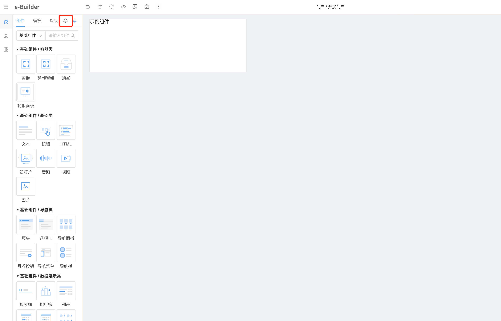


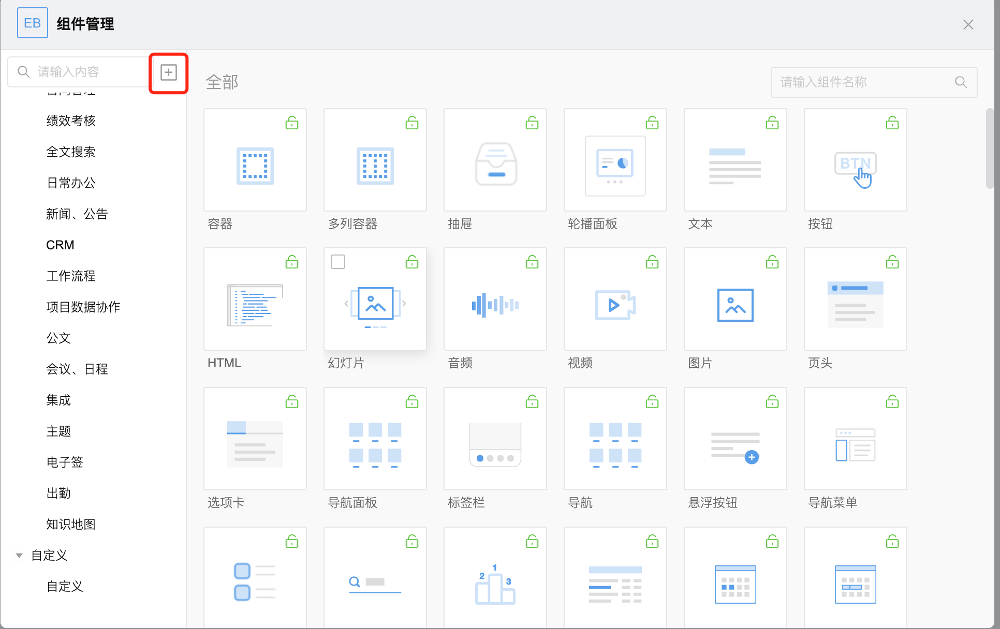


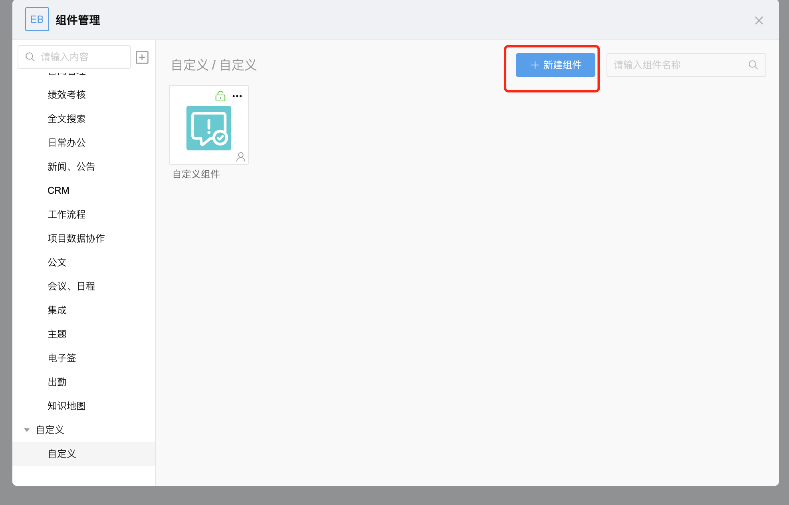


进入组件开发


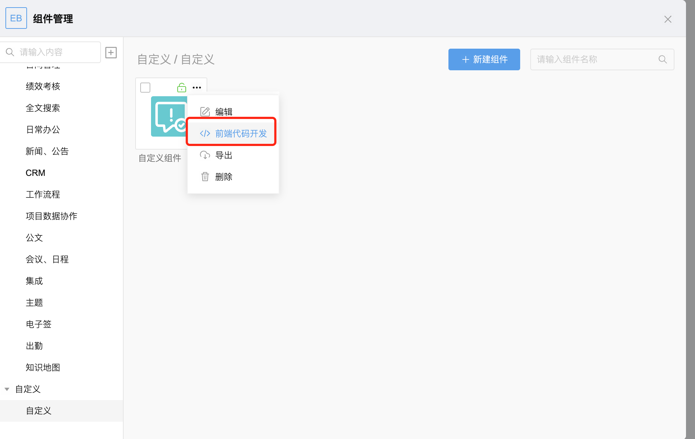


#### 文件结构

进入ecode后会初始化这几个组件：

- View.js ： 用来显示组件内容
- Config.js ：定义组件配置，可在表单设计中显示该组件的配置
- Disign.js ：在表单设计器中将该组件拖拽到表单后，显示的组件内容

##### Config.js 组件配置文件

items 是组件的配置项，这些配置会显示在表单设计器中的组件参数中

属性说明：

-  label ：配置项名称
- itemType ：配置项组件类型，可通过此文档查看可用的组件类型，[Form 表单](https://www.e-cology.com.cn/ui/form) （位置：FormItemProps 说明），可用类型有：
	| 'RATE' | 'UPLOAD' | 'SWITCH' | 'COLORPICKER' | 'SCOPE' | 'BROWSER' | 'CUSTOM' | 'DESCRIPTION' | 'TYPESBROWSER'
	
	| 'DATETIMEPICKER' | 'DATEQUICKFILTER' | 'LOCALE' | 'RICHTEXT' | 'PASSWORD' | 'SLIDER' | 'SIGNATURE' | 'ICONSELECTION' | 'BROWSERWINDOW'
	
	| 'MONTHDAYPICKER' | 'RANGE' | 'FILTERBUTTONS' | 'CASCADER' | 'SHAREBROWSER' | 'RICHICONSELECTION' | 'PLUGIN'
- helpTip : 提示内容，可在表单设计器中的组件参数配置中显示问号，问号的内容会显示 helpTip 的内容

```javascript
const Config = (data, store) => {
  return Promise.resolve({
    items: {
      detailKey: {
        label: '数据来源明细key ',
        itemType: 'INPUT',
      },
      idFieldName: {
        label: '唯一标识字段名',
        itemType: 'INPUT',
        helpTip:'请填入数据库字段名'
      },
      parentIdFieldName: {
        label: '上级标识字段名',
        itemType: 'INPUT',
        helpTip:'请填入数据库字段名'
      },
      sumFieldNames:{
        label: '合计字段名',
        itemType: 'INPUT',
        helpTip:'合计下级的字段值到上级字段，请填入数据库字段名，多个使用英文逗号分隔'
      },
      dataLinkageFileName:{
        label: '明细表数据字段联动字段名',
        itemType: 'INPUT',
        helpTip:'选填，填主表字段名，比如有一个主表字段为浏览框，选择后带出明细数据，在执行该字段联动后将会更新明细树数据'
      }
      
    },
    formatFormDatas: (_data) => {
      return {
        ..._data,
      }
    }
  });
};
    
export default Config;
```

效果：


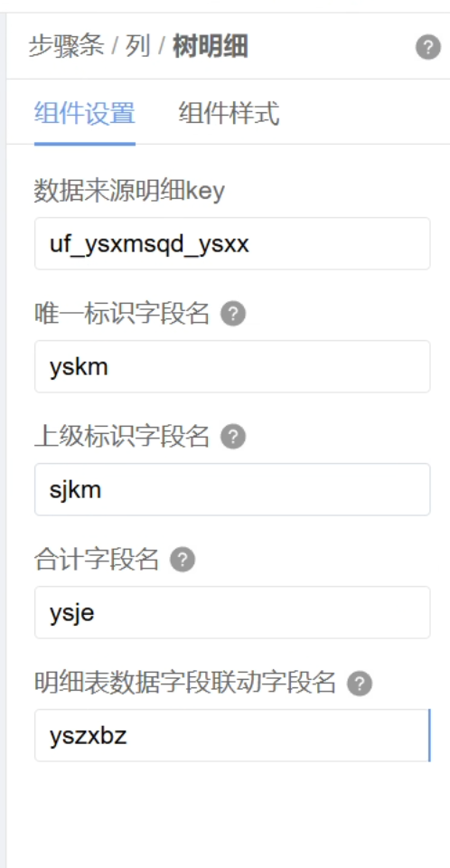


可在 View.js 中使用配置

```javascript
export default function View(props) {
  // 获取配置
  const { config } = props;
  const { detailKey, idFieldName, parentIdFieldName, sumFieldNames,dataLinkageFileName } = config;
  
  // ... 组件内容
}
```

#### 示例

在 View.js 中导入了一个组件

```javascript
import React from 'react';
import {asyncImport} from '@weapp/ecodesdk';
    
const Table = React.lazy(() => asyncImport('${appId}','components/Table'))
    
const View = (props) => {
  const { config } = props;
    
  return (
    <div className="cusStyleCls">
      <React.Suspense fallback={()=>{}}>
        <Table />
      </React.Suspense>
    </div>
  );
};
    
export default View
```

这里我定义了一个组件，作为组件的现实内容，在 View.js 中使用


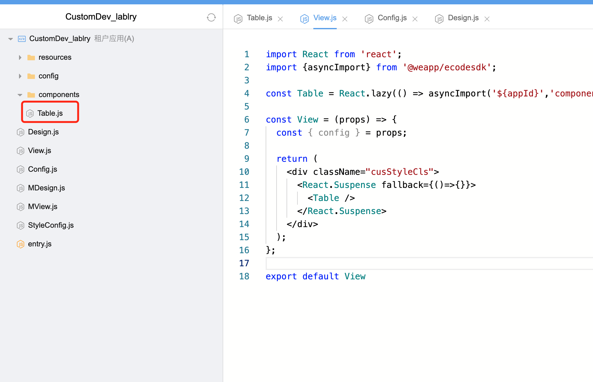


效果：


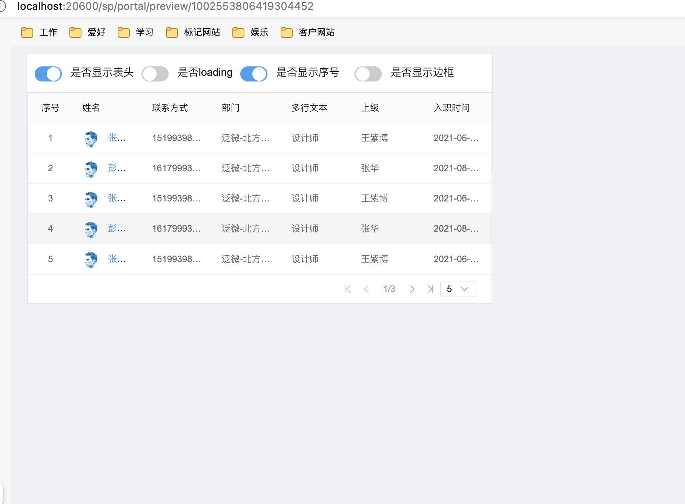


## 流程

### 流程表单开发

#### 新建流程保存后触发

表单js-SDK 的表单加载完成后回调事件和流程 js-SDK 的 Ready 加载事件都不会在流程新建保存后触发，如果是用 ecode 开发，需要使用`regHook`，配合`Ready`可实现只要表单载入时就触发，包括表单二次加载（比如保存时）。

参考：[流程详情-JSSDK文档](https://weapp.eteams.cn/ecode/playground/doc/share/view/988383343450701824#1.4%20eCode%E5%B9%B3%E5%8F%B0%E5%86%85%E5%BC%80%E5%8F%91%E6%A0%B7%E4%BE%8B)见1.4

```javascript
// 表单载入时触发
const wffpSdk = window.weappWorkflow.getFlowPageSDK();
wffpSdk.ready(()=>{
  onFormLoadedAction();
});
    
// 注册表单载入时触发
regHook('weappWorkflow', 'FPMainTabWillMount', onFormLoadedAction);
    
function onFormLoadedAction(params) {
  console.log('执行 onFormLoadedAction')
  const wffpSdk = window.weappWorkflow.getFlowPageSDK();
  
  // 如果需要立即获取到 formSdk，则需要添加 ready
  wffpSdk.ready(() => {
    const formSdk = window.WeFormSDK.getWeFormInstance();
    
    }
  });
}
```

#### 字段自定义渲染

可自定义字段的显示内容，使用表单 SDK 的`proxyFieldComp`实现，示例：

参数1: 字段id

`createElement`的第三个参数可传入 React 组件，为字段的显示内容

```
formSdk.proxyFieldComp(`${budgetInfoFieldMark}_${rowId}`, React.createElement('div', { budgetInfoFieldMark },
    <BudgetInfo totalBudget={totalBudget}
      availableBudget={availableBudget}
      usedCost={usedCost}
      approvalBudget={approvalBudget} />));
```

#### 明细表加载完后触发

这个没有标准接口支持，可以在表单载入时创建一个定时器，反复判断明细表是否有数据，可通过`formSdk.getDetailAllRowIndexStr(detailMark)`来判断明细表是否有数据，下面是一个示例，当明细表加载完成之后执行回调函数

```javascript
function onDetailReady(detailKey, callback) {
  const maxTime = 10000;
  const timeout = 100;
  let count = 0;
  const formSdk = window.WeFormSDK.getWeFormInstance();
    
  const interval = setInterval(() => {
    count++;
    const detailMark = formSdk.convertFieldNameToId(detailKey);
    const rowIdStr = formSdk.getDetailAllRowIndexStr(detailMark);
    if (rowIdStr) {
      callback(rowIdStr);
      clearInterval(interval);
    }
    if (count * timeout > maxTime) {
      console.warn('等待明细加载超时');
      clearInterval(interval);
    }
    
  }, timeout);
    
}
    
```

#### 加载 ecode

在流程高级设置里可以添加 ecode ,这里说的是另一种方法，可以在代码块里加载任意 ecode 应用

e10没有像e9那样可以使用 ecodeSDK.load() 加载 ecode ，不过流程表单代码块也是支持js模块化的，可以导入ecode的组件

可以在ecode中创建一个类，类中写代码逻辑，然后在流程中导入这个类去执行

示例：

在ecode中创建一个类，index.js

```
class DetailHrColControl {
    // 类中写代码逻辑
}
export default DetailHrColControl;
```

在流程中引入类：

```javascript
import { asyncImport,jsonp } from '@weapp/ecodesdk';
// 第一个参数是应用id，第二个参数是ecode中的组件所在文件名称
asyncImport('1149493253298642947','index').then(esmodule =>{
    // 相当于：new DetailHrColControl()
  const obj = new esmodule.default();
  // 执行代码
  obj.doSomeThing();
});
```

### 获取流程节点id

1. 在前端中新建流程
2. 打开浏览器中的开发者工具，并在工具中切换到网络标签页
3. 在流程中切换到流程图标签页
4. 在开发者工具中找到名称为 getXml 接口，选中该接口在右侧中点击预览标签页，查看该接口的返回信息
5. 在返回信息中找到 data -> chartFlowInfo -> normalChartInfoEntity -> nodeInfo
6. 在 nodeInfo 中包含了各节点的信息，里面的 nodeId 就是节点id


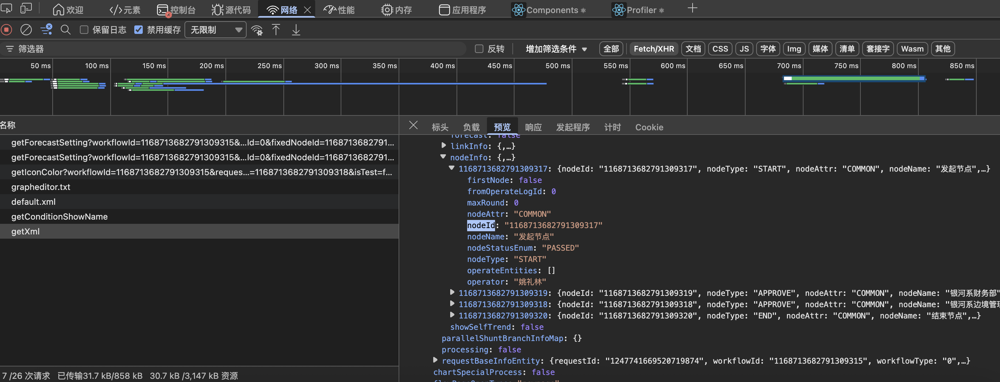


### 流程详情二开口子

[流程详情-组件复写-二开口子](https://weapp.eteams.cn/ecode/playground/doc/share/view/981360079733604353#2.2%E3%80%81%E6%89%93%E5%BC%80%E6%B5%81%E7%A8%8B%E8%AF%A6%E6%83%85%E6%9F%A5%E7%9C%8B/%E5%AE%A1%E6%89%B9%E9%A1%B5%E9%9D%A2%EF%BC%8C%E5%B9%B6%E6%94%AF%E6%8C%81%E6%8F%90%E4%BA%A4%E5%90%8E%E5%88%B7%E6%96%B0)

## 组件使用

### Radio

如果要创建一组单选框，则需要在Radio组件添加 data 参数

data 参数格式如下：

```javascript
const options = [
  {
    id: 'Apple',
    title: 'Apple',
    content: 'Apple',
    color: '#5D9CEC'
  },
  {
    id: 'Pear',
    title: 'Pear',
    content: 'Pear',
    color: '#FF4D4F'
  },
  {
    id: 'Orange',
    title: 'Orange',
    content: 'Orange',
    disabled: true,
    color: '#52C41A'
  },
];
```

如果 Radio 单独使用，则每个选择框都是独立的，不能实现单选

```
<Radio readOnly
          onChange={this.onChange}
          onClick={this.onClick}
          onFocus={this.onFocus}
          onBlur={this.onBlur}
        >只读</Radio>
        <Radio readOnly
          value={true}
          onChange={this.onChange}
          onClick={this.onClick}
          onFocus={this.onFocus}
          onBlur={this.onBlur}
        >只读2</Radio>
```

#### 示例

在签字意见上方添加单选框

```javascript
import { RichText, Radio } from '@weapp/ui';
import config from './config/config';
    
    
function getOptions(){
  // 从配置中获取选项
  const configList = config.workflowRemarkOptionConfig
  const weFormSdk = window.WeFormSDK.getWeFormInstance();
  const formInfo = weFormSdk.getBaseInfo();
  const optionConfig = configList.find(i => i.formId === formInfo.formId);
  if(optionConfig){
    const optionTexts = optionConfig.options;
    let id = 1;
    return optionTexts.map(i =>{ return {id:id++,title:i,content:i} });
  }
  return [];
}
    
/**
 * 在签字意见顶部添加单选框
 */
const NewRichText = (props, ref) => {
  const { OriginCom } = props;
    
  const onChange = (v, o, e) => {
    if(v){
      // 修改签字意见
      weappWorkflow.getFlowPageSDK().changeRemark(o.content);
    }
  }
    
  return (
    <div>
      <div style={{padding:10,display:'flex',alignItems:'center'}}>
        <span>签字意见</span> 
        <div style={{marginLeft:30}}>
          <Radio data={getOptions()} onChange={onChange} />
        </div>
      </div>
      <RichText {...props} noOverwrite={true} ref={ref} />
    </div>
  )
}
    
export default NewRichText;
```

## 案例

### 流程签字意见放到右边

[ecode-流程签字意见放到右边](ecode-流程签字意见放到右边.md)

## 问题汇总

### entry.js 文件里不能导入模块组件问题

#### 问题现象

无法获取到模块组件


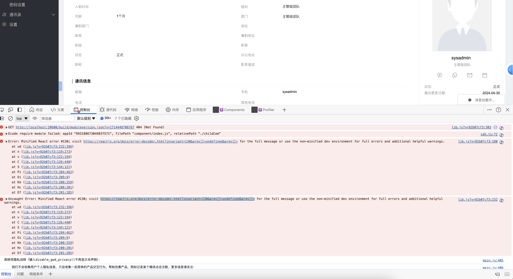


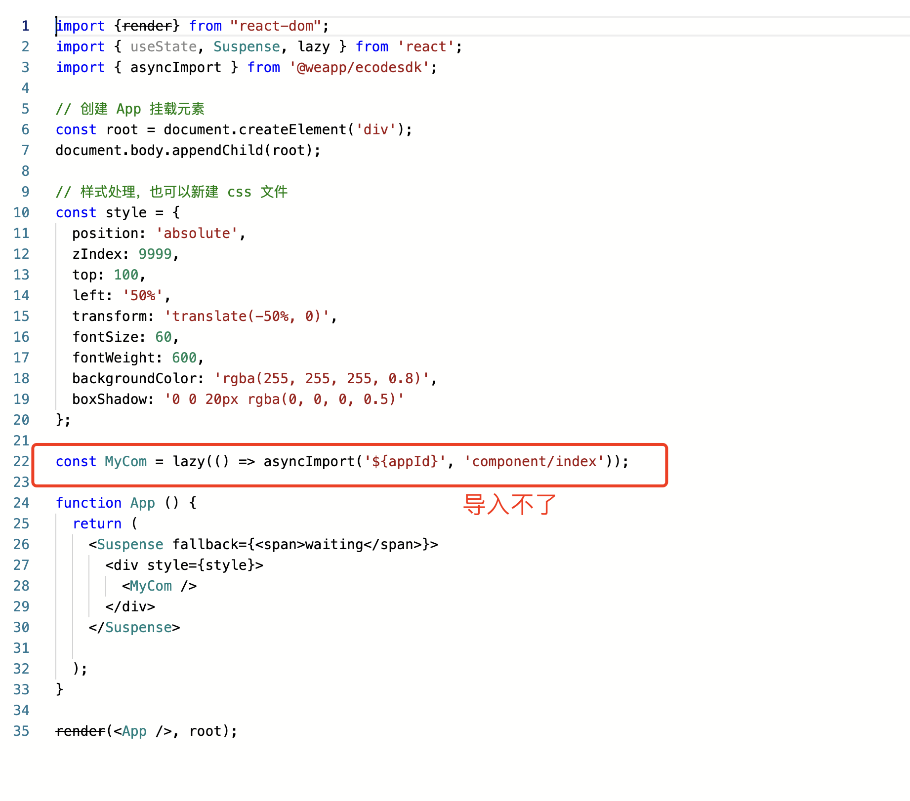


#### 解决方法

再新建一个项目，在里面重写旧项目的代码，发布