## 相关资料

表单前端对接：[泛微在线文档](https://e-cloudstore.com/doc.html?appId=546e5534977941d1b01a3edaf15c4e34)

表单引擎对接文档：[e-cology.com.cn/sp/form/components/FormSwitch](https://www.e-cology.com.cn/sp/form/components/FormSwitch)

## ecode 开发

### E-Code 平台介绍

E-code 平台的功能和 E9 的 E-Code 平台差不多，它是一个在线的前端代码编辑器，可编写 React 组件以及注册事件，可实现修改标准页面的组件和数据，以及创建自定义页面、进行接口拦截等。

E-Code 页面进入链接： `/ecode`

进入页面后是一个项目列表，你可以在这里创建项目


进入项目后就可以在此页面创建 E-Code 应用，发布该应用后就可以让该应用生效。

**应用ID**：
右键点击 E-Code 应用，选择 `属性` 可查看应用信息，其中应用ID分为 `appId` 和 `appUUID` , 需要注意 `appId` 是可变的，导入到其它 E10 系统后 ID 可能会变，而 `appUUID` 是不变的，所以在代码中需要使用应用 ID 时，尽量使用 `appUUID`。

### 编写组件

示例：在门户显示组件

1.编写连个组件，一个父组件和一个子组件


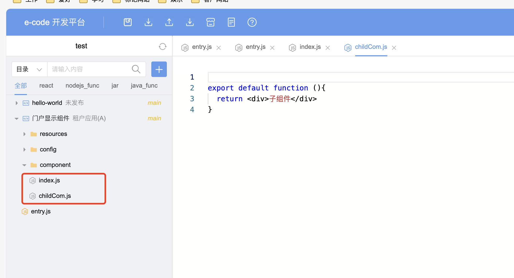


index.js

```javascript
import ChildCom from './childCom';
    
export default function(){
  return <div>
    父组件
    <ChildCom />
  </div>
}
```

childCom.js

```javascript
export default function (){
  return <div>子组件</div>
}
```

2.在 entry.js 里引入组件

在 entry.js 引入模块组件必需使用异步的方式

异步获取的组件必需放在 Suspense 元素中

```javascript
const MyCom = lazy(() => asyncImport('${appId}', 'component/index'));
```

entry.js

```javascript
import {render} from "react-dom";
import { useState, Suspense, lazy } from 'react';
import { asyncImport } from '@weapp/ecodesdk';
    
// 创建 App 挂载元素
const root = document.createElement('div');
document.body.appendChild(root);
    
// 样式处理，也可以新建 css 文件
const style = {
  position: 'absolute',
  zIndex: 9999,
  top: 100,
  left: '50%',
  transform: 'translate(-50%, 0)',
  fontSize: 60,
  fontWeight: 600,
  backgroundColor: 'rgba(255, 255, 255, 0.8)',
  boxShadow: '0 0 20px rgba(0, 0, 0, 0.5)'
};
    
const MyCom = lazy(() => asyncImport('${appId}', 'component/index'));
    
function App () {
  return (
    <Suspense fallback={<span>waiting</span>}>
      <div style={style}>
        <MyCom />
      </div>
    </Suspense>
    
  );
}
    
render(<App />, root);
```

效果：


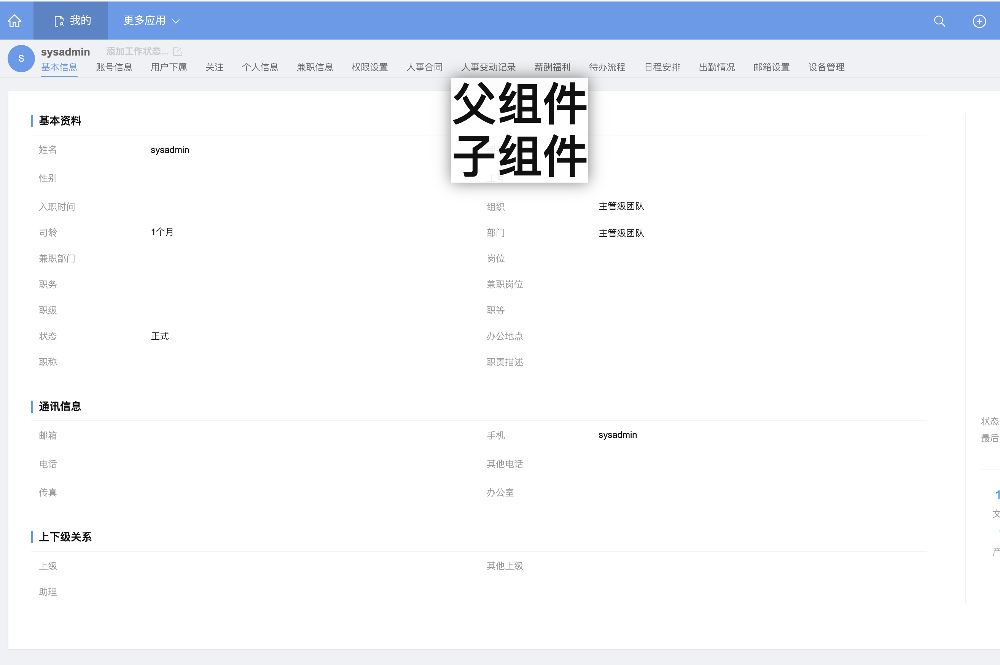


### 组件获取、导入导出

#### 在 entry.js 入口文件获取导出的组件

使用 `lazy` 和 `asyncImport` 异步获取组件

下面是导入在 `component/index` 文件下的 MyCom 组件示例

```javascript
import { useState, Suspense, lazy } from 'react';
import { asyncImport } from '@weapp/ecodesdk';

const MyCom = lazy(() => asyncImport('${appId}', 'component/index'));

function App () {
  // 必需使用 Suspense 包裹
  return (
    <Suspense fallback={<span>waiting</span>}>
      <div style={style}>
        <MyCom />
      </div>
    </Suspense>
    
  );
}
```


#### 在 entry.js 入口文件获取标准ui组件

比如我需要在标题中添加一个按钮，需要用 Button 组件，而入口文件是不能直接导入ui组件的，应该要怎么做

##### 方法：新建一个组件，在组件内使用UI组件

```javascript
import {Button } from '@weapp/ui';
    
function ExportButton (props) {
    return <Button {...props} type="primary">导出流程表单</Button>
}
    
export default ExportButton;
    
```

然后在入口文件导入新建的组件

```javascript
import {useState, Suspense, lazy} from 'react';
    
const ExportButton = lazy(() => asyncImport('${appId}',
    'components/exportButton'));
    
function Button() {
    let {buttonName} = config;
    if(!buttonName){
        buttonName = '导出流程表单';
    }
    
    return (
        <Suspense fallback={<span>waiting</span>}>
            <div>
                <ExportButton onClick={() => handleClick()}>导出流程表单</ExportButton>
            </div>
        </Suspense>
    
    );
}
```

这样就可以使用 UI 组件了

```javascript
/**
 * 添加顶部按钮
 */
regOvProps('weappUi', 'Title', (props) => {
    if (!location.href.includes('sp/workflow/report/customReportResult') || !currentPageEnable()) {
        return;
    }
    props.buttons.push(<Button/>)
    
}, 1);
```

##### 方法：在非入口文件导出UI组件

非入口文件导出组件，可通过window.uiComs获取到导出的组件

```javascript
import {Button,Dialog } from '@weapp/ui';
    
const coms = {
    Button,
    Dialog
}
    
window.uiComs = coms;
    
export  default coms;
    
```

要让导出组件生效，需要在另一个非入口文件中进行引入

```javascript
import {Button } from '@weapp/ui';
import getComs from './getComs';
    
function ExportButton (props) {
    // 引入组件，使导出组件生效
    const coms = getComs;
    return <Button {...props} type="primary">导出流程表单</Button>
}
    
export default ExportButton;
```

在 entry.js 入口文件使用导出的UI组件

注意：确保先要让导出组件生效，比如 ExportButton 组件需要先执行

```javascript
async function showMessage(type, content, delay) {
    if (!window.uiComs) {
        console.error('无法找到 uiComs');
        return;
    }
    const {Dialog} = window.uiComs;
    const obj = Dialog.message({type, content, delay});
    return obj.destroy;
}
```

#### asyncImport 和  jsonp 导入的区别

asyncImport 是异步导入组件，而 jsonp.require 是导入前置文件(entry.js) 中的对象

### 获取配置文件

配置编写在 /config/config.js 文件内，例如配置文件有以下内容：

```javascript
const config = {
  width:'30%'
}
    
export default config;
```

需要使用`export`导出配置文件

获取配置文件：

使用`import`导入配置文件，注意 from 后面的路径，是相对于当前文件的路径，当前文件路径是根目录，所以使用 ./ ,./ 表示当前路径。

```javascript
import config from './config/config'
// 使用配置文件
config.width;
```

### 组件参数复写

示例：将编辑按钮的文字改为红色


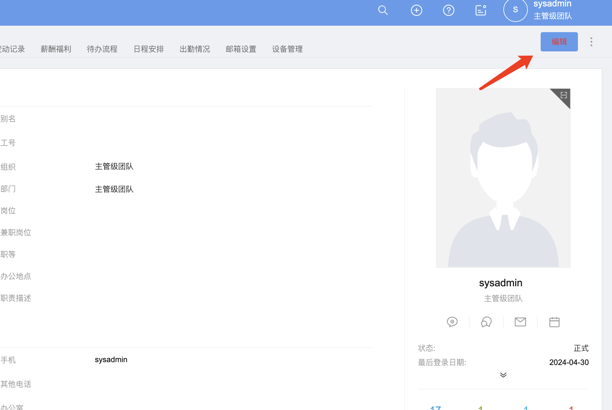


entry.js

```javascript
import { regOvProps } from '@weapp/utils';
    
regOvProps('weappUi','Button',(props)=>{
  if(props.weId.endsWith('_tm0row')){
    
    props.style={
      ...props.style,
      color:'red'
    }
  }
  return props;
},1)
```

### 组件替换

示例：在门户添加一个菜单


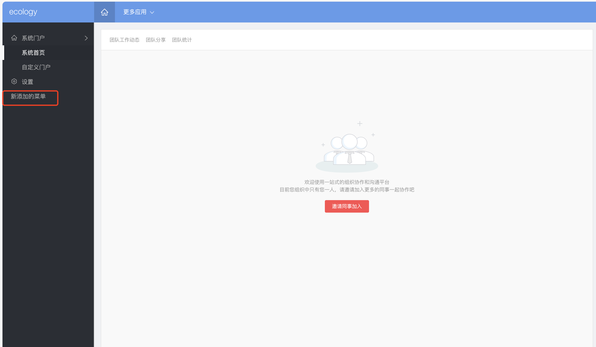


entry.js 文件：

```javascript
import React from 'react';
import { regOvComponent } from '@weapp/utils';
import { asyncImport } from '@weapp/ecodesdk';
    
const NewButton = React.lazy(() => asyncImport('${appId}', 'newMenu'));
    
regOvComponent('weappUi', 'Menu', (Com) => {
  return React.forwardRef((props, ref) => {
    // 需要根据 weId 去判断是否是要替换的组件，根据 noOverwrite 判断是否可重写，否则会无限循环造成卡死
    if (props.weId.endsWith('_39u13z')  && !props.noOverwrite) {
      return (
        <React.Suspense fallback={() => { }}>
          <NewButton ref={ref} {...props} OriginCom={Com} />
        </React.Suspense>
      )
    }
    // 如果不是要替换的组件需要返回原组件
    return <React.Suspense fallback={() => { }}>
          <Com ref={ref} {...props} />
        </React.Suspense>;
    });
}, 1)
```

newMenu.js

```javascript
    
import { Menu } from '@weapp/ui';
    
const newMenu =(props,ref)=>{
  const { OriginCom } = props;
  // 添加新菜单
  const data = props.data;
  data.push({ id: 'custom-tab', content: '新添加的菜单' })
    
  // 可以使用别的组件，也可以用 <OriginCom /> 使用原组件
  return(
    <Menu {...props} data={data} noOverwrite={true} ref={ref}/>
  )
}
    
export default newMenu;
    
```


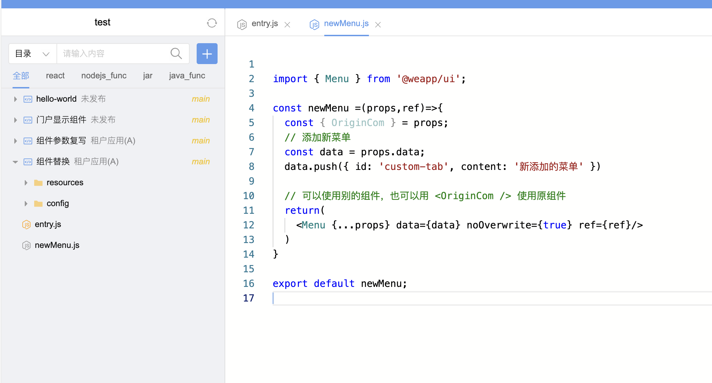


#### 注意事项

在使用ecode复写组件时，如果需要限定复写某个组件时，区分weId时，请不要使用全路径匹配，weId是多级父子组件的weId拼接而成，不同场景，不同页面weId可能不一样。

正确做法是取weId最后一段以下划线结尾的字符串作为该组件的唯一标识符。

示例：

table组件weId值：`f56o40_9d1m87_ktrfwy_su9cgs_8d2ywu_i83sct`

正确判断方法：

```javascript
regOvProps('weappUi',    'Table',    (props)    =>    {
        const    {weId=''}    =    props;
        if(weId    &&    weId.endsWith("_i83sct")){
                //逻辑处理
        }
        return    props;
},    0);
```

错误判断方法：

```javascript
regOvProps('weappUi',    'Table',    (props)    =>    {
        const    {weId=''}    =    props;
        if(weId==='f56o40_9d1m87_ktrfwy_su9cgs_8d2ywu_i83sct'){
                //逻辑处理
        }
        return    props;
},    0);
```

### 接口拦截

#### 使用 axios 进行拦截

有标准的拦截接口，如无必要不要使用 axios 拦截

##### 请求拦截

```javascript
// 前置拦截，获取请求数据
axios.interceptors.request.use(
  config =>{
    // config 包含所有请求信息
    const {url,params} = config;
    if(url.includes('api/hrm/employee/getTopMenu')){
      // 添加参数
      params.isTest = 1;
    }
    return config;
  },
  error =>{
    // 对请求错误做些什么
    return Promise.reject(error);
  }
)
```

##### 响应拦截

```javascript
// 后置拦截，获取接口返回数据
axios.interceptors.response.use(
  response =>{
    // response 里包含了响应信息，以及 config，使用 config 可以获取请求信息，data可以获取响应数据
    const {data,config:{url,params}} = response;
    if(url.includes('api/hrm/employee/getTopMenu')){
      // 能够获取到上面请求拦截中添加的参数
     const {isTest} = params;
      // 修改返回数据，添加一个按钮
      if(data.data){
        data.data.push({
          content:'新增按钮',
          id:'devBt'
        });
      }
    }
    return response;
  },
  error =>{
    // 对请求错误做些什么
    return Promise.reject(error);
  }
)
```

##### 效果

添加了一个页签


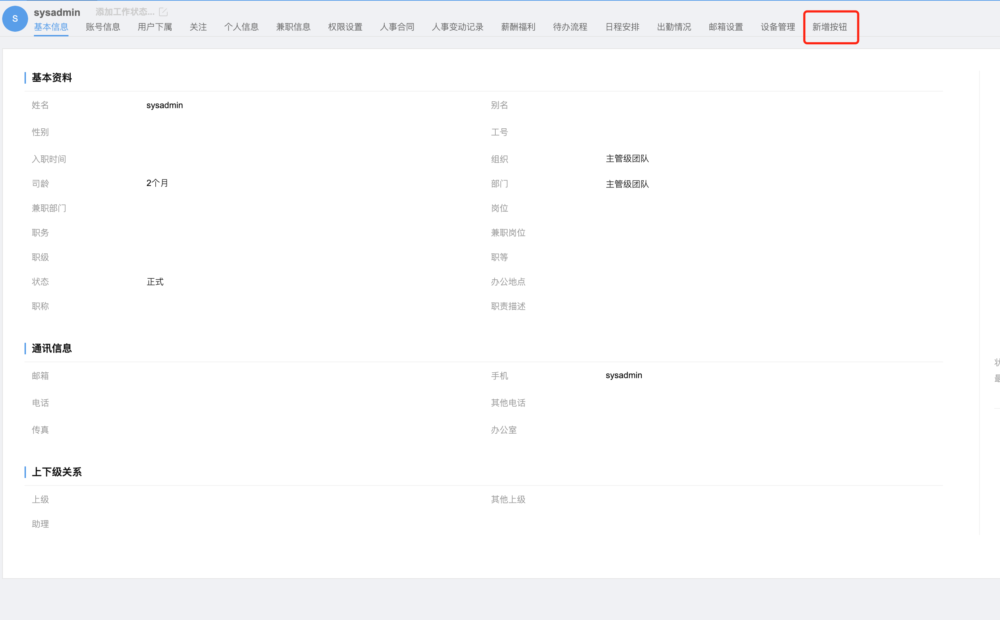


##### 注意事项

如果拦截有写 error 函数，则需要返回 Promise.reject(error)

### 公共插件

#### 创建公共插件

公共插件组件 index.js：

```javascript
import { Button,List} from '@weapp/ui';
const data=[
  {
    title:'内容1',
    id:1
  },
  {
    title:'内容2',
    id:2
  },
  {
    title:'内容3',
    id:3
  }
]
    
const MyPublicCom =()=>{
  return(
    <div>
      <div>
        <Button type={'primary'}>提交</Button>
      </div>
      <List
          sortable={true}
          direction="column"
          data={data}
          bordered={true}
          isStopMouseDown={true}
        />
    </div>
  )
}
    
export default MyPublicCom;
```

entry.js文件，导入上面的组件，并导出组件

在导出组件前要将组件放到 React.Suspense 内，因为组件是通过懒加载获取的

```javascript
import { asyncImport } from '@weapp/ecodesdk';
    
const MyPublicCom = React.lazy(() => asyncImport('${appId}', 'index'));
    
function LazyMyPublicCom (props) {
  return (
    <React.Suspense fallback={() => {}}>
      <MyPublicCom {...props} />
    </React.Suspense>
  );
}
    
export {LazyMyPublicCom as MyPublicCom}
```

#### 引入公共插件

##### 方式一：使用 @weapp/ecodesdk.asyncImport 导入

在另外一个应用内，建立一个新页面，在页面内引入公共插件

使用 asyncImport 引入公共插件，asyncImport 可以引入其它模块非入口文件的组件，需要在 asyncImport 函数的第二个参数输入组件的文件路径

引入公共插件后需要将组件放入到 React.Suspense 元素内

```javascript
import React from 'react';
import { Route } from 'react-router-dom';
import { regOvProps, appInfo, regReactChildren } from '@weapp/utils';
import { asyncImport, jsonp } from '@weapp/ecodesdk';
    
// 懒加载获取 index.js 里的组件，1002205076591648770 为应用id，index 为组件相对应用的路径
const MyPublicCom = React.lazy(() => asyncImport('1002205076591648770', 'index'));
    
const { publicUrl } = appInfo('@weapp/ecodesdk');
    
const newPage = (
  // publicUrl可能为空，前缀必需包含 /sp/custom/
  <Route path={`${publicUrl}/sp/custom/` + '${appId}/public-component-demo'}>
    <React.Suspense fallback= {() => { }}>
      <MyPublicCom />
    </React.Suspense>
  </Route>
);
    
// 注册路由
regOvProps('weappEcodesdk', 'Switch', (props) => {
  regReactChildren(props, newPage);
  return props;
}, 0);
```

##### 方式二：使用@weapp/ecodesdk 的 jsonp.require 方法引用

使用 jsonp.require 方法引用时，只能引用入口文件导出的组件，所以在公共插件应用内必需在入口文件内导出组件。引用的组件不需要放入 React.Suspense 元素内，直接使用即可

```javascript
import { jsonp } from '@weapp/ecodesdk';
import { regOvProps, appInfo, regReactChildren } from '@weapp/utils';
import { Route } from 'react-router-dom';
    
const { publicUrl } = appInfo('@weapp/ecodesdk');
    
// 导入公共插件，只能从入口文件导入
const {MyPublicCom} = jsonp.require('1002205076591648770','entry.js');
const newPage = (
  // publicUrl可能为空，前缀必需包含 /sp/custom/
  <Route path={`${publicUrl}/sp/custom/` + '${appId}/public-component-demo'}>
    <MyPublicCom />
  </Route>
);
    
// 注册路由
regOvProps('weappEcodesdk', 'Switch', (props) => {
  regReactChildren(props, newPage);
  return props;
}, 0);
```

### 新页面开发

entry.js 文件

```javascript
import React from 'react';
import { Route } from 'react-router-dom';
import { regOvProps, appInfo, regReactChildren } from '@weapp/utils';
import { asyncImport, jsonp } from '@weapp/ecodesdk';
    
const NewPage = React.lazy(() => asyncImport('${appId}', 'newPage'));
    
const { publicUrl } = appInfo('@weapp/ecodesdk');
    
const newPage = (
  // publicUrl可能为空，前缀必需包含 /sp/custom/
  <Route path={`${publicUrl}/sp/custom/` + '${appId}/newPage'}>
    <React.Suspense fallback= {() => { }}>
      <NewPage />
    </React.Suspense>
  </Route>
);
    
// 注册路由
regOvProps('weappEcodesdk', 'Switch', (props) => {
  regReactChildren(props, newPage);
  return props;
}, 0);
```

newPage.js 文件

```javascript
const NewPage = ()=>{
  return <div>新页面</div>
}
    
export default NewPage;
```


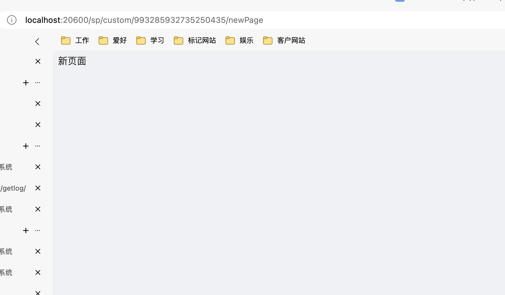


## E-builder 开发

### 重写ebuilder组件

1.需要获取页面ID，页面id在链接中可以找到


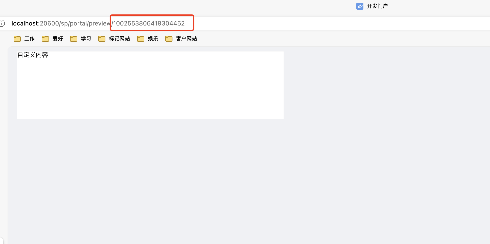


2.获取要重写的ebuilder组件id


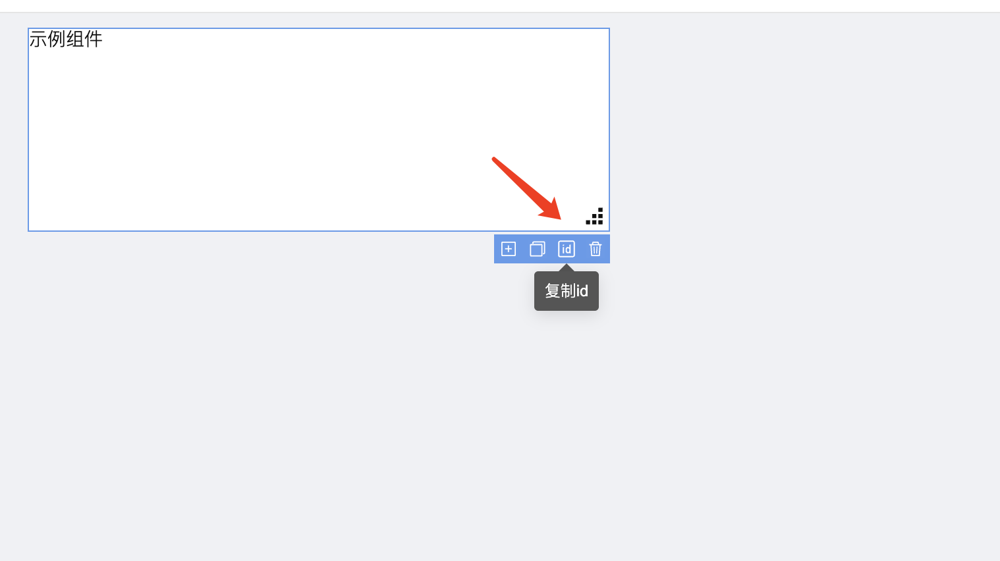


3.获取 weappEBpage 库的 PageView 组件参数，PageView 组件就是 ebuilder 页面里的容器组件，在里面做一个定时器，直到找到我们要的组件为止

```javascript
import { asyncImport, jsonp } from '@weapp/ecodesdk';
import { regOvProps } from '@weapp/utils';
import ReactDOM from 'react-dom';
    
const CustomConentLazy = React.lazy(()=> asyncImport('${appId}','CustomContent'));
const CustomConent = <React.Suspense fallback={() => {}}>
    <CustomConentLazy />
  </React.Suspense>
    
// 组件id
const comId = 'ed08ca238c59466fb7a4f6b0103ab77e';
// 页面id
const pageId = '1002553806419304452';
    
function renderCom(dom){
  ReactDOM.render(CustomConent ,dom);
}
    
regOvProps('weappEBpage','PageView',(props)=>{
  if(props.pageId === pageId){
    let time=0;
    const interval = setInterval(()=>{
      // 找到对应的ebuilder组件，comId为组件id
      const dom = document.querySelector(`#${comId}`);
      if('ebuilderSDK' in window && dom){
        clearInterval(interval);
        renderCom(dom);
      }
      if(time++ > 50){
        clearInterval(interval);
        console.warn('未找到对应的e-builder组件')
      }
    },100)
  }
})
```

4.找到组件的 dom 元素之后，将我们自己写的组件渲染到这个 dom 元素

### 自定义组件

#### 开发入口

在 eb 表单设计页面中，添加组件


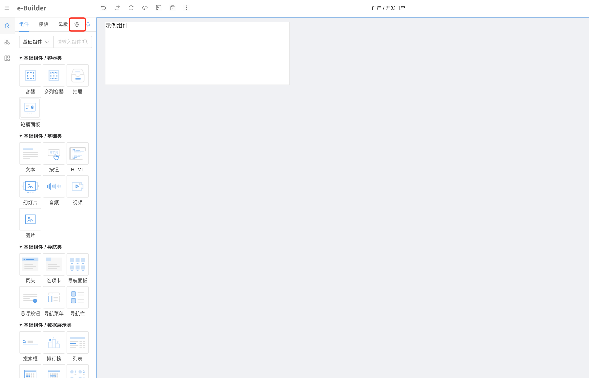


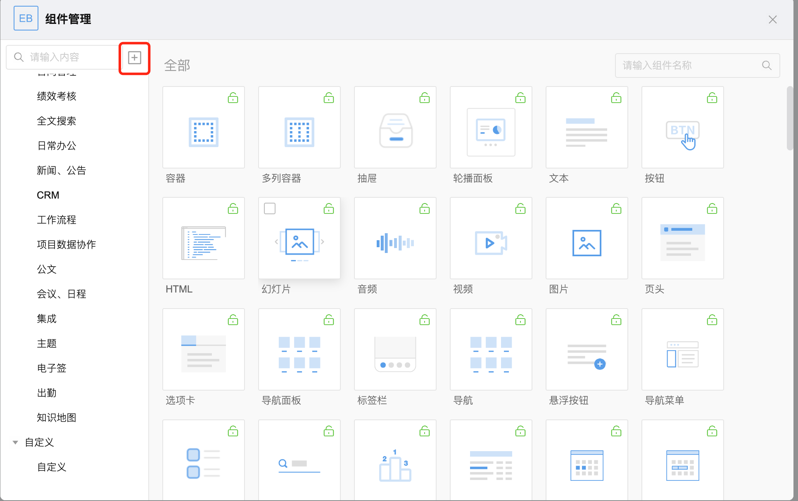


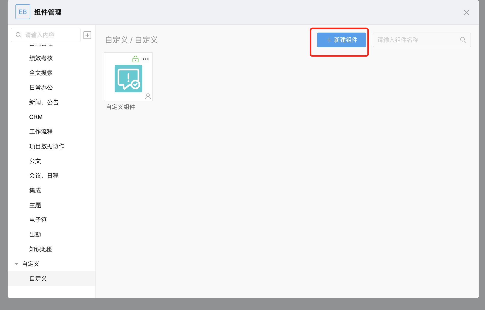


进入组件开发


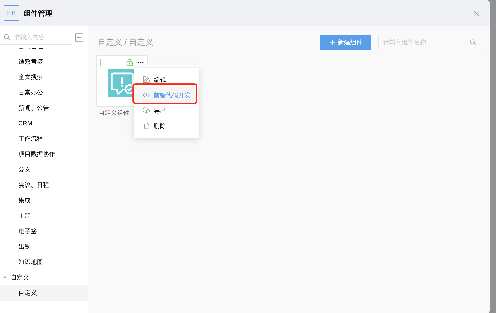


#### 文件结构

进入ecode后会初始化这几个组件：

- View.js ： 用来显示组件内容
- Config.js ：定义组件配置，可在表单设计中显示该组件的配置
- Disign.js ：在表单设计器中将该组件拖拽到表单后，显示的组件内容

##### Config.js 组件配置文件

items 是组件的配置项，这些配置会显示在表单设计器中的组件参数中

属性说明：

-  label ：配置项名称
- itemType ：配置项组件类型，可通过此文档查看可用的组件类型，[Form 表单](https://www.e-cology.com.cn/ui/form) （位置：FormItemProps 说明），可用类型有：
	| 'RATE' | 'UPLOAD' | 'SWITCH' | 'COLORPICKER' | 'SCOPE' | 'BROWSER' | 'CUSTOM' | 'DESCRIPTION' | 'TYPESBROWSER'
	
	| 'DATETIMEPICKER' | 'DATEQUICKFILTER' | 'LOCALE' | 'RICHTEXT' | 'PASSWORD' | 'SLIDER' | 'SIGNATURE' | 'ICONSELECTION' | 'BROWSERWINDOW'
	
	| 'MONTHDAYPICKER' | 'RANGE' | 'FILTERBUTTONS' | 'CASCADER' | 'SHAREBROWSER' | 'RICHICONSELECTION' | 'PLUGIN'
- helpTip : 提示内容，可在表单设计器中的组件参数配置中显示问号，问号的内容会显示 helpTip 的内容

```javascript
const Config = (data, store) => {
  return Promise.resolve({
    items: {
      detailKey: {
        label: '数据来源明细key ',
        itemType: 'INPUT',
      },
      idFieldName: {
        label: '唯一标识字段名',
        itemType: 'INPUT',
        helpTip:'请填入数据库字段名'
      },
      parentIdFieldName: {
        label: '上级标识字段名',
        itemType: 'INPUT',
        helpTip:'请填入数据库字段名'
      },
      sumFieldNames:{
        label: '合计字段名',
        itemType: 'INPUT',
        helpTip:'合计下级的字段值到上级字段，请填入数据库字段名，多个使用英文逗号分隔'
      },
      dataLinkageFileName:{
        label: '明细表数据字段联动字段名',
        itemType: 'INPUT',
        helpTip:'选填，填主表字段名，比如有一个主表字段为浏览框，选择后带出明细数据，在执行该字段联动后将会更新明细树数据'
      }
      
    },
    formatFormDatas: (_data) => {
      return {
        ..._data,
      }
    }
  });
};
    
export default Config;
```

效果：


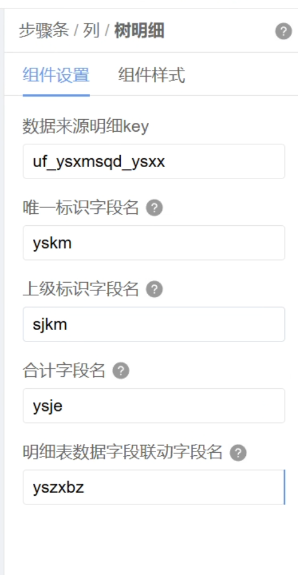


可在 View.js 中使用配置

```javascript
export default function View(props) {
  // 获取配置
  const { config } = props;
  const { detailKey, idFieldName, parentIdFieldName, sumFieldNames,dataLinkageFileName } = config;
  
  // ... 组件内容
}
```

#### 示例

在 View.js 中导入了一个组件

```javascript
import React from 'react';
import {asyncImport} from '@weapp/ecodesdk';
    
const Table = React.lazy(() => asyncImport('${appId}','components/Table'))
    
const View = (props) => {
  const { config } = props;
    
  return (
    <div className="cusStyleCls">
      <React.Suspense fallback={()=>{}}>
        <Table />
      </React.Suspense>
    </div>
  );
};
    
export default View
```

这里我定义了一个组件，作为组件的现实内容，在 View.js 中使用


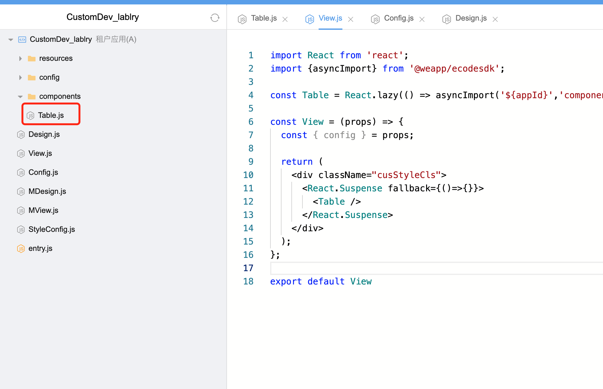


效果：


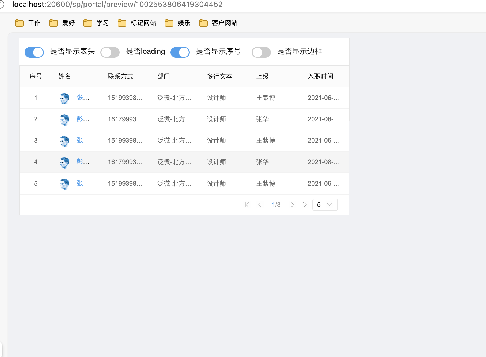


## 流程

### 表单 SDK
#### getFieldInfo() 获取字段信息

使用此接口可以获取字段信息，可以用于将字段信息传入 `FormSwitch` 组件中来复制字段

结果示例：

```json
{
    "childName": "",
    "componentKey": "Select",
    "content": "",
    "fieldId": "1263690721244209153",
    "flow": {
        "parent": "HpMjIxDAwP",
        "nodes": [],
        "isCanvas": false,
        "linkedNodes": {},
        "nodeId": "keGxB2-tRd"
    },
    "hasChild": false,
    "isDefault": false,
    "isHideTitle": false,
    "layout": {
        "selected": true,
        "offsetTop": 635
    },
    "name": "下拉单选框",
    "parentName": "",
    "size": "large",
    "subFormId": "1245174301386883072",
    "templateName": "控制方式",
    "hideScore": true,
    "optionBackgroundStyle": "default",
    "groupId": "-1",
    "templateId": "1263690953222774786",
    "title": "控制方式",
    "type": "Select",
    "dataCount": 1,
    "selectedNum": "",
    "dataKey": "kzfs",
    "publicTemplate": false,
    "systemField": true,
    "columnTypeSwitch": false,
    "options": [],
    "showType": "Select",
    "placeholder": "",
    "formTableId": "1245174322802999297",
    "typeLen": 64,
    "formId": "1242178016102858766",
    "templateOptionNum": {},
    "templateScore": {},
    "parentId": [],
    "columnType": "VARCHAR",
    "showOrder": 0,
    "hasTemplate": true,
    "columnName": "kzfs",
    "disableEdit": false,
    "display": true,
    "singleRow": false,
    "readOnly": false,
    "required": false,
    "autoFocus": false,
    "readOnlyPlaceholder": "暂无内容",
    "__IsFirstWithRow": true
}
```

#### 归档节点使用 SDK 获取字段属性判断问题

归档节点表单渲染字段都是只读的，如果表单设计器中将字段设为编辑，SDK 获取的显示属性依然是编辑，需要使用 `formSdk.getBaseInfo.isEditable` 配合判断表单是否整体可编辑，如果不可编辑则认为字段是只读的

### 流程 SDK
#### 流程表单添加菜单按钮

不要在 e-code 入口执行时立即调用 `getFlowPageSDK()` 并添加菜单：此时流程 SDK 可能尚未初始化，导致按钮未注册。应注册 PC 流程表单挂载钩子 `FPMainTabWillMount`，再在 `onceReady` 回调中添加菜单。

`regHook` 的作用是向 E10 已提供的模块生命周期事件注册回调。它不是“等待 SDK 已就绪”的方法：在本场景中，`regHook('weappWorkflow', 'FPMainTabWillMount', registerFlowMenu)` 让 `registerFlowMenu` 在 PC 流程表单主页签开始挂载时执行；回调中再调用 `flowSdk.onceReady(...)`，才能保证当前流程 SDK 已完成初始化后再注册菜单。

两者分工如下：

- `regHook`：选择正确的页面生命周期和作用范围，解决入口脚本执行过早、以及流程表单重新载入时需要再次执行的问题。
- `onceReady`：等待本次流程表单的 SDK 可用，之后才能安全调用 `addOperMenu`、`registerInterceptEvent` 等流程 SDK 方法。

entry.js :

```javascript
import { regHook } from '@weapp/utils';

const registeredSdkSet = new WeakSet();
const menuType = 'custombtn_flow_form_test';

function registerFlowMenu() {
  const flowSdk = window.weappWorkflow?.getFlowPageSDK?.();

  if (!flowSdk) {
    console.error('流程表单菜单：流程 SDK 未创建');
    return;
  }

  // 单页路由或重复挂载时，避免对同一个 SDK 重复添加菜单。
  if (registeredSdkSet.has(flowSdk)) {
    return;
  }
  registeredSdkSet.add(flowSdk);

  flowSdk.onceReady(() => {
    flowSdk.addOperMenu({
      id: 'flow_form_test_button', // 应用内唯一
      menutype: menuType, // 自定义且唯一，用于绑定点击拦截
      title: '测试按钮',
      istop: true, // 显示在顶部操作区
    }, 'Last');

    console.log('流程表单菜单：按钮已注册');

    flowSdk.registerInterceptEvent(
      `BeforeClickOperBtn|${menuType}`,
      (successFn, failFn, params) => {
        console.log('流程表单菜单：按钮已点击', params);
        successFn();
      },
    );
  });
}

regHook('weappWorkflow', 'FPMainTabWillMount', registerFlowMenu);
```

验证方法：在流程表单地址后增加 `wea_link_keep_show_console`，刷新页面。控制台出现“按钮已注册”且顶部显示按钮，说明注册成功；点击后应出现“按钮已点击”。若入口日志存在、但没有“按钮已注册”，优先检查流程 SDK 就绪时机。

效果：


### 流程表单开发

#### 表单加载完成后触发（新建流程保存后也能生效）

表单js-SDK 的表单加载完成后回调事件和流程 js-SDK 的 Ready 加载事件都不会在流程新建保存后触发，如果是用 ecode 开发，需要使用`regHook`，配合`Ready`可实现只要表单载入时就触发，包括表单二次加载（比如保存时）。

参考：[流程详情-JSSDK文档](https://weapp.eteams.cn/ecode/playground/doc/share/view/988383343450701824#1.4%20eCode%E5%B9%B3%E5%8F%B0%E5%86%85%E5%BC%80%E5%8F%91%E6%A0%B7%E4%BE%8B)见1.4

```javascript
// 表单载入时触发
const wffpSdk = window.weappWorkflow.getFlowPageSDK();
wffpSdk.ready(()=>{
  onFormLoadedAction();
});
    
// 注册表单载入时触发
regHook('weappWorkflow', 'FPMainTabWillMount', onFormLoadedAction);
    
function onFormLoadedAction(params) {
  console.log('执行 onFormLoadedAction')
  const wffpSdk = window.weappWorkflow.getFlowPageSDK();
  
  // 如果需要立即获取到 formSdk，则需要添加 ready
  wffpSdk.ready(() => {
    const formSdk = window.WeFormSDK.getWeFormInstance();
    
    }
  });
}
```

#### 新建流程页面通过自定义按钮触发保存，保存后触发动作

**需求描述**  
在流程表单上创建一个自定义按钮，在新建流程页面点击按钮后保存流程，然后触发弹窗，弹窗显示 eb 表单新建页面

**如何实现**  
需要做新建流程保存后触发动作，与编辑保存不同，新建保存会刷新页面，也就不能通过 js 的钩子动作来实现保存后触发。
解决方法是使用逻辑流进行保存，保存之后打开 eb 窗口。

流程表单创建按钮：
在流程表单内放入自定义按钮，单击事件选择逻辑流


逻辑流设计：
在逻辑流中保存流程表单，可以在保存后面设计动作，让它保存后能执行这些动作，比如打开 eb 窗口


#### 流程内弹窗中的 eb 表保存后刷新流程

**需求**
在流程内通过弹窗打开 eb 表单，eb 表单保存后会执行动作流更新流程数据，需要 eb 表保存后在流程中刷新，让流程中能看到更新的数据。

**如何实现**  
在流程中打开的 eb 表单的弹窗，需要使用标准功能打开，比如上面使用逻辑流打开 eb 弹窗。  
在流程里打开 eb 弹窗时，需要设置一个标记，用于在 eb 表单判断是否刷新流程，例如：`window.workflowRefreshFlag = true;`

使用上面的打开 eb 弹窗示例，打开前执行了代码，设置了一个标记。


需要在 eb 代码块中做一个保存后的钩子动作，保存后触发流程表单刷新。
eb 表代码块，示例代码：
```javascript
const ebFormSdk = window.WeFormSDK.getWeFormInstance();
// 表单保存后刷新当前流程表单，只有在流程中打开当前 eb 表单时才会生效
ebFormSdk.registerAction(window.WeFormSDK.ACTION_FORM_SAVE, () => {
    // 获取在流程中打开 eb 表单时设置的标识，判断是否为在流程中打开
    if (window.workflowRefreshFlag) {
        window.workflowRefreshFlag = false;
        // 需要延迟，因为保存后需要等动作流执行完成
        window.setTimeout(()=>{
            const flowFormSdk = window.weappWorkflow.getFlowPageSDK();
            // 刷新流程表单
            flowFormSdk.reloadPage();
            console.log('二开：EB 表保存完成，已刷新流程表单');
        },1000)
        
    }
});
```

### 获取流程节点id
#### 方法一：在流程页面查看节点接口

1. 在前端中新建流程
2. 打开浏览器中的开发者工具，并在工具中切换到网络标签页
3. 在流程中切换到流程图标签页
4. 在开发者工具中找到名称为 getXml 接口，选中该接口在右侧中点击预览标签页，查看该接口的返回信息
5. 在返回信息中找到 data -> chartFlowInfo -> normalChartInfoEntity -> nodeInfo
6. 在 nodeInfo 中包含了各节点的信息，里面的 nodeId 就是节点id


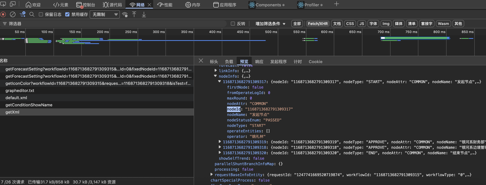

#### 方法二：在后台流程设置查看流程接口

在后台流程设置中，先按 f12 打开开发者工具并切换到网络标签页，然后在流程设置中切换到流转设置标签页，在开发者工具的网络标签中查看 `getNodeList` 接口的返回数据，找到 `data` 数据中的对应节点的id。


#### 方法三：使用 formSDK 获取当前节点id

代码示例：

```javascript
const sdk = window.WeFormSDK.getWeFormInstance();
const formInfo = sdk.getBaseInfo();
const nodeId = formInfo.customParam.nodeId
```

### 流程详情二开口子

[流程详情-组件复写-二开口子](https://weapp.eteams.cn/ecode/playground/doc/share/view/981360079733604353#2.2%E3%80%81%E6%89%93%E5%BC%80%E6%B5%81%E7%A8%8B%E8%AF%A6%E6%83%85%E6%9F%A5%E7%9C%8B/%E5%AE%A1%E6%89%B9%E9%A1%B5%E9%9D%A2%EF%BC%8C%E5%B9%B6%E6%94%AF%E6%8C%81%E6%8F%90%E4%BA%A4%E5%90%8E%E5%88%B7%E6%96%B0)

### 流程表单标准接口

#### 表单数据接口

包含表单全部字段数据和表单页面布局  
接口地址：`/api/workflow/core/form/core/getFormDataAndLayout?formId=1151612316977602563&dataId=1247741669520719874 

返回数据说明：
- 字段数据存放在：formData.dataDetails 中
- 表单字段组件数据(主表和明细)，包括字段显示名和字段id：formLayout.pageLayouts.comps

#### 表单附件下载接口

接口地址：`http://e10oa.bodatek.net:20600/api/file/remotedownload/[字段id]/upload/true?module=workflow&authModule=workflow&source=form&fieldId=[附件id]`

调用此接口可下载表单文件字段中的附件

## 表单开发

#### 字段自定义渲染

可自定义字段的显示内容，使用表单 SDK 的`proxyFieldComp`实现，示例：

参数1: 字段id

`createElement`的第三个参数可传入 React 组件，为字段的显示内容

```
formSdk.proxyFieldComp(`${budgetInfoFieldMark}_${rowId}`, React.createElement('div', { budgetInfoFieldMark },
    <BudgetInfo totalBudget={totalBudget}
      availableBudget={availableBudget}
      usedCost={usedCost}
      approvalBudget={approvalBudget} />));
```

#### 加载 ecode

在流程高级设置里可以添加 ecode ,这里说的是另一种方法，可以在代码块里加载任意 ecode 应用

e10没有像e9那样可以使用 ecodeSDK.load() 加载 ecode ，不过流程表单代码块也是支持js模块化的，可以导入ecode的组件

可以在ecode中创建一个类，类中写代码逻辑，然后在流程中导入这个类去执行

示例：

在ecode中创建一个类，index.js

```javascript
class DetailHrColControl {
    // 类中写代码逻辑
    doSomeThing(){
	    // 获取表单数据...
    }
}
export default DetailHrColControl;
```

在流程中引入类：

```javascript
import { asyncImport,jsonp } from '@weapp/ecodesdk';
// 第一个参数是应用id，第二个参数是ecode中的组件所在文件名称
asyncImport('1149493253298642947','index').then(esmodule =>{
    // 相当于：new DetailHrColControl()
  const obj = new esmodule.default();
  // 执行代码
  obj.doSomeThing();
});
```

#### 明细表加载完后触发

这个没有标准接口支持，可以在表单载入时创建一个定时器，反复判断明细表是否有数据，可通过`formSdk.getDetailAllRowIndexStr(detailMark)`来判断明细表是否有数据，下面是一个示例，当明细表加载完成之后执行回调函数

```javascript
function onDetailReady(detailKey, callback) {
  const maxTime = 10000;
  const timeout = 100;
  let count = 0;
  const formSdk = window.WeFormSDK.getWeFormInstance();
    
  const interval = setInterval(() => {
    count++;
    const detailMark = formSdk.convertFieldNameToId(detailKey);
    const rowIdStr = formSdk.getDetailAllRowIndexStr(detailMark);
    if (rowIdStr) {
      callback(rowIdStr);
      clearInterval(interval);
    }
    if (count * timeout > maxTime) {
      console.warn('等待明细加载超时');
      clearInterval(interval);
    }
    
  }, timeout);
    
}
    
```

### 字段复制

可以使用 `FormSwitch` 组件复制字段，比如复制整个明细，详细可以看 [FormSwitch - 表单组件分发](#FormSwitch%20-%20表单组件分发)

### ebuilderSDK.openPage() - eb 表单弹窗

使用场景：需要使用弹窗打开 eb 表单页面，比如在流程中弹窗打开 eb 表单页面

使用此接口可以使用标准的 eb 弹窗打开 eb 表单页面，此接口也可以打开任意的链接，不限定 eb 表单页面

示例：

```javascript
const ebSdk = window.ebuilderSDK;
const url = `/sp/ebdfpage/card/2/1307107355997863937/${id}`;
const options = {
    openType: 3,
    modalWidth: '80%',
    modalHeight: '80%'
};
ebSdk.openPage(url, {}, options, () => {
        console.log(`二开：关联 EB 表单已保存，glbdxx：${id}`);
    });
```

- options 参数可配置弹窗
	- `modalWidth` 和 `modalHeight` 可配置弹窗的宽高，可用像素或百分比
	- openType 可配置弹窗的打开方式，方式为：
		- 1  在当前页面打开，也就是在当前页面跳转到指定页面
		- 2  在浏览器的新页面打开
		- 3  使用弹窗打开
- openPage 的第 4 个参数（最后一个）为 eb 表单保存后的回调

效果：


## 组件使用

### Radio

如果要创建一组单选框，则需要在Radio组件添加 data 参数

data 参数格式如下：

```javascript
const options = [
  {
    id: 'Apple',
    title: 'Apple',
    content: 'Apple',
    color: '#5D9CEC'
  },
  {
    id: 'Pear',
    title: 'Pear',
    content: 'Pear',
    color: '#FF4D4F'
  },
  {
    id: 'Orange',
    title: 'Orange',
    content: 'Orange',
    disabled: true,
    color: '#52C41A'
  },
];
```

如果 Radio 单独使用，则每个选择框都是独立的，不能实现单选

```
<Radio readOnly
          onChange={this.onChange}
          onClick={this.onClick}
          onFocus={this.onFocus}
          onBlur={this.onBlur}
        >只读</Radio>
        <Radio readOnly
          value={true}
          onChange={this.onChange}
          onClick={this.onClick}
          onFocus={this.onFocus}
          onBlur={this.onBlur}
        >只读2</Radio>
```

#### 示例

在签字意见上方添加单选框

```javascript
import { RichText, Radio } from '@weapp/ui';
import config from './config/config';
    
    
function getOptions(){
  // 从配置中获取选项
  const configList = config.workflowRemarkOptionConfig
  const weFormSdk = window.WeFormSDK.getWeFormInstance();
  const formInfo = weFormSdk.getBaseInfo();
  const optionConfig = configList.find(i => i.formId === formInfo.formId);
  if(optionConfig){
    const optionTexts = optionConfig.options;
    let id = 1;
    return optionTexts.map(i =>{ return {id:id++,title:i,content:i} });
  }
  return [];
}
    
/**
 * 在签字意见顶部添加单选框
 */
const NewRichText = (props, ref) => {
  const { OriginCom } = props;
    
  const onChange = (v, o, e) => {
    if(v){
      // 修改签字意见
      weappWorkflow.getFlowPageSDK().changeRemark(o.content);
    }
  }
    
  return (
    <div>
      <div style={{padding:10,display:'flex',alignItems:'center'}}>
        <span>签字意见</span> 
        <div style={{marginLeft:30}}>
          <Radio data={getOptions()} onChange={onChange} />
        </div>
      </div>
      <RichText {...props} noOverwrite={true} ref={ref} />
    </div>
  )
}
    
export default NewRichText;
```

### FormSwitch - 表单组件分发

此组件可用于在表单中复制已有的表单字段，复制出的字段组件能达到和原表单字段组件一样的效果，比如复制出一个已有的明细。  

**使用场景：**  
- 复制表单内的一个明细，让明细内的字段组件与原明细字段组件相同（例如人力资源浏览框）
- 想要在自己的开发组件中，复制表单字段组件，比如做一个明细表批量编辑功能，在弹出的批量编辑对话框中复制明细的字段组件，填写字段值后进行明细表的批量编辑

下面这个是我做的流程表单助手功能，它能查看表单中的所有字段，显示的组件与表单中的字段组件一致，就是通过复制字段组件实现


组件说明：[e-cology.com.cn/sp/form/components/FormSwitch?ticket=ST-7374-UZ1hsJZqHEs3adc7Vmz1-https://www.e-cology.com.cn](https://www.e-cology.com.cn/sp/form/components/FormSwitch)

案例：[Ecode-表单明细树组件](Ecode-表单明细树组件.md)

**简单示例**   
`config`  是重点，它决定能不能复制字段组件，它包含了表单字段组件的参数，可以从表单 SDK 获取字段组件参数，传入 `config` 中。`value` 是字段组件的值，与表单 SDK 获取的字段值不一样，需要进行转换。

```javascript
<CorsComponent  
    app="@weapp/formbuilder"  
    compName="FormSwitch"  
    config={componentDefinition.config}  
    isNewDataFormat  
    onBlur={() => {}}  
    onChange={() => {}}  
    rowId={componentData.rowId}  
    value={componentValue}  
/>
```

#### 使用 SDK 属性复制字段组件

从表单 SDK 获取原字段的配置和字段值，再通过 `CorsComponent` 加载表单引擎的 `FormSwitch`。`FormSwitch` 根据 `config.componentKey` 分发到原字段对应的控件，无需分别创建文本、选择、人员或附件组件，也无需复制或修改原字段的 HTML。

配置使用 `formSdk.getFieldInfo(fieldId)` 获取，保留完整返回对象，不要只提取标题和组件类型。值使用 `formSdk.getFieldObj(fieldMark)` 获取，再将 SDK 的 `value`、`specialObj` 转为组件需要的 `content`、`dataOptions`。明细字段使用同一列配置，但必须按当前行的 `rowId` 获取值和读写属性。

#### CorsComponent 参数说明

| 参数 | 本场景的取值 | 说明 |
| --- | --- | --- |
| `app` | `"@weapp/formbuilder"` | 被加载组件所属的应用包。 |
| `compName` | `"FormSwitch"` | 加载表单字段组件分发器，由 `config` 决定具体字段控件。 |
| `config` | SDK 字段配置对象 | 来自 `getFieldInfo(fieldId)`，包含 `fieldId`、`componentKey`、标题、选项及控件配置等；可在副本中调整 `readOnly`、`disabled`，不要修改 SDK 原对象。 |
| `isNewDataFormat` | `true` | 使用本示例的字段数据对象格式，即 `content`、`dataOptions` 等，而不是直接传字符串。 |
| `value` | 字段数据对象 | 原字段当前值。文本内容放入 `content`；选项和浏览数据放入 `dataOptions`，每项包含 `optionId`、`content`，有扩展信息时保留 `optionObj`。 |
| `onChange` | `(newValue) => …` | 复制控件值改变时触发，收到的是新字段数据对象，不是 DOM 事件；更新本地 `value`，并将新值转换为 SDK 格式回写原字段。 |
| `onBlur` | `() => …` | 可选。可将 `onChange` 收到的值暂存，失焦后再提交，避免输入过程中频繁触发表单联动。 |

`config` 决定字段的显示方式，`value` 决定显示内容，两者必须来自同一字段（明细还必须是同一行）。仅传字段 ID 或数据库值，不能完整复制浏览名称、选项或附件信息。附件、自定义浏览等字段需要保留 SDK `specialObj[].data`，转换为组件的 `dataOptions[].optionObj`，不能只保留 ID 和名称。

`getFieldInfo()` 中的 `readOnly` 不应作为当前节点读写权限的唯一依据。使用 `getFieldAttr(fieldMark)` 获取当前字段或明细行字段的属性：`1` 为只读、`2` 为可编辑、`3` 为必填、`4` 为隐藏、`5` 为隐藏行；同时结合 `getBaseInfo().isEditable`。如果只用于展示，可在配置副本中统一设置 `readOnly: true`、`disabled: true`。

#### 复制字段，并在 onChange 中回写原表单

下面示例传入已就绪的 `formSdk` 和 SDK 获取的 `fieldId`。主表不传 `rowId`；明细传入对应行的 `rowId`。字段 ID 按字符串使用，避免大整数精度丢失。

```javascript
import React, { useState } from 'react';
import { CorsComponent } from '@weapp/ui';

/**
 * 将 SDK 字段值转换为 FormSwitch 的字段数据对象。
 * @param {Object} fieldValue SDK getFieldObj 返回值
 */
function toComponentValue(fieldValue) {
    const value = { ...fieldValue, content: fieldValue.value };
    const hasSpecialOptions = Array.isArray(fieldValue.specialObj);
    if (hasSpecialOptions) {
        value.dataOptions = fieldValue.specialObj.map(option => ({
            optionId: option.id,
            content: option.name,
            optionObj: option.data,
            type: option.type,
        }));
    }
    return value;
}

/**
 * 将复制控件的新值转换为 SDK changeFieldValue 的入参。
 * @param {Object} newValue FormSwitch onChange 返回值
 */
function toSdkValue(newValue) {
    const value = { value: newValue.content };
    const hasDataOptions = Array.isArray(newValue.dataOptions);
    if (hasDataOptions) {
        value.specialObj = newValue.dataOptions.map(option => ({
            id: option.optionId,
            name: option.content,
            data: option.optionObj,
            type: option.type,
        }));
    }
    return value;
}

/**
 * 复制主表字段或指定明细行字段，值变更后同步原表单。
 * @param {Object} formSdk 已就绪的表单 SDK 实例
 * @param {string} fieldId SDK 获取的原字段 ID
 * @param {string} [rowId] 明细行 ID，主表不传
 * @param {string} appId 当前 ecode 应用 ID，仅用于二开样式标记
 */
function CopiedFormField({ formSdk, fieldId, rowId, appId }) {
    const isDetailField = rowId !== undefined && rowId !== null;
    const fieldMark = isDetailField ? `${fieldId}_${rowId}` : fieldId;
    const fieldInfo = formSdk.getFieldInfo(fieldId);
    const fieldAttr = formSdk.getFieldAttr(fieldMark);
    const isReadOnly = fieldAttr === 1 || !formSdk.getBaseInfo().isEditable;
    const fieldConfig = {
        ...fieldInfo,
        readOnly: isReadOnly,
        disabled: isReadOnly,
    };
    const [value, setValue] = useState(() => (
        toComponentValue(formSdk.getFieldObj(fieldMark))
    ));

    const handleChange = (newValue) => {
        // 复制控件是受控组件，先更新其显示值。
        setValue(newValue);
        // 再同步原字段；空 dataOptions 转为空 specialObj，可清空浏览值。
        formSdk.changeFieldValue(fieldMark, toSdkValue(newValue));
    };

    return (
        <div className={`appid-${appId} seconddev-ecode`}>
            <CorsComponent
                app="@weapp/formbuilder"
                compName="FormSwitch"
                config={fieldConfig}
                isNewDataFormat
                value={value}
                onChange={handleChange}
            />
        </div>
    );
}
```

示例演示初始化与复制控件向原表单回写；原表单因联动等原因从外部改变时，还需在对应 SDK 值变更回调中刷新本地 `value`。隐藏字段或隐藏行应按业务要求处理，不应当作可编辑字段直接展示。

#### 输入缓冲与失焦回写

需要避免逐次输入触发表单联动时，可以在复制控件中管理缓冲状态：`onChange` 接收 `newValue`，更新本地 `value` 并标记值已变更；使用 `useRef` 保存最新缓冲值，供稳定的失焦回调读取。`onBlur` 仅在值发生变更时提交，将缓冲值转换为 SDK 格式后调用 `formSdk.changeFieldValue`，并清除变更标记。若复制控件所在的表格还管理了独立数据，也应在提交后同步更新对应行和字段的数据。

`CorsComponent` 并不会自动修改原字段：需要自行提供回调。需要即时回写时使用上面的 `handleChange`；需要缓冲输入时，则在 `onChange` 中只暂存，把 `changeFieldValue` 移到 `onBlur` 中执行。原字段从外部改变时，只有在未缓冲输入的情况下才用外部值刷新本地状态，避免覆盖用户正在输入的内容。明细字段标识中的行 ID 只拼接一次，例如 `${fieldId}_${rowId}`，不能重复追加 `_${rowId}`。

#### SDK 无字段配置时：通过后端复制布局外字段

字段已经创建但未放入当前表单布局时，`formSdk.getFieldInfo(fieldId)` 可能取不到配置。此时不能仅凭字段类型自行拼一个控件配置，也不能用另一个字段的配置代替；应由后端分别查询字段元数据和完整表单数据，按字段 ID 合并，再把配置和值交给同一个 `CorsComponent/FormSwitch`。

##### 后端调用的 RPC 接口

以下接口用于流程表单，字段信息与字段值需要分别获取：

| 用途      | RPC 接口与方法                                                     | 返回对象及作用                                                               |
| ------- | ------------------------------------------------------------- | --------------------------------------------------------------------- |
| 全部字段清单  | `FormFieldRest.listAllFormFieldByFormId(formId, 0, employee)` | `List<SimpleFormFieldDto>`，枚举未删除的主表字段及明细字段，不依赖当前布局。简化 DTO 不能代替完整组件配置。 |
| 完整字段元数据 | `FormFieldRest.getFieldMapByFormId(formId, employee)`         | `Map<Long, FormField>`，key 为字段 ID，value 为字段元数据；用来提取数据库列名和组件配置。        |
| 完整字段值   | `WfcFormDataRest.getFullFormData(dataId, employee)`           | `FormData`，从 `getDataDetails()` 获取字段数据记录，包含布局外字段的数据。                  |

`FormFieldRest` 的完整类名为 `com.weaver.common.form.api.rest.field.FormFieldRest`，可通过注入的 `FormRestFactory` 按流程分组取得；`WfcFormDataRest` 的完整类名为 `com.weaver.workflow.core.api.rest.publicapi.WfcFormDataRest`。

后端调用示意（`formRestFactory` 和 `wfcFormDataRest` 均由平台注入）：

```java
// 使用当前登录用户作为权限上下文，不使用管理员账号兜底。
SimpleEmployee employee = UserContext.getCurrentUser();
FormFieldRest formFieldRest = formRestFactory.getFormFieldRest(
        RpcGroup.WORKFLOW.getValue());

List<SimpleFormFieldDto> fields = formFieldRest.listAllFormFieldByFormId(
        formId, 0, employee);
// key：字段 ID；value：完整字段元数据。
Map<Long, FormField> metadata = formFieldRest.getFieldMapByFormId(
        formId, employee);
FormData formData = wfcFormDataRest.getFullFormData(dataId, employee);
List<FormDataDetail> values = formData.getDataDetails();
```

RPC 的 `group` 应匹配目标接口的实际发布配置，不能将所有接口都写成 `group = "workflow"`。在已核实的调用中，`WfcFormDataRest` 使用不带 `group` 的 `@RpcReference`；错误分组会导致 `instance does not exist`。

##### 从哪些对象提取配置和值

组件配置从 `FormField` 获取：先解析 `getLayoutDetail()` 返回的 JSON，提取其中的 `config` 对象；没有有效 `config` 时，再解析 `getOtherProperties()` 返回的字段扩展配置。布局外字段尤其需要检查后者。接口将解析后的 JSON 对象作为 `componentConfig` 返回，并同时返回字段的 `fieldId`、`componentKey`。这两处均没有有效配置时，应明确返回配置缺失，不能保证仅靠字段类型就能复制组件。

字段值从 `FormDataDetail` 获取：普通内容读取 `getContent()`；选项、浏览和附件读取 `getDataOptions()`，每项为 `FormDataOption`，包含 `optionId`、`content`、`type`、`optionObj`。按字段 ID 将值与元数据对应起来；明细字段还需按所属明细表和行身份归组，不能把不同明细行的值合并到一起。

`FormData.getDataDetails()` 的名称不代表它只包含明细表。主表字段也以 `FormDataDetail` 记录返回；主表、明细归属应依据字段元数据及行信息判断。

后端应投影成自己的 DTO，不直接序列化 `FormData`、`FormDataDetail` 或完整平台附件对象，避免循环引用和不必要的内部数据暴露。例如字段 DTO 使用如下结构：

```javascript
{
    fieldId: '原字段ID',
    componentKey: '原字段组件类型',
    componentConfig: { /* FormField 中提取的完整有效配置 */ },
    value: {
        content: '原始字段内容',
        dataOptions: [
            {
                optionId: '选项或文件ID',
                content: '选项或文件名称',
                type: 'file',
                optionObj: { /* 附件等字段所需的扩展属性 */ },
            },
        ],
    },
}
```

##### 前端把后端数据放入 CorsComponent

后端已将字段值转换成 `content`、`dataOptions` 格式时，前端不需要再转为 SDK 的 `specialObj`；直接保留 `dataOptions` 及每项的 `optionObj`。下面以布局外主表字段的只读复制为例：

```javascript
/**
 * 使用后端字段 DTO 复制布局外主表字段的只读组件。
 * @param {Object} field 后端返回的字段，包含配置与字段值
 * @param {string} appId 当前 ecode 应用 ID，仅用于样式标记
 */
function BackendCopiedField({ field, appId }) {
    const hasComponentConfig = Boolean(field.componentConfig);
    const hasComponentKey = Boolean(field.componentKey);
    const canCopyComponent = hasComponentConfig && hasComponentKey;
    if (!canCopyComponent) {
        return <span>未获取到字段组件配置</span>;
    }

    const config = {
        ...field.componentConfig,
        fieldId: field.fieldId,
        componentKey: field.componentKey,
        readOnly: true,
        disabled: true,
        display: true,
        show: true,
    };
    const backendValue = field.value || {};
    const dataOptions = backendValue.dataOptions || [];
    const hasContent = backendValue.content !== null
        && backendValue.content !== undefined;
    const content = hasContent
        ? backendValue.content
        : dataOptions.map(option => option.optionId).join(',');
    const value = { ...backendValue, content, dataOptions };

    return (
        <div className={`appid-${appId} seconddev-ecode`}>
            <CorsComponent
                app="@weapp/formbuilder"
                compName="FormSwitch"
                config={config}
                isNewDataFormat
                value={value}
            />
        </div>
    );
}
```

调用端仍优先使用 SDK：SDK 有配置时采用前面的 SDK 复制方式；没有配置时，从后端返回的字段集合按 `fieldId` 找到目标字段，传入上述组件。这里的 `display`、`show` 只让配置在复制位置显示，不会把该字段添加到原表单布局。原表单数据的读权限仍由后端执行。

在流程表单助手中，已有后端接口为 `GET /api/secondev/hnweaver/form-assist/field-value?formId=表单ID&dataId=表单数据ID`，返回 `WeaResult`，字段位于 `data.mainFields` 或 `data.detailTables` 中。该接口当前仅允许登录的系统管理员调用；不要用前端展示条件替代后端权限校验。

##### 附件字段：配置完整还不够，文件元数据也必须完整

附件字段的组件配置与每个附件的文件属性是两类数据。以布局外“拼接文件”为例，即使拿到了与普通附件相同的组件配置，只返回文件 ID 和名称也只能显示文件名，不能完整恢复预览、下载和上传信息。

附件元数据读取路径为：`FormDataDetail.getDataOptions()` → `FormDataOption.getOptionObj()`。本例已核实实际对象为 `com.weaver.eteams.file.client.file.FileObj`，而不是字段配置 `FormField`。后端需要从这个对象提取如下属性，放入响应的 `value.dataOptions[].optionObj`：

| 属性 | 来源和转换 | 组件用途或注意事项 |
| --- | --- | --- |
| `fileid`、`id`、`refId`、`docId` | `FileObj` 对应 getter，ID 转字符串 | 标识文件、引用和关联文档，避免前端大整数精度丢失；外层 `optionId` 也需保留。 |
| `name`、`type`、`size`、`extName` | `FileObj` 对应 getter | 文件名、MIME 类型、大小和扩展名，影响文件显示及识别。 |
| `doc`、`img`、`image`、`docType`、`fileStatus` | `FileObj` 对应 getter | 文档或图片类型、文件状态；不要根据文件名自行猜测。 |
| `uploadTime` | `getUploadTime()` 返回 `Date`，使用 `.getTime()` 转为毫秒时间戳 | 组件按上传时间渲染日期。非空 `optionObj` 缺少此属性时，组件执行 `new Date(undefined).getTime()` 会得到 `NaN`；不能只处理字符串和数字而丢弃 `Date`。 |
| `uploadUser`、`uploadEmployeeId`、`uploadUserName` | `FileObj` 提供上传员工标识；必要时查询同租户员工显示姓名 | 用于显示上传人。当前依赖中的 `getUploadUserName()` 实际返回 `uploadName`，不能仅依据 `toString()` 判断 getter 的值。已知上传员工 ID 时，可调用 `UserService.getSimpleEmployeeById` 获取同租户员工姓名；员工不存在或租户不匹配时不伪造姓名。 |
| `options` | `getOptions()` 返回 `List<FileOption>`；转换为普通 JSON 数组 | 组件检查是否存在 `id: "preview"` 才允许预览，并依据操作列表显示下载按钮。每项保留 `id`、`icon`、`content`、`moreType`；只读复制只保留平台实际返回的 `preview`、`download`，不自行授予操作权限。 |
| `loadlink`、`url`、`encryptId` | `FileObj` 对应 getter | 保留平台返回的文件链接和标识，不自行拼接下载 URL。缺少 `loadlink` 是数据不完整，但“提示不支持预览”的直接原因可能是缺少 `preview` 操作，应区分。 |
| `module`、`ban`、`signTip` | `getModule()` 转为模块名称，另取 `isBan()`、`getSignTip()` | 保留文件所属模块、禁止访问状态和签署提示，不能通过补操作绕过禁止状态。 |

`FileOption` 的完整类名为 `com.weaver.eteams.file.client.constant.FileOption`。`options` 是嵌套列表，不能交给仅支持标量属性的转换方法，否则即使加到属性白名单也会被丢弃。应逐项投影所需字段，排除重命名、替换、删除等修改操作，以及操作对象的 `url`、`cusMap` 等不必要的扩展信息。

前端必须把这些属性留在 `value.dataOptions[].optionObj`，不能移到 `config`，也不能把 `value` 简化成文件名或文件 ID 字符串。仍由 `CorsComponent/FormSwitch` 渲染附件组件，不需要单独创建附件展示组件。


## 标准页面修改

### 动作流
#### 动作流页面组件参数说明
##### 动作流数据接口
地址：/api/bs/esb/setting/flow/design/getDesignBySceneId/1279306359223615490

**返回数据关键说明**
- actions 里包含了各个动作组件的数据，例如：
这是一个 serverless/Action 组件的数据

```json
{
 "actions": [
	            {
	                "id": "2064625614526222352",
	                "wId": "2064625614526222352",
	                "name": "serverless/Action",
	                "type": "ServerlessAction",
	                "typeName": "serverless/Action",
	                "attr": {
	                    "icon": "Icon-codeblock"
	                }
	            }
            ]
}
```
- wId 为组件id

##### 获取 Action 参数对话框中的赋值信息
可通过获取当前 `Dialog` 组件的参数，获取参数中的 `props.children.props.assignProps` 数据，这些就是对话框中的参数赋值信息，其中可通过 `assignProps.assignContext.wId` 获取到当前动作组件的 wId 。


#### 使用方法
以下是如何复制一个表单字段的用法：
需要使用 `CorsComponent` 组件，在 `compName` 参数中指定 `FormSwitch` , 示例：

```javascript
 <CorsComponent
      app="@weapp/formbuilder"
      compName="FormSwitch"
      config={fieldConfig}
      isNewDataFormat
      value={valueToRender}
      onChange={handleChange}
    />
```

**config 参数** ：
`config` 参数是字段的属性，决定这个字段是什么样的，可以使用 `formSdk.getFieldInfo(fieldId)` 来获取字段属性，放到 `config` 参数中，其中里面的 `readOnly` 和 `disabled` 决定了这个字段的只读属性，如果字段只读需要将这两个属性赋值为 true
**请注意**：通过 `formSdk.getFieldInfo(fieldId)` 获取的 `readOnly` 并不准确 ,请使用表单 sdk 来获取字段编辑属性

**value 参数** ：
参数格式参见文档
该参数表示字段的值，通过表单 SDK 获取的字段值需要进行转换，才能放入 value 参数中，转换示例：

```javascript
/**
 * 因为从明细中获取的字段值与表格中数据的字段值格式不一致，需要转为表格中的字段数据结构
 */
function getTargetFieldData(data) {
  // 如果存在 specialObj 数组，将 id 用逗号拼接作为 content（如果 content 尚未设置）
  if (data.specialObj && Array.isArray(data.specialObj) && data.specialObj.length > 0) {
    // 优先使用已存在的 content，否则使用 id 拼接
    if (!data.content) {
      data.content = data.specialObj.map(item => item.id).join(',');
    }
  } else if (!data.content) {
    // 如果没有 specialObj 且 content 尚未设置，使用 value
    data.content = data.value;
  }

  // 处理下拉框/浏览按钮类型的字段
  // 如果有 specialObj，转换为 dataOptions 格式
  if (data.specialObj && Array.isArray(data.specialObj)) {
    data.dataOptions = data.specialObj.map(item => ({
      optionId: item.id,
      content: item.name
    }));
  }

  // 不同字段类型有不同的数据格式，可以根据 fieldType 字段类型转换为对应字段类型的数据格式
  return data;
}
```

**onChange参数**：
当值改变时会调用 onChange(value) ，value 为变化后的值，与组件的 value 参数的值格式一样。
示例：

```javascript
 const handleChange = (newValue) => {
    // 获取当前字段数据
    const fieldData = rowData[field.fieldId] || {};

    // 如果有 dataOptions，转换为 specialObj 格式
    let specialObj = null;
    if (newValue.dataOptions && Array.isArray(newValue.dataOptions)) {
      specialObj = newValue.dataOptions.map(opt => ({
        id: opt.optionId,
        name: opt.content
      }));
    }

    // 数据更新到表单明细
    if (!rowData.isVirtual) {
      const fieldMark = `field${field.fieldId}_${rowData.rowId}`;
      const updateData = { value: newValue.content };
      // 如果有 specialObj，添加到更新数据中
      if (specialObj) {
        updateData.specialObj = specialObj;
      }
      formSdk.changeFieldValue(`${fieldMark}_${rowData.rowId}`, updateData);
    }
  };
```

## 案例

### 流程签字意见放到右边

[ecode-流程签字意见放到右边](案例/ecode-流程签字意见放到右边.md)

### 流程页面添加按钮

[案例-流程表单页面添加按钮](案例/案例-流程表单页面添加按钮.md)

### 明细表树组件
[Ecode-表单明细树组件](案例/Ecode-表单明细树组件.md)

## 问题汇总

### entry.js 文件里不能导入模块组件问题

#### 问题现象

无法获取到模块组件


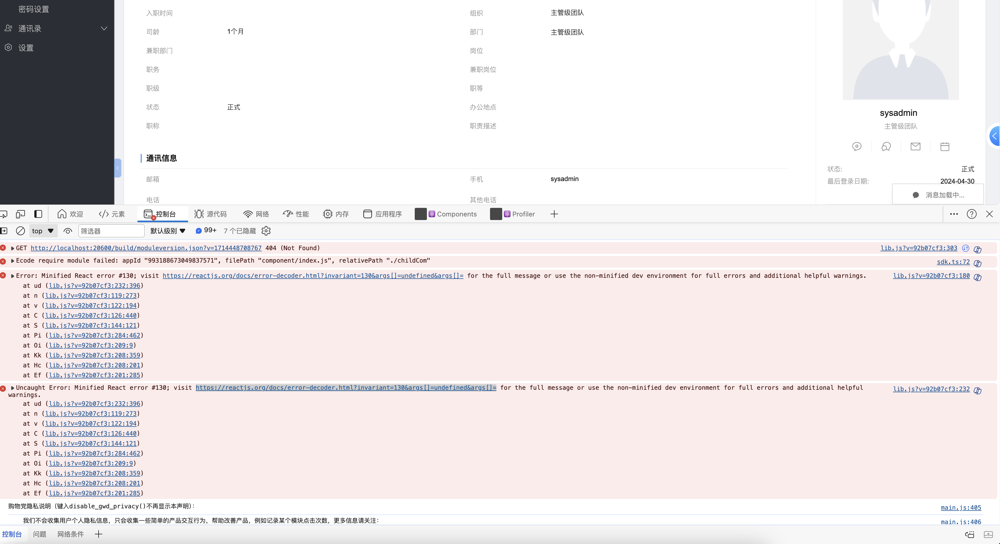


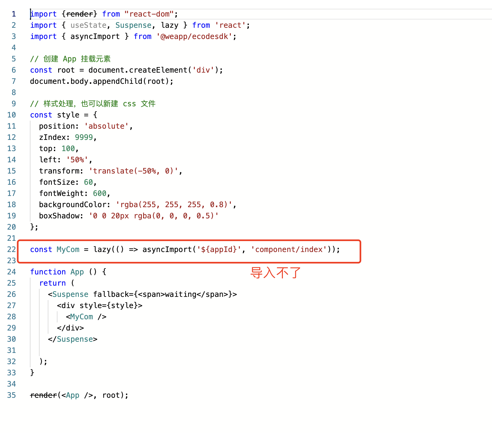


#### 解决方法

再新建一个项目，在里面重写旧项目的代码，发布
