## 相关资料

E10表单后端接口对接，包括表单基础类、枚举、相关接口：[泛微在线文档](https://e-cloudstore.com/doc.html?appId=546e5534977941d1b01a3edaf15c4e34#%E4%BA%8C%E3%80%81E10%E8%A1%A8%E5%8D%95%E5%90%8E%E7%AB%AF%E6%8E%A5%E5%8F%A3%E5%AF%B9%E6%8E%A5)

E10表结构（需登录上海系统）：[配置运维 - 泛微网络 - 高效源于协同](https://www.e-cology.com.cn/cusapp/5409863017715139265/SEARCH/926437111845470235-5409890696220349775?cusMenuId=5409890696220349775&urlPageTitle=RTEw5pWw5o2u5a2X5YW4)

## 开发规范

详见上海技术文档：

[二次开发规范说明文档](https://weapp.eteams.cn/ecode/playground/doc/share/view/974701716410515476#%E4%BA%8C%E3%80%81%E5%90%8E%E7%AB%AF%E4%BA%8C%E6%AC%A1%E5%BC%80%E5%8F%91%E8%A7%84%E8%8C%83)

华南开发规范：

[后端开发环境搭建](http://oahnweaver.com:8001/dist/docs/e10-16.html)

## 开发环境搭建

搭建方式参考华南的教程

E10 开发环境推荐使用 gradle 进行构建

### Gradle 配置

- 多模块

- 依赖公共模块源码

- 合并打包公共模块class文件

根目录 gradle 配置：

```groovy
group 'com.weaver.seconddev'
version '1.0.0'
description 'e10二开'
    
// 应用到所有项目（包括根项目）
allprojects {
    apply plugin: 'java'
    
    java {
        sourceCompatibility = JavaVersion.VERSION_1_8
        targetCompatibility = JavaVersion.VERSION_1_8
    }
    
    compileJava {
        options.encoding = 'UTF-8'
        targetCompatibility = JavaVersion.VERSION_1_8
        sourceCompatibility = JavaVersion.VERSION_1_8
    }
    
    
    repositories {
        maven { url 'https://maven.aliyun.com/repository/public/' }
        mavenLocal()
        mavenCentral()
    }
    
    // 添加 zipJar 任务，生成 build.zip 文件，可以用于上传到二开服务
    tasks.register('zipJar', Zip) {
        dependsOn jar
        archiveFileName = 'build.zip'
        destinationDirectory = layout.buildDirectory.dir("libs")
    
        from jar.archiveFile
    }
    
    jar {
        // 执行 jar 任务之后执行 zipJar 任务，生成 build.zip 文件
        finalizedBy(zipJar)
    }
}
    
// 应用到子模块
subprojects { subproject ->
    // 除 common 模块外，其它子模块都引入 common 模块的源码
    if (subproject.name != 'common') {
        dependencies {
            implementation project(':common')
        }
    
        jar {
            archiveBaseName = "secondev-hnweaver-yll-" + subproject.name
            // 合并打包公共模块的class文件
            from(project(":common").sourceSets.main.output.classesDirs.files)
            // 合并打包公共模块的源码文件
            from(project(":common").sourceSets.main.java)
        }
    }
    
    sourceSets {
        main {
            resources {
                exclude '**'
            }
        }
    }
    
    jar {
        manifest {
            attributes 'weaver-ecode-seconddev-id': 'hnweaver-' + rootProject.version,
                    'Implementation-Version': rootProject.version,
                    'Implementation-Vendor-Id': rootProject.group,
                    'Implementation-Title': rootProject.name
        }
        // 将源码打进jar包
        from(subproject.sourceSets.main.java)
    }
    
    // 添加公共的依赖
    dependencies {
        compileOnly group: 'org.projectlombok', name: 'lombok', version: '1.18.20'
        annotationProcessor 'org.projectlombok:lombok:1.18.20'
        testImplementation("org.junit.jupiter:junit-jupiter-api:5.13.3")
        testRuntimeOnly("org.junit.jupiter:junit-jupiter-engine:5.13.3")
        testImplementation("org.junit.platform:junit-platform-launcher:1.13.3")
        testImplementation("org.mockito:mockito-core:5.18.0")
        testImplementation("org.mockito:mockito-junit-jupiter:5.18.0")
    
        // 添加二开服务拉取的清单依赖
        def includeType = ['**/*.jar', '**/*.class']
        implementation fileTree(dir: rootProject.projectDir.getPath() + '/secDevLib', includes: includeType)
        // 项目二开自定义依赖
        implementation fileTree(dir: subproject.projectDir.getPath() + "/out-dep", includes: includeType)
    
    }
    
    test {
        useJUnitPlatform()
    }
}
    
```

子模块gradle 配置

创建模块时默认生成，无需手动配置

```groovy
group = "com.weaver.seconddev"
version = "1.0.0"
```

项目结构：


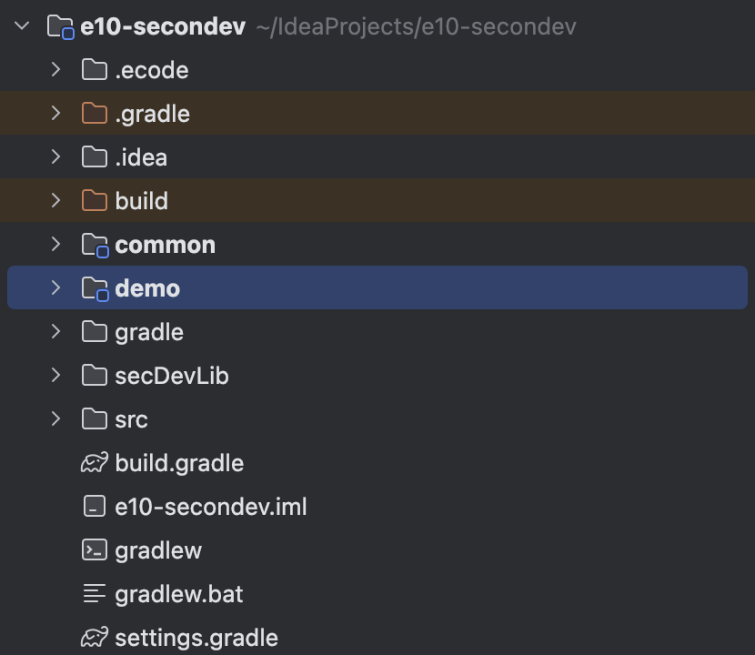


#### 配置说明

##### 源码打到jar包

如果jar包内没有源码则不能部署到服务器上

配置：

```
jar {
    // 将源码打进jar包
    from(subproject.sourceSets.main.java)
}
```

##### 生成build.zip文件

服务器不能直接jar包部署，需要压缩成压缩包，gradle可以配置在执行打包后自定生成zip文件

配置在所有项目中：

```groovy
// 应用到所有项目（包括根项目）
allprojects {
    // 添加 zipJar 任务，生成 build.zip 文件，可以用于上传到二开服务
    tasks.register('zipJar', Zip) {
        dependsOn jar
        archiveFileName = 'build.zip'
        destinationDirectory = layout.buildDirectory.dir("libs")
    
        from jar.archiveFile
    }
    
    jar {
        // 执行 jar 任务之后执行 zipJar 任务，生成 build.zip 文件
        finalizedBy(zipJar)
    }
}
```

##### 模块依赖其它模块，合并打包

例如 demo 模块要依赖 weaverOpenApi 模块的源码，需要将  weaverOpenApi 模块的源码和class文件一起打包到当前模块jar包中

```
jar {
    // 合并 weaverOpenApi 的class文件和源码到当前jar包
    from(project(":weaverOpenApi").sourceSets.main.java)
    from(project(":weaverOpenApi").sourceSets.main.output.classesDirs.files)
}
    
dependencies {
    // 如果不添加此处，执行 jar 命令时 weaverOpenApi 模块将不会被编译
    implementation project(':weaverOpenApi')
}
    
```

需要注意，为了保证合并打包的其它模块在执行本模块的 jar 命令时其它模块能够编译，`dependencies`中需添加对其它模块的依赖。

### Mockito + Junit5 测试

添加依赖

```
testImplementation("org.junit.jupiter:junit-jupiter-api:5.13.3")
testRuntimeOnly("org.junit.jupiter:junit-jupiter-engine:5.13.3")
testImplementation("org.junit.platform:junit-platform-launcher:1.13.3")
testImplementation("org.mockito:mockito-core:5.18.0")
testImplementation("org.mockito:mockito-junit-jupiter:5.18.0")
```

启用Junit5

gradle 配置：

```
test {
    useJUnitPlatform()
}
```

为了避免依赖冲突，需要删除旧的二开依赖包

在 secDebLib 目录中删除：

- mockito 依赖

- byte-buddy 依赖

#### 调整 gradle 虚拟机内存

测试可能出现内存不足，可以提高虚拟机内存

创建 gradle.properties 配置文件，添加内容：

```
org.gradle.jvmargs=-Xmx2048m -Dfile.encoding=UTF-8
```

#### 可选

将 gradle 升级到 8.8

#### 参考

[Using JUnit 5 with Gradle | Baeldung](https://www.baeldung.com/junit-5-gradle)

## 项目结构规范建议

- 可以创建公共模块，其它模块都依赖于公共模块，但公共模块不允许依赖第三方库，否则其它项目部署开发包时都需要部署第三方依赖包

- 可以创建需要依赖第三方依赖包的公共模块，其它模块按需引入

- 一个客户项目一个模块，不允许一个模块多个项目代码一起，不利于打包部署

- 每个客户项目模块都需要有说明文档，说明开发内容、需要怎么配置等

- 每个客户项目模块，如果需要在二开服务配置文件上配置的，需要在模块创建配置文件，测试环境和生产环境分开创建


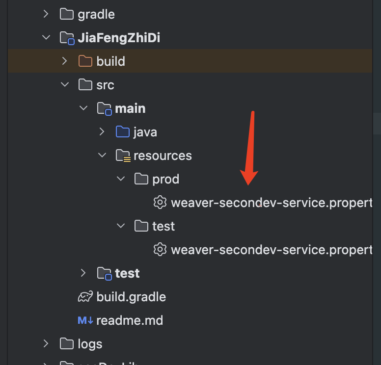


## 项目模板

链接:[https://pan.baidu.com/s/1VtTO7IqFsZXYZEN02sF1QQ?pwd=j1hg](https://pan.baidu.com/s/1VtTO7IqFsZXYZEN02sF1QQ?pwd=j1hg)提取码: j1hg

## 根据接口路径找到后端文件和获取表名

上海没有给出e10的表结构，只能依靠代码去摸索

### 场景

例如需要知道流程基本信息是在哪个表里

### 表名获取方法

#### 打包class文件

将e10部署路径下的class文件夹内的com文件夹打包成jar包，放到开发环境依赖中，该jar包内包含了e10的后端代码，就能方便的根据接口路径在jar包中查找接口对应的文件

#### 根据接口路径查找后端文件

比如需要查找 /api/bs/workflow/pathdef/frame/getPathFrameInfo （流程基本信息）接口的文件，就可以根据接口路径去查找

要获取到相关表名，需要根据代码一直找到所调用的`mapper.xml`文件


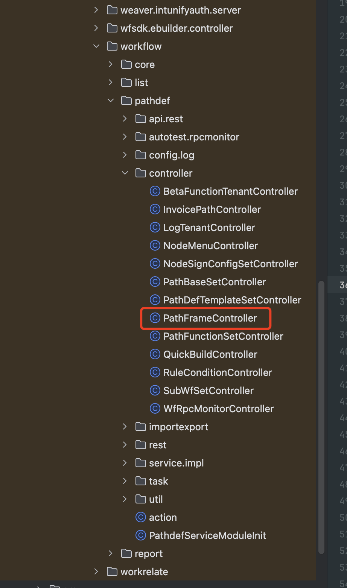


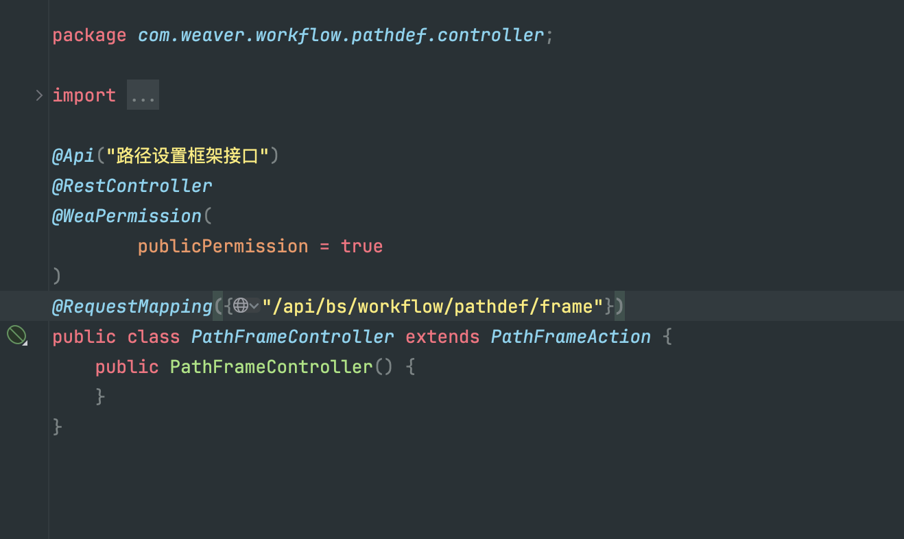


或者使用我写的一个工具类，可以方便得根据接口路径查找到对应的文件

```java
package com.weaver.seconddev.hnweaver.util;
    
import org.reflections.Reflections;
import org.springframework.web.bind.annotation.*;
    
import java.lang.reflect.Method;
import java.util.ArrayList;
import java.util.Arrays;
import java.util.List;
import java.util.Set;
    
/**
 * @author 姚礼林
 * @desc todo
 * @date 2025/7/23
 **/
public class FindApiFileUtil {
    
    public static String  findApiFile(List<Class<?>> classes, String apiPath) {
        for (Class<?> c : classes) {
            RequestMapping path = c.getAnnotation(RequestMapping.class);
            // 该类的Path注解是否包含指定路径
            if (Arrays.stream(path.value()).anyMatch(i -> i.contains(apiPath))) {
                // 获取该类的所有方法
                Method[] methods = c.getMethods();
                for (Method m : methods) {
                    // 该方法是否使用 GetMapping 注解，并且该注解是否包含指定接口路径
                    if (m.isAnnotationPresent(GetMapping.class)) {
                        GetMapping methodPath = m.getAnnotation(GetMapping.class);
                        if ( Arrays.stream(methodPath.value()).anyMatch(i -> i.contains(apiPath))) {
                            return c.getName();
                        }
                    } else if (m.isAnnotationPresent(PostMapping.class)) {
                        PostMapping methodPath = m.getAnnotation(PostMapping.class);
                        if ( Arrays.stream(methodPath.value()).anyMatch(i -> i.contains(apiPath))) {
                            return c.getName();
                        }
                    } else if (m.isAnnotationPresent(PutMapping.class)) {
                        PutMapping methodPath = m.getAnnotation(PutMapping.class);
                        if ( Arrays.stream(methodPath.value()).anyMatch(i -> i.contains(apiPath))) {
                            return c.getName();
                        }
                    } else if (m.isAnnotationPresent(DeleteMapping.class)) {
                        DeleteMapping methodPath = m.getAnnotation(DeleteMapping.class);
                        if ( Arrays.stream(methodPath.value()).anyMatch(i -> i.contains(apiPath))) {
                            return c.getName();
                        }
                    } else if (m.isAnnotationPresent(RequestMapping.class)) {
                        RequestMapping methodPath = m.getAnnotation(RequestMapping.class);
                        if ( Arrays.stream(methodPath.value()).anyMatch(i -> i.contains(apiPath))) {
                            return c.getName();
                        }
                    }
                }
            }
        }
        return "";
    }
    
    public static List<Class<?>> findApiClasses(String packagePrefix, String apiPath) {
        List<Class<?>> result = new ArrayList<>();
        // 可以在构造方法加上包路径，这样就会扫描指定包下的类，如 com.api ,如不指定包名则会扫描所有类，这样会比较慢
        Reflections f = new Reflections(packagePrefix);
        // 找到所有使用Path注解的类
        Set<Class<?>> set = f.getTypesAnnotatedWith(RequestMapping.class);
        for (Class<?> c : set) {
            RequestMapping path = c.getAnnotation(RequestMapping.class);
            // 该类的Path注解是否包含指定路径
            if (path != null && Arrays.stream(path.value()).anyMatch(i -> i.contains(apiPath))) {
                result.add(c);
            }
        }
        return result;
    }
}
    
```

使用方法：

```
List<Class<?>> apiClasses = FindApiFileUtil.findApiClasses("com.weaver",
        "bs/workflow/pathdef/frame");
System.out.println("找到类路径：");
apiClasses.forEach(c -> System.out.println(c.getName()));
String apiFilePath = FindApiFileUtil.findApiFile(apiClasses, "getPathFrameInfo");
System.out.println("结果："+apiFilePath);
```

## 动作流

### Action

#### 输出参数的取值

输出参数取的是`WeaResult`类中的 data 属性中的数据，而不是`WeaResult`中的属性。


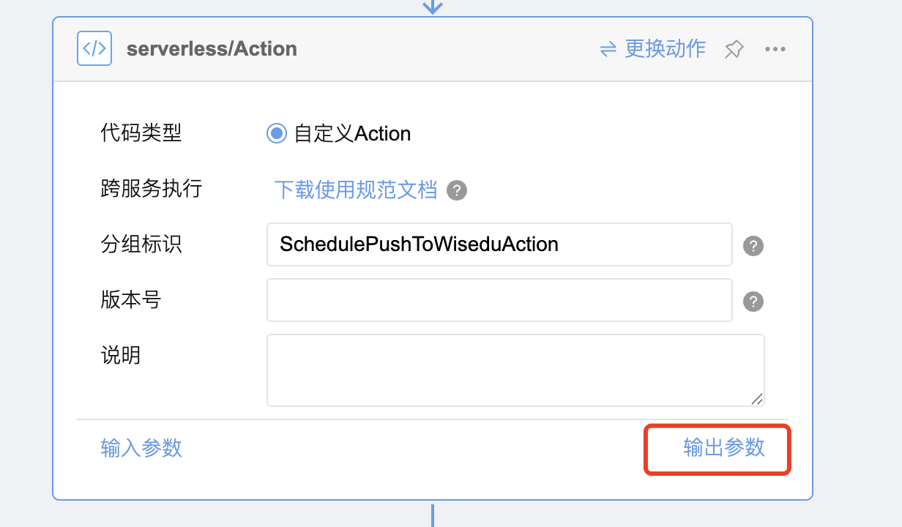


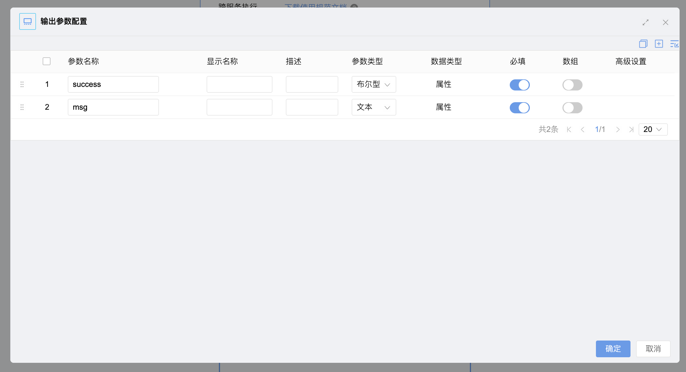


取 Action 类中返回`WeaResult`中的 data，也就是 Map。

```java
@Override
public WeaResult<Map<String, Object>> execute(Map<String, Object> params) {
}
```

#### 异常处理，更直观的错误显示

Action 内如果不进行异常处理，则异常将不会打印在二开错误日志文件中，而是打印在 sys.err 日志文件，在动作流中的错误显示也相当不直观，不知道错误的原因是什么，糟糕的是，当 Action 发生异常，动作流中就无法查看输入和输出参数。

我还建议，在其它顶层执行类中，如 Action、计划任务，都手动捕获异常，而不是向上抛出，这有利于错误排查。

好处：

- 将异常打印在二开日志文件

- 动作流中的错误显示更加直观

- 可在动作流中显示输入和输出参数

示例：

```java
public class SchedulePushToWiseduAction implements EsbServerlessRpcRemoteInterface {
    private final ScheduleCreateToWiseduService createToWiseduService;
    private final ScheduleUpdateToWiseduService updateToWiseduService;
    private final ScheduleDeleteToWiseduService deleteToWiseduService;
    private final HrmCommonEmployeeService employeeService;
    
    @Override
    public WeaResult<Map<String, Object>> execute(Map<String, Object> params) {
        log.info("执行日程推送到金智，传入参数：{}", JSON.toJSONString(params));
        try {
            // 业务代码
        } catch (Exception e) {
            // 处理异常
            log.error("执行发生异常", e);
            // 返回异常信息，在动作流中可查看异常栈
            return WeaResult.fail("执行失败:" + e.getMessage()+";\n stacks:"+
                    Arrays.stream(e.getStackTrace()).map(StackTraceElement::toString).
                            collect(Collectors.joining("\n")));
        }
    }
}
```

手动处理异常前：


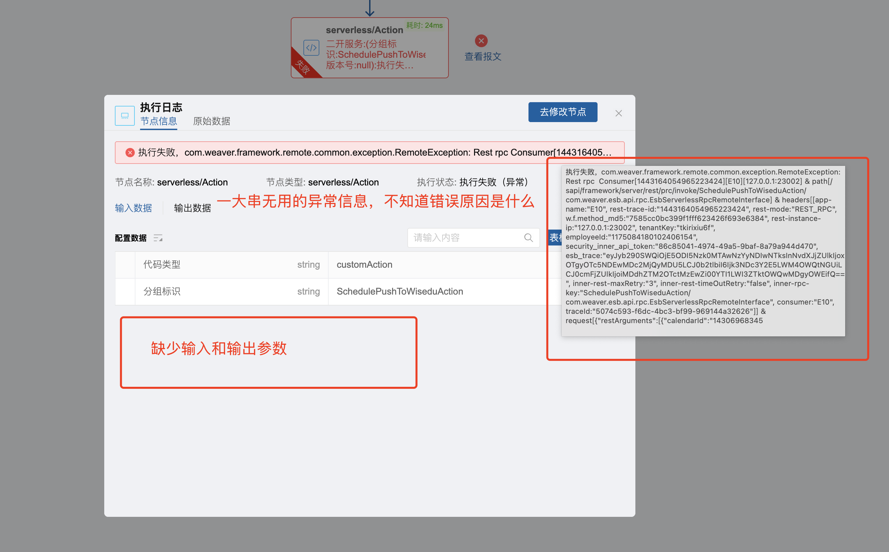


手动处理异常后：


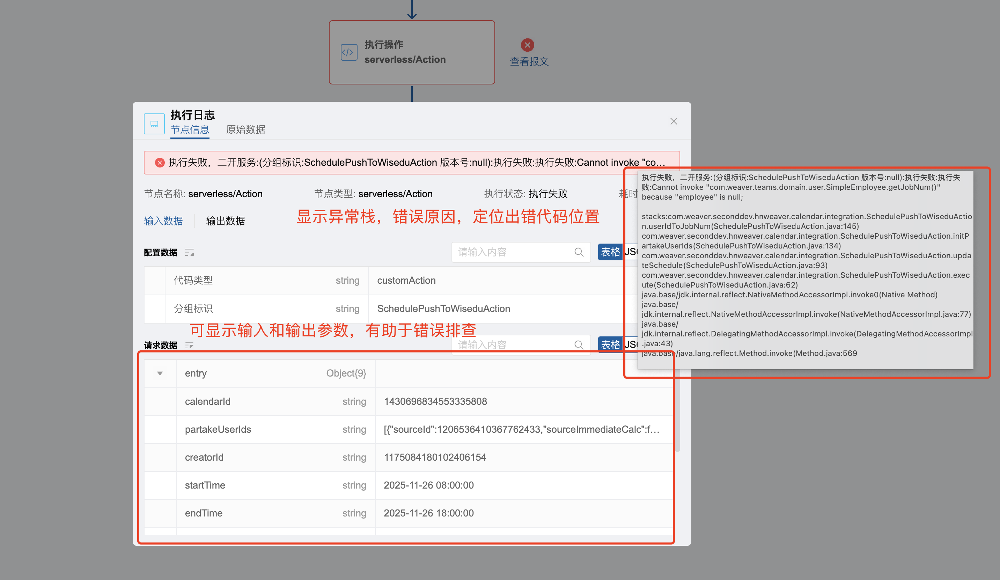


### 动作流参数

#### 获取List参数

获取 list 参数可以将参数配置为数组 json，数组下再添加节点参数，或者参数类型配置为文本，传入的将会是一个数组 json，在后端进行解析。如果参数类型为数组 json ，不能没有子节点，否则不能正确传入参数。


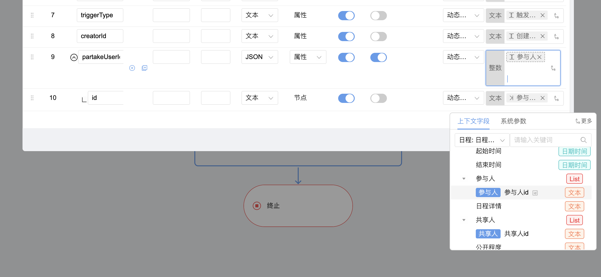


## 日志

### 查看日志

有时异常不一定会输出到 secondev-err 日志，可以在 sys-err 日志查看报错，如果是调用 rpc 接口，可以在 sys-rest-rpc-consumer 日志查看

### 写入日志

在类上使用 @Slf4j 注解

使用如下:, name 将会替换 {}

```
log.info("hello,=> {}",name);
```

注意：日志级别默认为 error ，需要手动设置日志级别

### 设置日志级别

#### 浏览器执行：

(可能没有用)

二开服务地址/sapi/framework/setLoggingLevel?packagePath=com.weaver.seconddev\&loggingLevel=debug

链接前面的服务器地址是二开服务部署的访问地址，不是OA的地址。

#### 编辑配置文件

修改 weaver-secondev-service\webapps\ROOT\WEB-INF\classes\weaver\config\config-center\weaver-secondev-service.properties ，添加配置：

`logging.level.com.weaver.seconddev=info`

com.weaver.seconddev包下面的日志级别都是info

## 读取配置文件

默认读 weaver-secondev-service\webapps\ROOT\WEB-INF\classes\weaver\config\config-center\weaver-secondev-service.properties 文件

例如读取 spring.datasource.username 属性

```java
public class ApiDemoController {
    @Value("${spring.datasource.username}")
    private String name;
}
```

配置文件属性类

```java
@Data
@Configuration
@RefreshScope
public class TwoHaoHrProperty {
    @Value("${2HaoHr.appId}")
    private String appId;
    @Value("${2HaoHr.appKey}")
    private String appKey;
    @Value("${oaAddress}")
    private String oaAddress;
    @Value("${2HaoHr.ssoUrl:https://h5.2haohr.com/browser/authorize.html}")
    private String ssoUrl;
}
```

注意：如果使用`@ConfigurationProperties`会读取不到配置文件

#### 读取其它配置文件

注意：如果配置文件不存在则服务会起不来

```java
@PropertySource("classpath:/weaver/config/config-center/seconddev-demo-openapi.properties")
@Configuration
@Data
public class DemoProperties {
    @Value("${openapi.serverAddress}")
    private String serverAddress;
    @Value("${openapi.cropid}")
    private String cropid;
    @Value("${openapi.appKey}")
    private String appKey;
    @Value("${openapi.appSecret}")
    private String appSecret;
}
```

## 使用缓存

使用 BaseCache 类，在类中自动注入

```java
@RestController
@RequestMapping({"/api/secondev/workflow/demo","/papi/secondev/workflow/demo"})
@Slf4j
public class ApiDemoController {
    
    // 默认读weaver-secondev-service\webapps\ROOT\WEB-INF\classes\weaver\config\config-center\weaver-secondev-service.properties文件
    @Value("${spring.datasource.username}")
    private String name;
    @Autowired
    private BaseCache baseCache;
    
    @GetMapping("/hello")
    public String hello() {
        log.info("hello,=> {}",name);
        // 写入缓存并设置时间
        baseCache.set("dev", "age", 18,60*60);
        log.info("age = {}", baseCache.get("dev", "age"));
        baseCache.del("dev", "age");
        log.info("age = {}", baseCache.get("dev", "age"));
        return "hello world";
    }
}
```

## 操作数据库

### DataSetService 执行sql

使用 DataSetService 类，自动注入

需要传入 GroupId ，这个可以通过这个接口查到每个模块的 GroupId ：/api/datasource/ds/group?sourceType=LOGIC

```java
package com.weaver.seconddev.demo.api;
    
import cn.hutool.core.codec.Base64;
import com.weaver.common.cache.base.BaseCache;
import com.weaver.ebuilder.datasource.api.entity.ExecuteSqlEntity;
import com.weaver.ebuilder.datasource.api.enums.SourceType;
import com.weaver.ebuilder.datasource.api.service.DataSetService;
import com.weaver.framework.rpc.annotation.RpcReference;
import com.weaver.workflow.core.api.rest.form.WfcFormRest;
import lombok.extern.slf4j.Slf4j;
import org.springframework.beans.factory.annotation.Autowired;
import org.springframework.beans.factory.annotation.Value;
import org.springframework.web.bind.annotation.GetMapping;
import org.springframework.web.bind.annotation.RequestMapping;
import org.springframework.web.bind.annotation.RestController;
    
import java.util.HashMap;
import java.util.LinkedHashMap;
import java.util.List;
import java.util.Map;
    
/**
 * @author 姚礼林
 * @desc TODO
 * @date 2024/4/1
 */
@RestController
@RequestMapping({"/api/secondev/workflow/demo","/papi/secondev/workflow/demo"})
@Slf4j
public class ApiDemoController {
    
    @Autowired
    DataSetService dataSetService;
    
    @GetMapping("/hello")
    public String hello() {
        ExecuteSqlEntity sqlEntity = new ExecuteSqlEntity();
        String sql = "select person_name,age from uf_personrecord";
        sqlEntity.setSql(Base64.encode(sql));
        sqlEntity.setGroupId("weaver-ebuilder-form-service");
        sqlEntity.setSourceType(SourceType.LOGIC);
        Map<String, Object> result = dataSetService.executeSql(sqlEntity);
        // records 可能为null，注意判断
        List<HashMap<String ,Object>> records = (List<HashMap<String, Object>>) result.get("records");
        for (HashMap<String, Object> row : records) {
            row.forEach((k,v) -> log.info("column:"+k+",value:"+v));
        }
        return "hello world";
    }
}
    
```

executeSql() 返回的结果如下


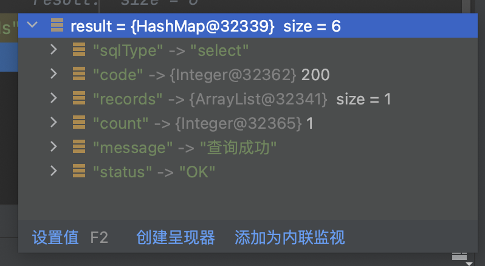


返回结果示例

```json
{
 "sqlType": "select",
 "status": "OK",
 "message": "查询成功/执行成功",
 "records": [
		{
			"id": 643834048850100234,
			"uuid": "526b4d21d0a045e3b40134b28f159335",
			"log_date": 1633104296000,
			"device": "",
			"log_operator": -1,
			"operatorname": "",
			"tenant_key": "",
			"targetid": 643834048850100233,
			"targetname": "按月 每2月 2,3天",
			"modulename": "meeting",
			"functionname": "detail_",
			"interfacename": "operateMeetingByType",
			"requesturl": "非http请求",
			"requesturi": "",
			"operatetype": "ADD",
			"operatetypename": "1624",
			"operatedesc": "",
			"params": "",
			"belongmainid": "",
			"clientip": "",
			"groupid": "",
			"groupnamelabel": "",
			"redoservice": "",
			"redocontext": "",
			"cancelservice": "",
			"cancelcontext": "",
			"create_time": 1633104295000,
			"update_time": 1633104295000,
			"creator": -1,
			"delete_type": 0,
			"totalruntime": 28,
			"mainruntime": 15,
			"log_result": "",
			"fromterminal": "",
			"resultdesc": "",
			"old_content": "",
			"link_type": "",
			"link_id": 0,
			"old_link_id": 0,
			"customInfo": ""
		}
 ]
}
```

### sapi 接口执行sql 支持预编译 250101基线--250401基线

接口地址：/sapi/secondev/ds/executeSqlAll

预编译参数示例

SqlParamType 指定了sql字段的类型，实际上没有和字段类型对应上也能执行，比如 SqlParamType 为 String ,但字段类型为 Int

dataSetUtil 为上海写的工具类，代码请看官方技术文档（参考链接中）

```sql
//获取预编译参数数据
        List<SqlParamEntity> logicSqlParams = new ArrayList<>();
        SqlParamEntity sqlParam3 = new SqlParamEntity();
        sqlParam3.setParamType(SqlParamType.LONG);
        sqlParam3.setValue("973258354118836227");
        logicSqlParams.add(sqlParam3);
    
    
        SqlParamEntity sqlParam2 = new SqlParamEntity();
        sqlParam2.setParamType(SqlParamType.INTEGER);
        sqlParam2.setValue("0");
        logicSqlParams.add(sqlParam2);
    
        SqlParamEntity sqlParam1 = new SqlParamEntity();
        sqlParam1.setParamType(SqlParamType.VARCHAR);
        sqlParam1.setValue("thsv5s4n2c");
        logicSqlParams.add(sqlParam1);
    
        //预编译LOGIC执行Sql
        Map<String, Object> execute04 = dataSetUtil.executeSqlWithTrans(SourceType.LOGIC, "weaver-workflow-list-service",
                "select * from wfc_testinfo_log where id = ? and delete_type = ? and tenant_key = ?",
                logicSqlParams, "", false, false, false);
        res.put("预编译方式LOGIC执行sql", execute04);
```

### 自定义Sql工具类

我写了一个工具类，可以简化 sql 执行，就像e9 一样

### 注意事项

#### 查询结果字段名可能为大写

即使查询语句的字段名为小写，返回结果中的字段名可能为大写，也有可能查询语句中的字段名为大写，但返回结果中的字段名为小写，这个需要注意。

如查询语句为：

```sql
SELECT requestname FROM wfc_requestbase WHERE requestid=?
```

查询结果字段名可能为：REQUESTNAME

建议在获取 sql 结果时，判断字段名是大写还是小写，可使用以下代码来判断：

```java
/**
 * 忽略大小写的获取 record 中的字段值，如果获取不到则返回 null
 *
 * @param record    sql 查询结果
 * @param fieldName 字段名
 * @return 字段值，如果获取不到则返回 null
 */
@Nullable
public static String getFieldValueIgnoreCase(Map<String, Object> record, String fieldName) {
    if (record.containsKey(fieldName)) {
        return (String) record.get(fieldName);
    }
    if (record.containsKey(fieldName.toUpperCase())) {
        return (String) record.get(fieldName.toUpperCase());
    }
    if (record.containsKey(fieldName.toLowerCase())) {
        return (String) record.get(fieldName.toLowerCase());
    }
    return null;
}
```

### java参考

[技术文档-二开执行sql-sapi接口文档](https://weapp.eteams.cn/build/techdoc/wdoc/index.html#/public/doc/8bcf1e40-a333-401d-a5c0-20b375d7bc84)

[e10平台定制开发指引](https://www.e-cology.com.cn/ecode/playground/doc/share/view/916733818655342593#250101%E5%9F%BA%E7%BA%BF--250401%E5%9F%BA%E7%BA%BF)

## 调用RPC接口

示例：调用流程rpc接口

在类中自动注入 WfcFormRest

```java
@RpcReference(group = "workflow")
WfcFormRest wfcFormRest;
```

直接调用类的方法即可

```
wfcFormRest.getFormByRelateFormId();
```

## 标准类和接口

产品公开的类和接口

### 根据文件id获取实体文件（下载）

注入 FileDownloadService

```java
@Autowired
FileDownloadService downloadService;
    
```

获取文件流

```
FileData fileData = downloadService.downloadFile(1213L);
fileData.getInputStream();
```

### 文件上传

#### 使用 RPC 上传


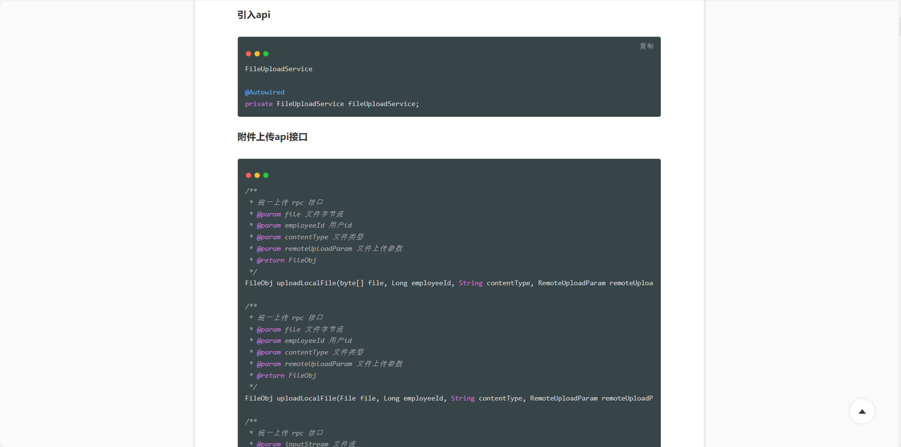


#### 使用 Open API 接口上传


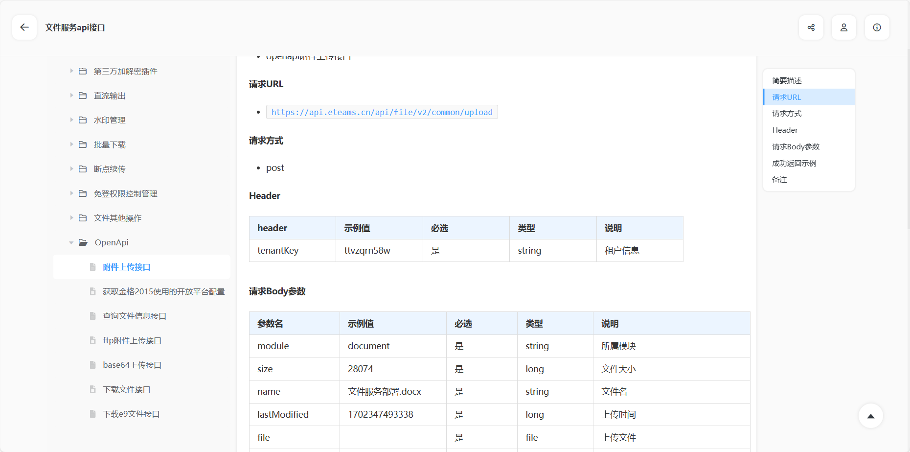


### FileUtil 标准工具类

该工具类提供了一些实用的方法，比如下载文件、获取临时目录

com.weaver.ecode.module.serverless.common.utils.FileUtil

#### 获取临时目录

该目录一般为 /weaver-secondev-service/temp/

```
System.getProperty("java.io.tmpdir") + "/";
```

#### 下载文件

downloadFile 方法可以在接口中提供文件下载功能

### 标准公共类

<span style="color:red">微服务下无法调用，只能单体使用，为了确保通用性谨慎使用，建议使用sql查询、调用RPC接口或调用open api接口</span>

#### 获取用户信息 HrmCommonEmployeeService

该类在微服务下可正常调用

注意用户表的id和user_id字段不是同一个值，前端调用系统标准接口参数中的用户id为用户表的id字段

使用 HrmCommonEmployeeService 类可以获取到用户信息

获取用户信息：

```
// 获取用户对象
SimpleEmployee employee = employeeService.getById(Long.parseLong(userId));
```

根据用户id和租户key获取用户信息：

```
User currentUser = UserContext.getCurrentUser();
List<SimpleEmployee> employee = employeeService
        .getEmployeeByUserIds(CollUtil.toList(currentUser.getUserId()), currentUser.getTenantKey());
```

参考文档：

[技术文档-人员全信息查询接口](https://weapp.eteams.cn/build/techdoc/wdoc/index.html#/public/repository/91f5067f-775e-48f4-93a2-ce84ca0b9c2e/doc/192354133733277696)

#### 获取表单信息

标准类：FormService formService;

注意：<span style="color:red">表单id有 form_id 和 id ,这两个不一样，一般用 id，form_id 对应的是 Form 对象的 getId() ,id 对应的是 Form 对象的 getTargetId()</span>

根据表单名称查询表单信息

```
List<Form> forms = formService.listFormByNameAndTenantKey("主表字段生成多明细列测试", "thhtqh9ryi");
```

返回信息：

```json
[{"allcount":0,"autoSave":false,"biaogeRecommend":false,"collectStatus":"disable","convertType":0,"copyCount":0,"createTime":1753675095000,"creator":7515108099660413316,"customTitle":false,"customTitleEdit":false,"delete":false,"describe":"","dfaption":0,"exportCount":0,"fieldauthcount":0,"fillCount":0,"headOrder":0,"id":1161681610339917828,"isAdvance":false,"module":"workflow","multi":true,"name":"主表字段生成多明细列测试","needCount":false,"newFillCount":0,"newLayout":false,"orgId":0,"ownership":"company","physicalTable":true,"recommend":false,"relateFlow":false,"reviewCount":0,"selfcount":0,"sort":32,"status":"enable","tenantKey":"thhtqh9ryi","usecount":0,"viewCount":0}]
```

根据表单id获取明细表

```
List<SubFormDto> subForms = subFormService.getSubFormsByFormId(forms.get(0).getId(), 0);
```

返回信息：

```json
[{"columnTypeSwitch":false,"dataCount":0,"dataKey":"ft_1161681_mxb1","deleteType":0,"describe":"","formId":"1161681610339917828","otherProperties":"{\"columnTypeSwitch\":false,\"componentKey\":\"DataTable\",\"dataCount\":0,\"dataKey\":\"ft_1161681_mxb1\",\"describe\":\"\",\"formId\":\"1161681610339917828\",\"groupId\":\"-1\",\"order\":0.0,\"placeholder\":\"\",\"showOrder\":1.0,\"subFormId\":\"1161681897893011460\",\"tableName\":\"ft_1161681_mxb1\",\"title\":\"明细表1\",\"type\":\"DetailTable\"}","placeholder":"","showOrder":1.0,"subFormId":"1161681897893011460","tableName":"ft_1161681_mxb1","title":"明细表1"}]
```

#### 获取表单字段信息

标准类：FormFieldService formFieldService;

根据表单id获取主表字段：

```
List<FormField> mainFields = formFieldService.getByForm(1161681610339917828L, UserContext.getCurrentUser());
    
```

根据明细表id获取明细表字段：

```
List<FormField> subFormFields = formFieldService.getBySubFormId(1161681897893011460L,
        UserContext.getCurrentUser());
```

#### 查询字段下拉框选项

标准类：FieldOptionService

可以查询字段的选项，获取选项名称

使用例子：

```
List<FormField> formFields = form.getFormFields();
for (FormField formField : formFields) {
    if (fieldName.equals(formField.getDataKey())) {
        List<FieldOption> options = optionService.getByFieldId(formField.getId(),
                UserContext.getCurrentUser());
        Optional<FieldOption> find = options.stream()
                .filter(i -> i.getValueKey().equals(fieldValue)).findFirst();
        if (find.isPresent()) {
            return find.get().getName();
        }
    }
}
```

#### 获取当前用户

<span style="color:red">注意：有 getUserId() 和 getEmployeeId()，两个是不一样的，getEmployeeId() 获取的是数据库表的数据id，getUserId() 获取的是数据库表的 user_id 字段，一般用 getEmployeeId()</span>

<span style="color:red">如果是系统远程调用接口可能获取不到当前用户</span>

```
UserContext.getCurrentUser();
```

### 生成流程表单pdf、html

文档：[流程存文档-二开口子](https://weapp.eteams.cn/ecode/playground/doc/share/view/969524129164623912#1.1%E3%80%81%E6%A0%B9%E6%8D%AE%E6%B5%81%E7%A8%8BrequestId%E7%94%9F%E6%88%90%E6%B5%81%E7%A8%8B%E8%AF%A6%E6%83%85PDF%E3%80%81Html%E9%99%84%E4%BB%B6)

### WPS文件格式转换

示例：


> 附件: DumpDocumentAction.java8.44KB


标准类：OfficialFileConvertService fileConvertService;

```
private String convertFile(String targetFormat, long fileId) {
    FileCapabilityParam param = new FileCapabilityParam();
    param.setOption("CONVERT");
    param.setModule("doc");
    param.setUserId(UserContext.getCurrentEmployeeId().toString());
    FileCovertParam fileCovertParam = new FileCovertParam();
    fileCovertParam.setTargetType(targetFormat);
    param.setFileCovertParam(fileCovertParam);
    param.setFileId(fileId);
    
    WeaResult<FileCapabilityResult> result = fileConvertService.capabilityFile(param);
    if (result.isFail()) {
        throw new FileConvertException("文件转换失败，错误信息：" + result.getMsg());
    }
    log.info("文件转换成功");
    FileCapabilityResult data = result.getData();
    return data.getTargetFileId();
}
```

### E-builder 表单数据修改

不要使用执行 sql 方式去修改，有一些标准的表单字段值需要插入，会比较麻烦，需要通过标准接口进行修改。

修改方式：[技术文档-数据操作相关接口](https://weapp.eteams.cn/build/techdoc/wdoc/index.html#/public/doc/c98b2645-ea0a-465e-a00c-19b36aa50c4b)

#### RPC 方式修改报错：java.lang.NullPointerException: Cannot invoke "java.lang.Comparable.compareTo(Object)" because the return value of "java.util.function.Function.apply(Object)" is null

执行`remoteSimpleDataService.saveFormData(ebDataChangeReqDto);`时出现异常

异常信息：

```javascript
msg==> [java.lang.NullPointerException: Cannot invoke "java.lang.Comparable.compareTo(Object)" because the return value of "java.util.function.Function.apply(Object)" is null] com.weaver.framework.remote.common.exception.RemoteException: java.lang.NullPointerException: Cannot invoke "java.lang.Comparable.compareTo(Object)" because the return value of "java.util.function.Function.apply(Object)" is null at com.weaver.framework.remote.rest.rpc.DefaultRestRpcInvoker.invokeMethod(DefaultRestRpcInvoker.java:73) ~[weaver-framework-remoting-starter-2.53.0.RELEASE.jar:2.53.0.RELEASE] at com.weaver.framework.remote.rest.rpc.DefaultRestRpcInvoker.invoke(DefaultRestRpcInvoker.java:46) ~[weaver-framework-remoting-starter-2.53.0.RELEASE.jar:2.53.0.RELEASE] at com.weaver.framework.remote.rest.rpc.DefaultRestRpcInvoker.invoke(DefaultRestRpcInvoker.java:63) ~[weaver-framework-remoting-starter-2.53.0.RELEASE.jar:2.53.0.RELEASE] at jdk.internal.reflect.NativeMethodAccessorImpl.invoke0(Native Method) ~[?:?] at jdk.internal.reflect.NativeMethodAccessorImpl.invoke(NativeMethodAccessorImpl.java:77) ~[?:?]
......
```

RPC 方式支持不够好，该用 open API 方式修改表单数据

## 流程

## 数据库表结构

E10 表结构：[https://www.e-cology.com.cn/cusapp/5409863017715139265/SEARCH/926437111845470235-5409890696220349775?cusMenuId=5409890696220349775&urlPageTitle=RTEw5pWw5o2u5a2X5YW4](https://www.e-cology.com.cn/cusapp/5409863017715139265/SEARCH/926437111845470235-5409890696220349775?cusMenuId=5409890696220349775&urlPageTitle=RTEw5pWw5o2u5a2X5YW4)

### 表单

#### form_field - 查询流程表单字段信息 字段类型

表名：form_field

字段名：

title:字段中文名

data_key:字段数据库名

component_key : 字段组件类型，比如选择框、人力资源浏览框

data_type : 数据类型，比如string、select

form_id : 表单id

SUB_FORM_ID: 明细表单id，为空则为主表字段

##### 示例

查询表单主表字段

```
select
  f.id,
  f.data_key,
  f.title,
  f.SUB_FORM_ID,
  f.component_key
from
  form_field f
where 
	form_id = 1163240945436205059
```

查询流程主表字段

```
select
  f.id,
  f.data_key,
  f.title,
  f.SUB_FORM_ID,
  f.component_key
from
  form_field f
  join wfp_relateform w on f.form_id = w.relatekey
where
  w.workflowid = 1151612316977602642
```

#### field_option - 查询字段选项名称

```sql
SELECT value_key, name FROM field_option WHERE field_id = '字段ID'
```

### 流程

#### wfp_relateform - 查询流程关联表单

表名：wfp_relateform

详见：FormRelateDao_oracle.xml

内部接口：com.weaver.workflow.engine.formdef.service.FormRelateService.getFirstRelateForm

```sql
<select id="getRelateFormByWorkflowId" resultMap="getRelateFormResultMap" databaseId="oracle"> 
     SELECT * FROM (SELECT TMP.*,ROWNUM ROW_ID FROM (select id, 
    create_time, 
    update_time, 
    creator, 
    delete_type, 
    tenant_key, 
    workflowid, 
    relatetype, 
    relatekey 
    from wfp_relateform
    where workflowid = #{workflowId} 
    and tenant_key = #{tenantKey} 
    <if test="deleteType!=-1"> 
        and delete_type = #{deleteType} 
    </if>
    and delete_type != 9
    ) TMP WHERE ROWNUM &lt;=1)
</select> 
```

#### form_field - 查询流程表单字段

```sql
select f.id,f.data_key,f.title,f.SUB_FORM_ID,component_key from form_field f
join wfp_relateform w on f.form_id = w.relatekey 
where w.workflowid=1151612316977602642
```

#### wfc_requestbase - 流程请求信息

表名：wfc_requestbase

#### wfc_form_data - 请求流程与表数据对应表

可以根据请求id查询流程表数据id，sql 示例：

```sql
SELECT dataid,requestid FROM wfc_form_data WHERE requestid = '您的流程请求ID';
```

## 档案集成 ecode 自定义归档

### 说明

档案集成归档方式可以选择ecode自定义归档，文件打包、档案推送由开发实现


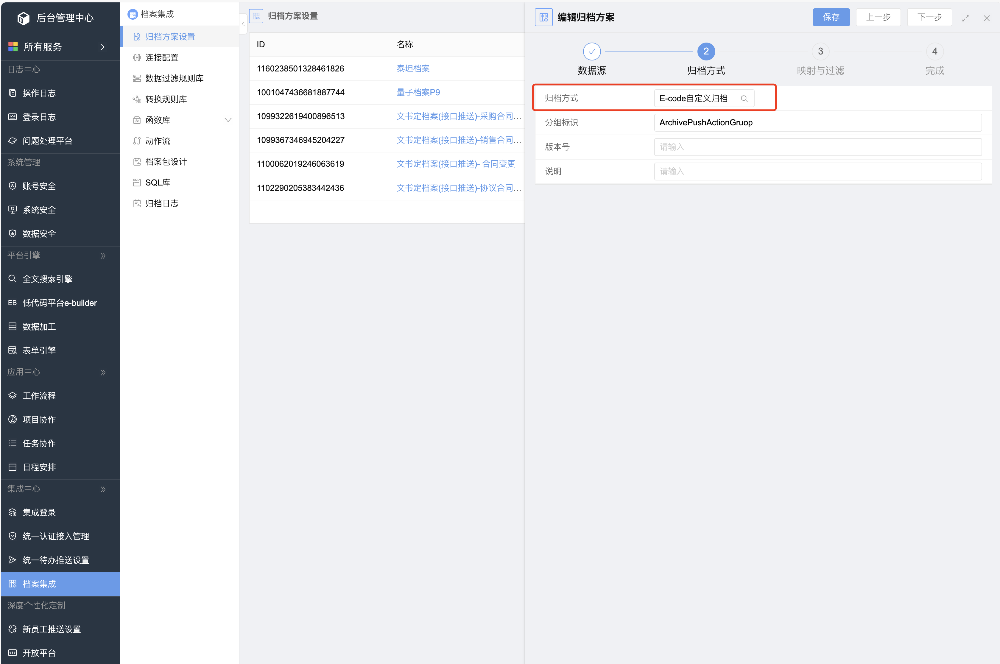


### 如何使用

后端需要实现 com.weaver.intcenter.ias.core.api.hook.EcodeInterface 方法

示例

```java
package com.weaver.seconddev.hnweaver.integration.archive;
    
import com.alibaba.fastjson.JSON;
import com.weaver.common.base.entity.result.WeaResult;
import com.weaver.intcenter.ias.core.api.hook.EcodeInterface;
import com.weaver.intcenter.ias.core.api.hook.dto.EcodePushRequest;
import lombok.extern.slf4j.Slf4j;
import org.springframework.stereotype.Service;
    
import java.util.HashMap;
import java.util.Map;
    
/**
 * @author 姚礼林
 * @desc 档案推送业务类
 * @date 2025/7/24
 **/
@Slf4j
@Service("ArchivePushAction")
public class ArchivePushAction implements EcodeInterface {
    
    @Override
    public WeaResult<Map<String, Object>> doPush(EcodePushRequest request) {
        log.info("参数：{}", JSON.toJSONString(request));
        return WeaResult.success(new HashMap<>(1));
    }
}
```

发布 rpc 接口

配置文件添加配置

ref：@Service 注解中的值

interface ： 固定 com.weaver.intcenter.ias.core.api.hook.EcodeInterface

group：自定义，唯一


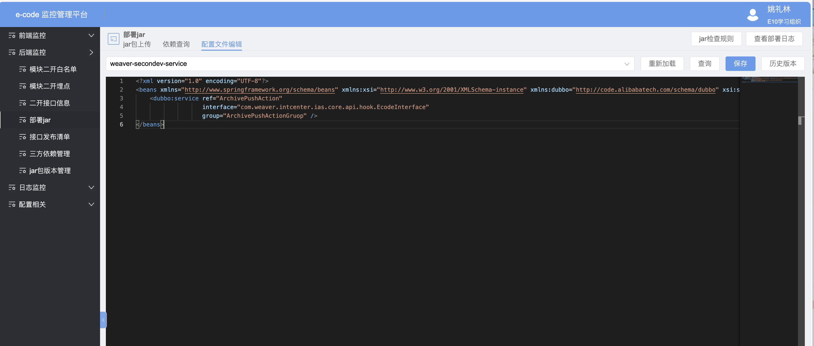


```
<beans xmlns="http://www.springframework.org/schema/beans" xmlns:xsi="http://www.w3.org/2001/XMLSchema-instance" xmlns:dubbo="http://code.alibabatech.com/schema/dubbo" xsi:schemaLocation="http://www.springframework.org/schema/beans http://www.springframework.org/schema/beans/spring-beans-4.0.xsd   http://code.alibabatech.com/schema/dubbo http://code.alibabatech.com/schema/dubbo/dubbo.xsd">
    <dubbo:service ref="ArchivePushAction"
                   interface="com.weaver.intcenter.ias.core.api.hook.EcodeInterface"
                   group="ArchivePushActionGruop" />
</beans>
```

### 方法参数

#### 参数格式

```json
{
     "channelId": "1160238501328461826",
     "extParam": {},
     "outDataModel": {
          "RequestId": "1169817446596091911",
          "RequestName": "银河系关税减免申请流程-姚礼林-2025-08-19 ",
          "RequestCreateDate": "2025-08-19 10:10:45",
          "FinishDateTime": "2025-08-19 10:10:47",
          "WorkflowId": "1168713682791309315",
          "formdata": {
               "ryzzdx_jzo4": "",
               "qx_9vlu": "",
               "gj_f38x": "",
               "gllc_0nky": "用车流程-姚礼林-2025-08-15 ",
               "sfz_3vt9": "",
               "ryxz_o3gk": "姚礼林",
               "glbg_xulq": "",
               "rlzytj_r79c": "",
               "sj_ylim": "",
               "glbj_py41": "",
               "pdfField": "银河系关税减免申请流程-姚礼林-2025-08-19.pdf",
               "xlfxk_570p": "选项1,选项2",
               "glxm_8usr": "",
               "sz_i9ko": "2",
               "glhd_dtvv": "",
               "xxjz_j2te_3": "",
               "xxjz_j2te_1": "",
               "xxjz_j2te_2": "",
               "glcp_deu4": "",
               "rq_wms7": "",
               "rqqj_08my_1": "2025-08-16",
               "rqqj_08my_0": "2025-08-01",
               "psp_925g": "",
               "gllxr_hqds": "",
               "glkh_lb07": "",
               "dh_v0hx": "",
               "sj_2fty": "",
               "xldxk_9gvj": "选项2",
               "glsj_d7dg": "",
               "glgw_x103": "",
               "yy_nr2e": "",
               "fbxz_tejd": "",
               "glwd_yv6a": "泰坦档案开发方案",
               "bmxz_mwmz": "",
               "glds_b4j5": "",
               "glgw_bhbg": "",
               "sf_ecqy": "",
               "fj_fltf": "测试.docx",
               "glbg_y8xc": "",
               "cs_hgqv": "",
               "gljx_r739": "",
               "ryfwxz_sb94": "",
               "tpsc_fo3a": "",
               "yx_i8qk": "",
               "glkq_nn2f": "",
               "glrc_u63k": "",
               "dxk_o20z": "选项2",
               "jl_ndcl": "",
               "sx_bwjc": "",
               "je_l0qu": "3.00",
               "fxk_9wor": "选项1,选项2",
               "glrw_s477": "",
               "glxs_8wzy": ""
          },
          "DeptId": "1026746502482001921",
          "RequestCreator": "7515108099660413316",
          "FieldList": [
               {
                    "FieldLabel": "数字",
                    "Invoices": [],
                    "FieldValue": "2",
                    "FieldName": "sz_i9ko",
                    "FieldType": "NumberComponent"
               },
               {
                    "FieldLabel": "金额",
                    "Invoices": [],
                    "FieldValue": "3.00",
                    "FieldName": "je_l0qu",
                    "FieldType": "Money"
               },
               {
                    "FieldLabel": "附件",
                    "FileList": [
                         {
                              "Ext": "docx",
                              "FileFtpDir": "/",
                              "Size": 10585,
                              "FileName": "测试.docx",
                              "FileId": "1169817734275014671",
                              "FileFtpPath": "",
                              "MD5": "ea54c1c52928e84f06782fedb7e3628d"
                         }
                    ],
                    "Invoices": [],
                    "FieldValue": "测试.docx",
                    "FieldName": "fj_fltf",
                    "FieldType": "FileComponent"
               },
               {
                    "FieldLabel": "单选框",
                    "Invoices": [],
                    "FieldValue": "选项2",
                    "FieldName": "dxk_o20z",
                    "FieldType": "RadioBox"
               },
               {
                    "FieldLabel": "复选框",
                    "Invoices": [],
                    "FieldValue": "选项1,选项2",
                    "FieldName": "fxk_9wor",
                    "FieldType": "CheckBox"
               },
               {
                    "FieldLabel": "下拉单选框",
                    "Invoices": [],
                    "FieldValue": "选项2",
                    "FieldName": "xldxk_9gvj",
                    "FieldType": "Select"
               },
               {
                    "FieldLabel": "下拉复选框",
                    "Invoices": [],
                    "FieldValue": "选项1,选项2",
                    "FieldName": "xlfxk_570p",
                    "FieldType": "SelectMultiple"
               },
               {
                    "FieldLabel": "日期区间(开始时间)",
                    "Invoices": [],
                    "FieldValue": "2025-08-01",
                    "FieldName": "rqqj_08my_0",
                    "FieldType": "DateComponent"
               },
               {
                    "FieldLabel": "日期区间(结束时间)",
                    "Invoices": [],
                    "FieldValue": "2025-08-16",
                    "FieldName": "rqqj_08my_1",
                    "FieldType": "DateComponent"
               },
               {
                    "FieldLabel": "人员选择",
                    "Invoices": [],
                    "FieldValue": "姚礼林",
                    "FieldName": "ryxz_o3gk",
                    "FieldType": "Employee"
               },
               {
                    "FieldLabel": "流程表单PDF",
                    "FileList": [
                         {
                              "Ext": "pdf",
                              "FileFtpDir": "/",
                              "Size": 50489,
                              "FileName": "银河系关税减免申请流程-姚礼林-2025-08-19.pdf",
                              "FileId": "1169818000546209818",
                              "FileFtpPath": "",
                              "MD5": ""
                         }
                    ],
                    "FieldValue": "银河系关税减免申请流程-姚礼林-2025-08-19.pdf",
                    "FieldName": "pdfField",
                    "FieldType": "FileComponent"
               }
          ],
          "RequestLevel": "正常",
          "Details": [
               {
                    "TableName": "明细表1",
                    "FieldList": [
                         [
                              {
                                   "FieldLabel": "申请组织",
                                   "Invoices": [],
                                   "FieldValue": "银河护卫队",
                                   "FieldName": "明细表1.sqzz",
                                   "FieldType": "Text"
                              },
                              {
                                   "FieldLabel": "所属星系",
                                   "Invoices": [],
                                   "FieldValue": "阿斯卡",
                                   "FieldName": "明细表1.ssxx",
                                   "FieldType": "Text"
                              },
                              {
                                   "FieldLabel": "代表人",
                                   "Invoices": [],
                                   "FieldValue": "Lghg",
                                   "FieldName": "明细表1.dbr",
                                   "FieldType": "Text"
                              }
                         ]
                    ]
               }
          ],
          "SecLevel": "0",
          "RequestOverDate": "2025-08-19 10:10:47",
          "CurrentDatetime": "2025-08-19 10:11:18",
          "WorkflowTypename": "银河系关税减免申请流程",
          "DeptName": "泛微广西大区E10"
     },
     "requestId": "1169817446596091911"
}
```

#### 获取字段值

接口参数中的所有字段的值都是字段的显示名，例如选择框字段，值会是选项名称

#### 获取表单pdf

如何档案集成方案中开启了生成表单pdf，在方法参数中可以获取到表单pdf文件，在 FieldList 参数中有 FieldName 为 pdfField 的字段参数，里面可以获取到文件id

```json
 {
                    "FieldLabel": "流程表单PDF",
                    "FileList": [
                         {
                              "Ext": "pdf",
                              "FileFtpDir": "/",
                              "Size": 35572,
                              "FileName": "银河系关税减免申请流程-姚礼林-2025-07-24.pdf",
                              "FileId": "1160558248574197773",
                              "FileFtpPath": "",
                              "MD5": ""
                         }
                    ],
                    "FieldValue": "银河系关税减免申请流程-姚礼林-2025-07-24.pdf",
                    "FieldName": "pdfField",
                    "FieldType": "FileComponent"
               }
```

### 归档日志表

表名称：ias_data_log


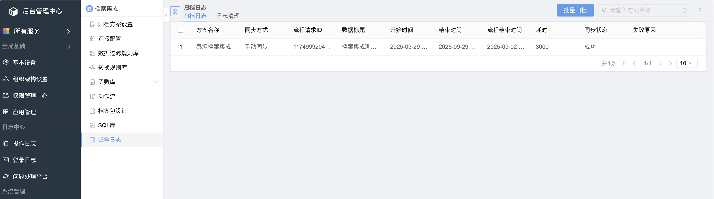


### 参考

[E10档案集成设计 V1.16.0 | 对接Ecode](https://www.yuque.com/yoran/og797n/qk1hrg6hr2elax9g#C7f6K)

## 开发注意事项

### 区分租户

有一些二开代码是会所有租户都影响到的，比如流程流转的二开钩子，代码中需要注意使用租户判断，避免影响到其它租户

## 开发问题汇总

### 二开错误日志无法写入新日志

二开错误日志只能看到之前的日志，无法写入新日志，这是属于产品bug

解决方法：

目前没有找到解决方法，只能通过其它日志看有没有错误日志，比如 sys.err ,如果是调用了 rpc 接口，则可以看看 sys-rest-rpc-consumer 日志

### 上传二开 jar 包提示被调用的类不存在

jar 包中确实存在该类，但提示不存在


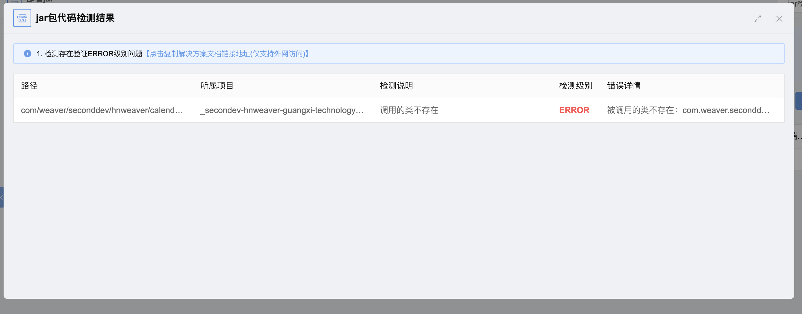


解决方法：

如果校验结果中的问题已经全部处理，可登录到主管理团队，访问 /info/dispatch/escheduler/report，查询 ecode.EcodeJarCheckInitJob 定时任务，手动执行一次。执行成功后等20分钟再次上传jar包

## 运维

### windows运维平台手动升级

如果使用运维平台升级不了，比如版本太老，可以进行手动升级

[win手动升级操作文档](https://www.e-cology.com.cn/sp/doc/docDetail/8141566577643293343?type=IM_View&_isEm=1&_emGid=1767146917707001299&fromWeappMsgGroupId=1767146917707001299&authModule=im&weappAuthStr=eyJtc2dpZCI6IjE3NjcxNDczMjkxMTEwODUyOTgiLCJmbGFnIjoxLCJncm91cF9pZCI6IjE3NjcxNDY5MTc3MDcwMDEyOTkifQ%3D%3D)

### E10升级

#### 错误：重命名目录失败

若在运维平台中升级提示重命名目录失败，则可能是权限不足导致，可以在升级日志中找到相关的错误信息，查看目录的路径，然后手动重命名目录


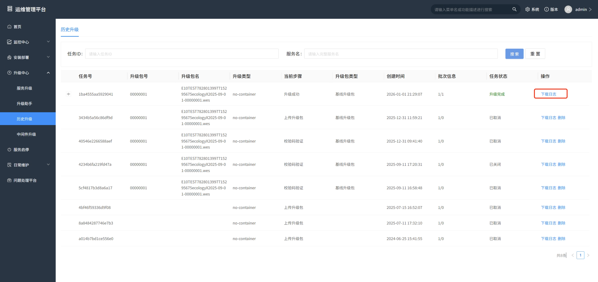


日志错误信息：

```
### [2025-12-31 14:52:16] 解压/重命名流程失败：E10TEST7828013997715295675ecologyX2025-09-01-00000001.wes 重命名目录失败（重试 60 次后仍失败）: D:\weaver\e-monitor\versionupgrade\unzipVersionTempPath\ecology -> D:\weaver\e-monitor\versionupgrade\unzipVersionTempPath\ecology_070B67A18230E645439986FBCB33B061。最后一次异常：D:\weaver\e-monitor\versionupgrade\unzipVersionTempPath\ecology -> D:\weaver\e-monitor\versionupgrade\unzipVersionTempPath\ecology_070B67A18230E645439986FBCB33B061
```

可手动将 ecology 目录重命名为 ecology_070B67A18230E645439986FBCB33B061 ，然后继续升级