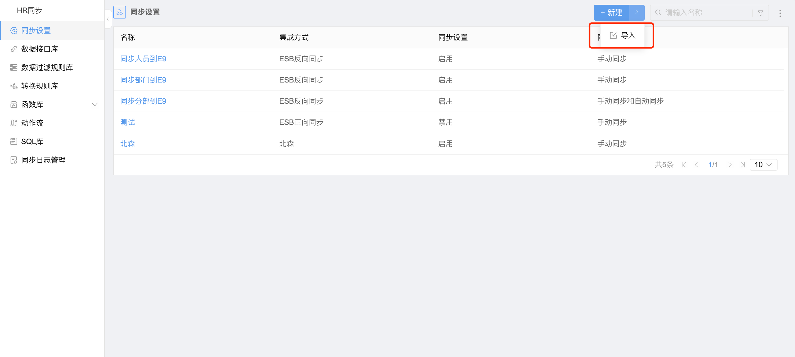
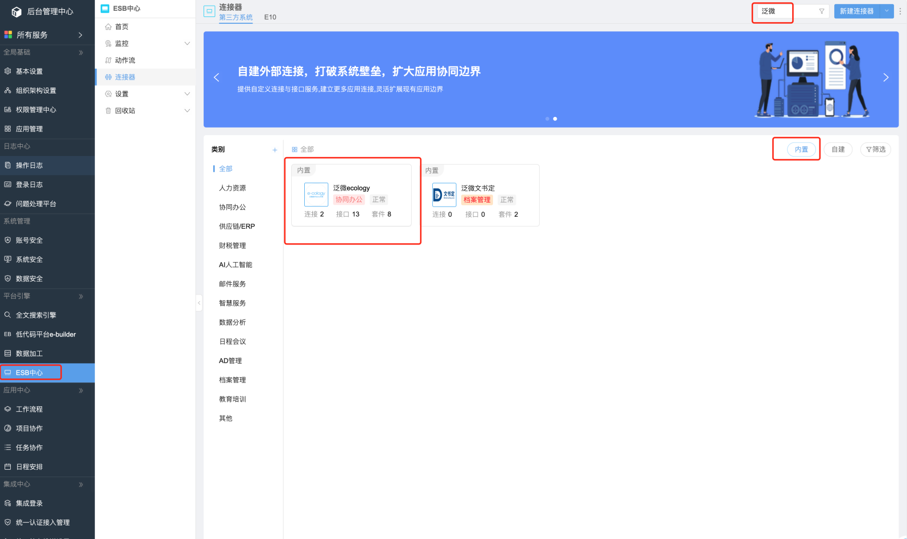
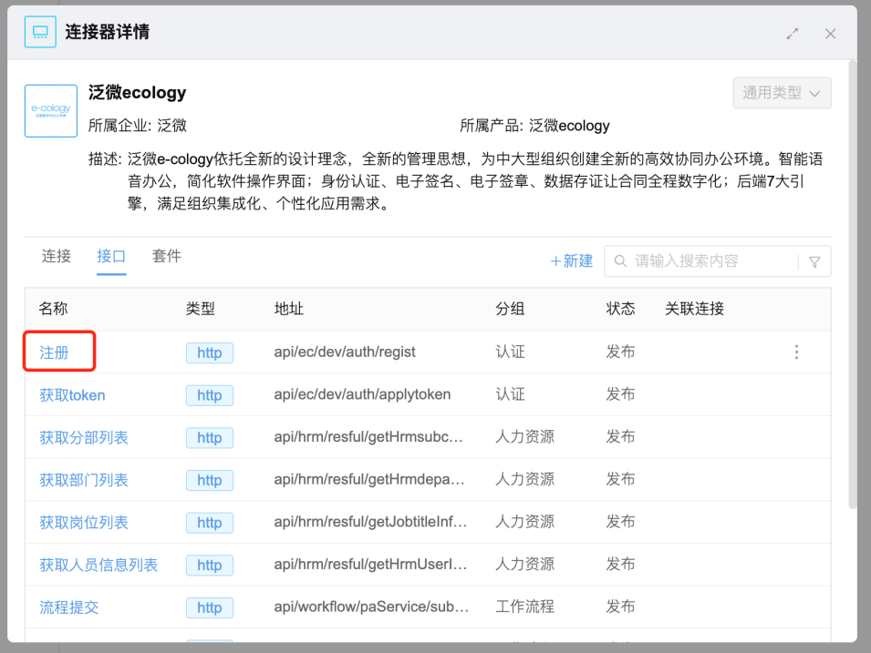
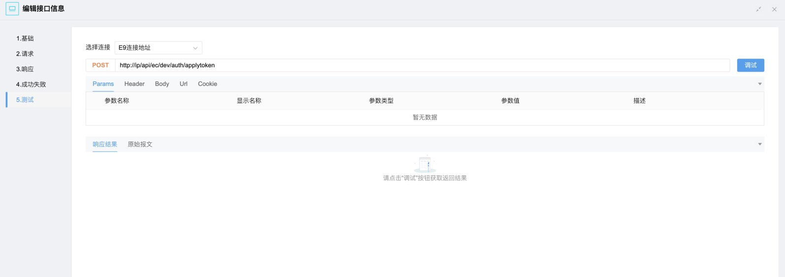
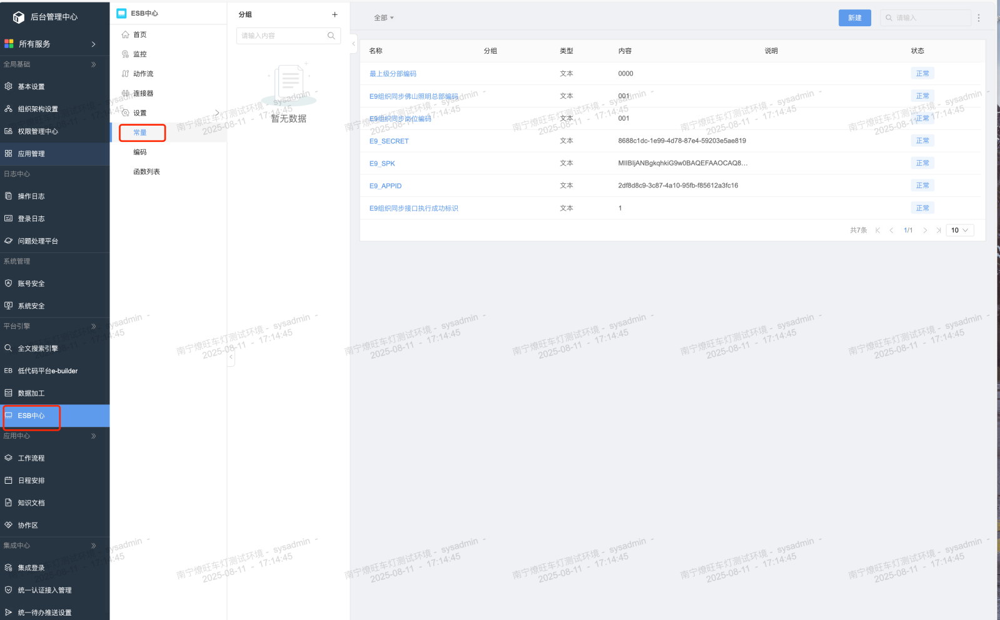
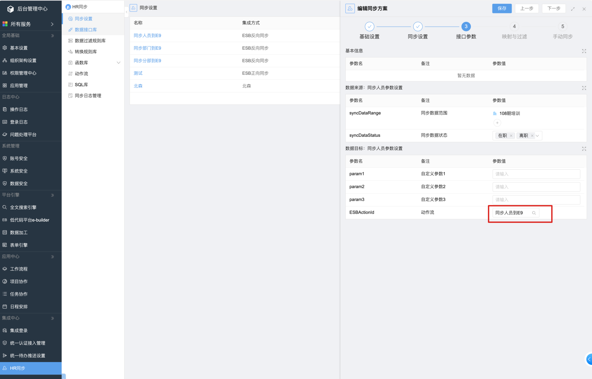
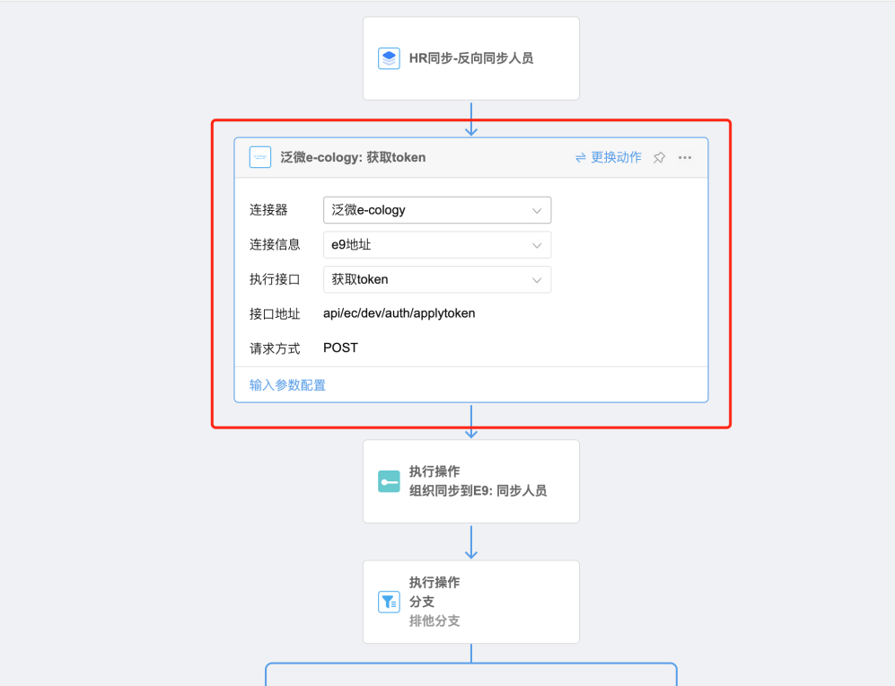

# E10人力资源组织同步到E9操作说明

## 功能说明

燎望车灯OA可将系统组织架构数据同步到佛山E9

## 实现原理

使用E10 HR反向同步功能，调用E9标准组织架构同步接口，同步组织数据

## 部署方法

在后端HR同步页面中，导入包内的压缩包

## 配置说明

### 注册许可证

如已注册可略过。

调用E9组织同步接口需要进行认证，所以需要先注册许可证。

需要借助Postman等工具，调用注册接口，如果E10版本较高，可在连接器中进行调试，调用接口。

E10连接器接口调试入口：

**接口信息：**

接口地址：E9地址/api/ec/dev/auth/regist

请求方式：POST

head 参数：

- appid：填写E9 AppId，具体获取方法可参考官方文档：泛微在线文档
- cpk：随便填

调用后取接口返回的spk 和 secret，复制粘贴到 E9_SPK 常量中和 E9_SECRET 常量中（常量入口见下方）。

### 常量配置

常量入口：

常量配置如下：

- **E9岗位编码：e9 岗位编码固定为1个，取E9任意岗位编码配置到该常量中**
- **最上级分部编码：取当前系统组织架构最上级分部编码**
- **E9组织同步佛山照明总部编码：取e9系统中“佛山照明本部及分子公司”分部编码，也就是e10系统组织架构最上级分部在e9系统中对应的上级分部**
- **E9_APPID：e9系统的appId**
- **E9_SPK：上一步注册许可证接口返回的spk**
- **E9_SECRET：上一部注册许可证接口返回的secret**

### 检查动作流

导入HR同步后可能动作流中的E9认证连接器配置会丢失，如果丢失需要重新配置连接器。

## 同步注意事项

之所以要拆分为分部、部门、人员这3个同步，就是一起同步的话它是设定不了同步顺序的，如果先同步了部门再同步分部，则部门就会没有在对应分部下，定时同步设置需要设置同步分部的时间在前，部门在后，再到人员。

## HR同步文件下载

可导入到 HR 同步中

