# 使用动作流实现统一待办推送到金智

## 开发功能

实现将OA待办流程推送到金智。

通过统一待办进行推送，推送方式为动作流。

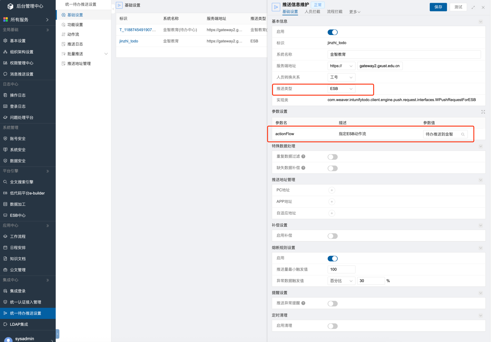

## 金智任务接口说明

见：[金智任务接口说明](../../E9/案例/金智任务接口说明.md)

## 实现细节描述

使用动作流实现将待办推送到金智。

为了能够调用金智接口，需要在ESB中新建连接器，配置金智接口，然后在动作流中调用连接器。

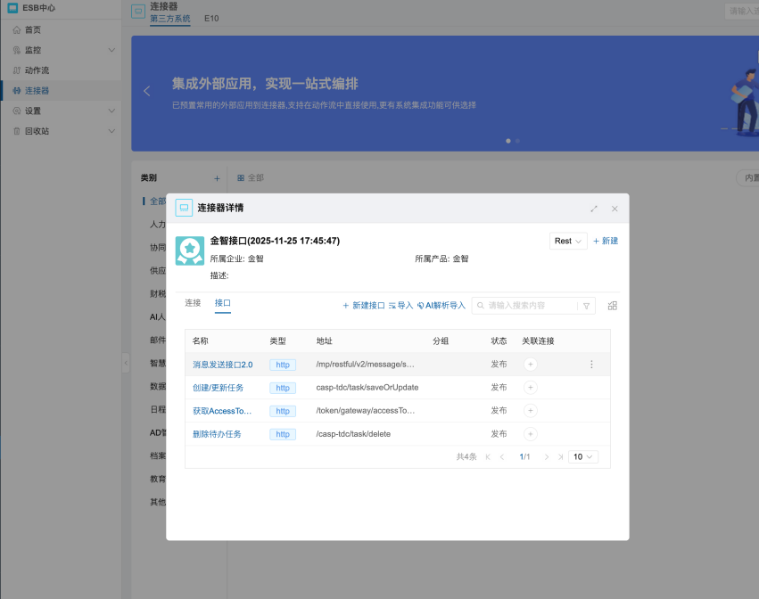

在动作流中需要查询标准的金智推送日志表以及自己新建的EB金智推送日志表，之所以需要查询标准的日志表是因为之前使用了标准的金智推送功能，为了防止数据异常，需要查询标准日志表判断之前是否有推送过这条待办，其实是不用查询标准日志表的。

EB金智推送日志表的作用：

判断待办是否有推送过，如果没有推送过，则在金智新增任务，否则更新任务。

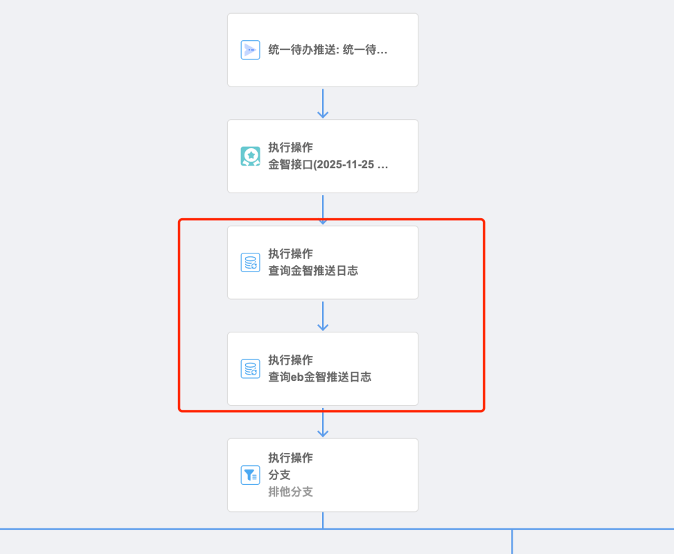

### 流程推送记录 EB 应用

需要创建一张 EB 表，来记录流程的推送，表字段为：
- 推送流程：流程请求id
- 操作人：用户id
- 推送时间

这张表的作用就是为了记录这条流程以及操作者有没有推送过，如果没有就需要在推送待办时调用金智任务接口创建任务，否则有记录的话就需要调用金智的任务接口更新任务。

上面提到过需要根据 `标准的金智推送日志表` 来判断是否推送过，这个是因为之前使用了标准功能的金智集成功能，来判断之前的标准功能推送中有没有记录，如果之前没有别的推送，是不用判断这个标准推送记录表的。

### 新增任务

当标准的金智推送日志表和EB金智推送日志表都没有这条待办的推送记录时，并且为待办，则调用金智接口，新增任务，为什么需要为待办而不是已办才能新增任务呢？因为金智的新增任务只能为待办。接口调用成功后，需要将待办推送记录写入到EB金智推送日志表中。

新增任务条件：
- 推送记录中没有这条流程和操作者的记录
- 需为待办流程
- 操作类型不为删除流程


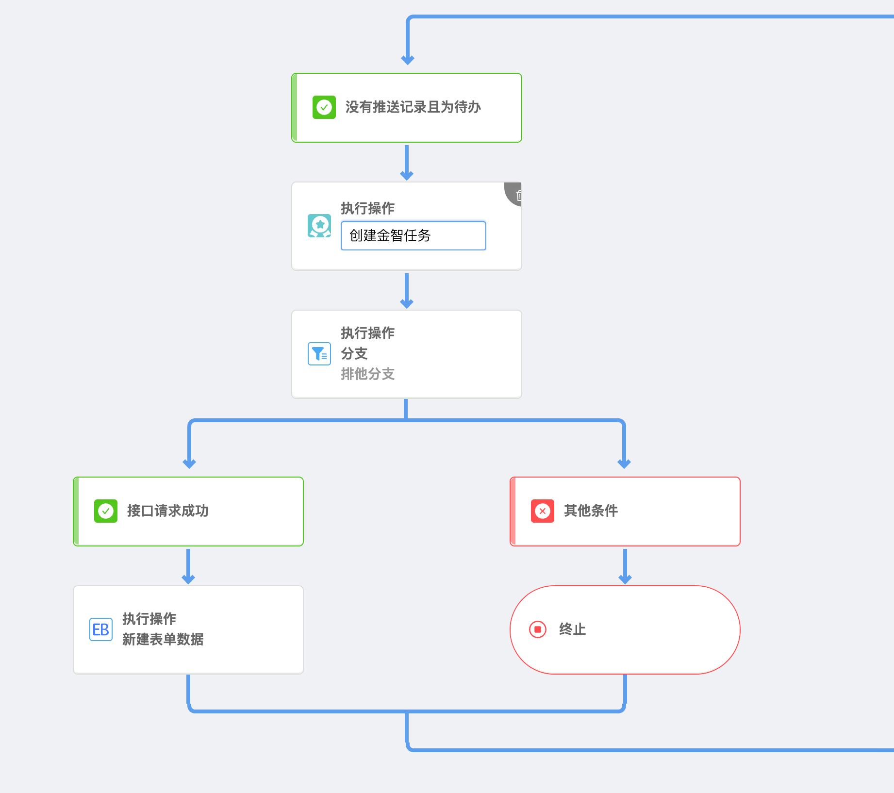

在新增任务中，接口只需要添加 `insertModel` 参数。

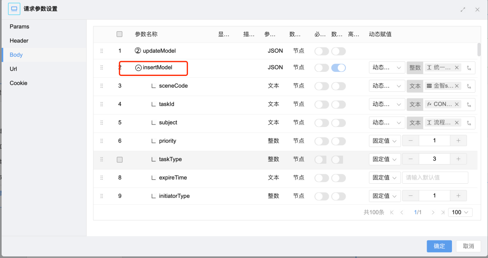

### 更新任务

当标准的金智推送日志表或EB金智待办推送日志表有数据时，则调用金智接口更新金智任务。
更新任务表示更新用户下已有的任务（待办），比如将待办更新为已办。

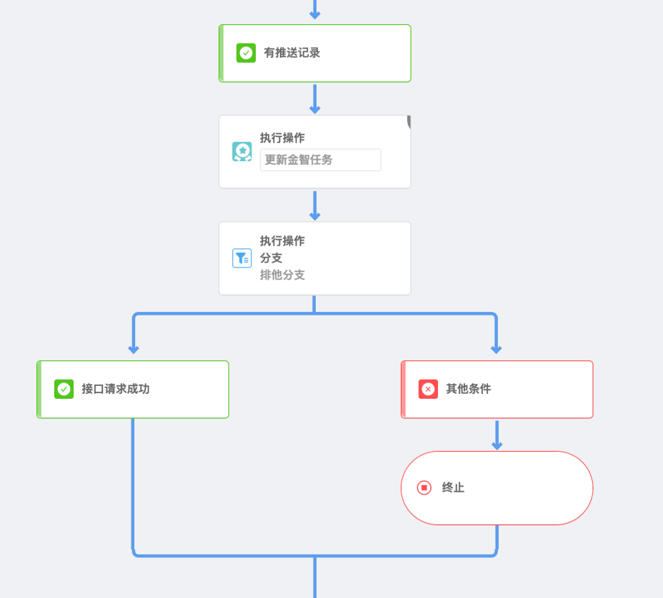

在金智接口中只需要添加 updateModel 中的 taskModels 参数。

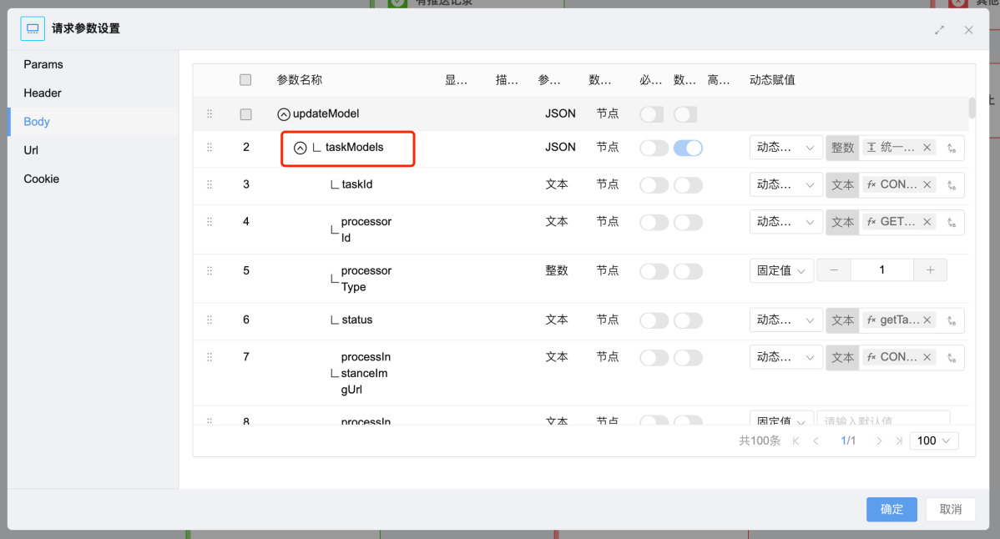

**status 参数**
`taskModels` 中的 `status` 参数决定了待办的状态，是待办还是已办，或者其他状态，可根据动作流中的统一待办参数 `operateType`（流程流转操作类型） 和 `iutIsRemark`（流程审批状态）确定当前待办的状态。

`operateType` 和 `iutIsRemark` 参数说明见 [动作流输入参数说明](#动作流输入参数说明)

可创建一个 js 函数来获取状态：

```json
function getTaskStatus(operateType,approveState){
    if (!operateType) {
        return '';
    }
    if (approveState === '-1') {
        return 'WITHDRAW';
    }
    switch (operateType) {
        case 'REJECT_END':
            if (approveState === '0') {
                return 'ACTIVE';
            }
            return 'ROLLBACK';
        case 'TURN_TO_DO_END':
            if (approveState === '0') {
                return 'ACTIVE';
            }
            return 'DELEGATE';
        case 'SUBMIT_END':
        case 'FORCED_RAWBACK_END':
        default:
            if (approveState === '0') {
                return 'ACTIVE';
            }
            return 'COMPLETE';
    }
}
```

### 删除任务

当统一待办推送中的传入参数 operateType （流程流转操作类型）为 DELETE_END 时，则表示为流程删除操作，需要调用金智任务删除接口删除金智任务（流程），还需要判断是否存在该流程的统一待办推送记录，有才能调用删除任务接口删除任务。

条件：

- operateType 为 DELETE\_END，即操作类型为删除
- 该流程在推送日志中有记录（根据流程请求id与操作者查询记录）

### 动作流输入参数说明

可根据统一待办中的 iutIsRemark（流程审批状态） 参数，判断是待办、已办还是撤回。

- 撤回：流程审批状态 等于 -1
- 待办：流程审批状态 等于 0
- 已办：流程审批状态 等于 2
- 办结：流程审批状态 等于 4

operateType（流程操作类型）字段可判断流程的操作类型，字典为：
- SUBMIT\_END：流程提交
- REJECT\_END：退回
- TURN\_TO\_DO\_END：转办
- FORCED\_RAWBACK\_END：强制收回
- DELETE\_END：删除
- 还有更多没有列出。

其它参数：
- realUserId（真实身份id），也就是流程操作人id。

### taskId 构成

taskId 是表示在金智中任务（流程）的唯一标识，在金智中同一个任务不能多个用户享有，在更新金智任务中根据 taskId 进行更新。

taskId 构成：`请求id_操作人id`，这就能构成金智任务的唯一标识了，因为金智的待办（任务）是按请求流程和用户来的。比如一条流程到了这个用户中，这个用户没有这条流程的待办数据，则会新增任务，然后流程到了下一个用户中，这个用户如果没有这条流程的数据，就会新增任务，否则更新任务数据。

## 部署说明

导入动作流文件


导入EB应用


### 常量配置

在 ESB 中心的常量中，将这几个常量的值改为实际值。

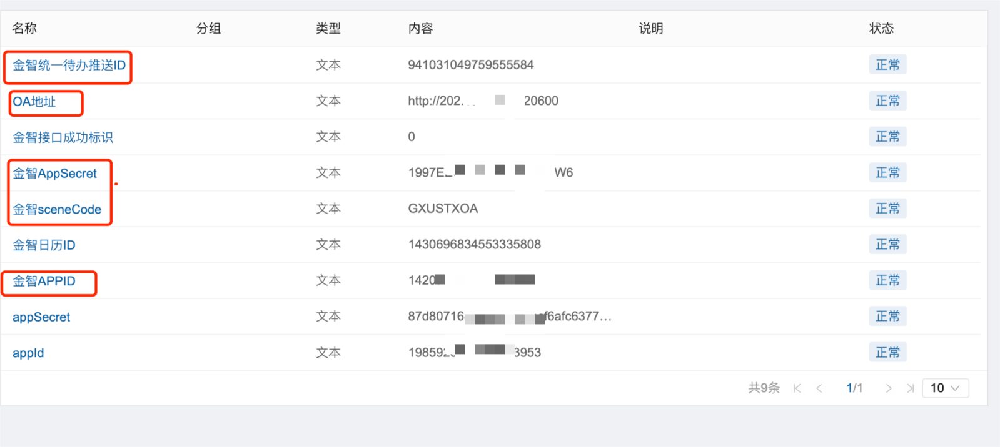

（推送ID需要新建待办推送后才有，如果没有新建请转到下个章节查看新建方法）

其中金智统一待办推送ID的获取方式为：

对于生产环境，如果之前没有使用其它推送方案，则推送ID取使用这个动作流的推送ID，否则取之前使用的推送ID，对于测试环境只取使用本动作流的推送ID。

例如之前用了下图中的第一个推送方案，则取这个的推送ID，如果之前没有使用其它推送方案进行推送，则取第二个的推送id，第二个为使用本动作流进行推送的推送方案。

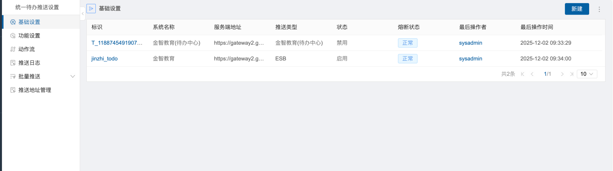

推送ID获取方法：

按 f12 打开开发者工具，并切换到网络标签。

进入到统一待办推送的基础设置，如果之前已经进入了，则切换到其它菜单再切回来。

查看开发者工具中的网络信息，搜索 getList 接口，找到最后一个，查看该接口的返回数据。

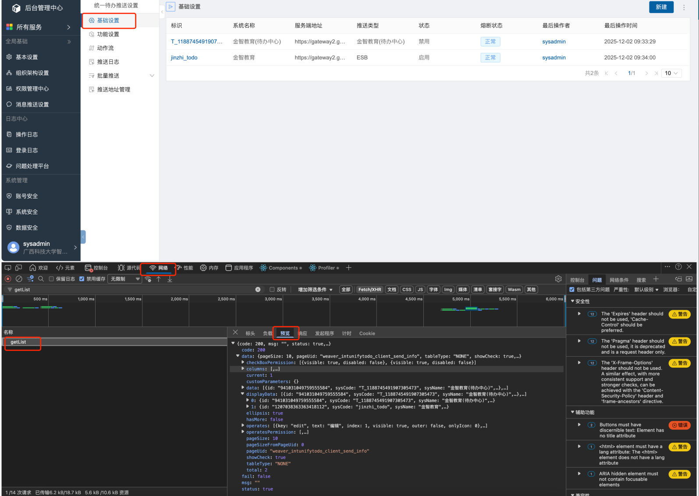

在返回数据中查看 data > displayData 数据，里面就是列出的推送方案，推送方案中的id字段就是推送ID。

### 统一待办推送设置

在统一待办推送设置中新建推送设置。

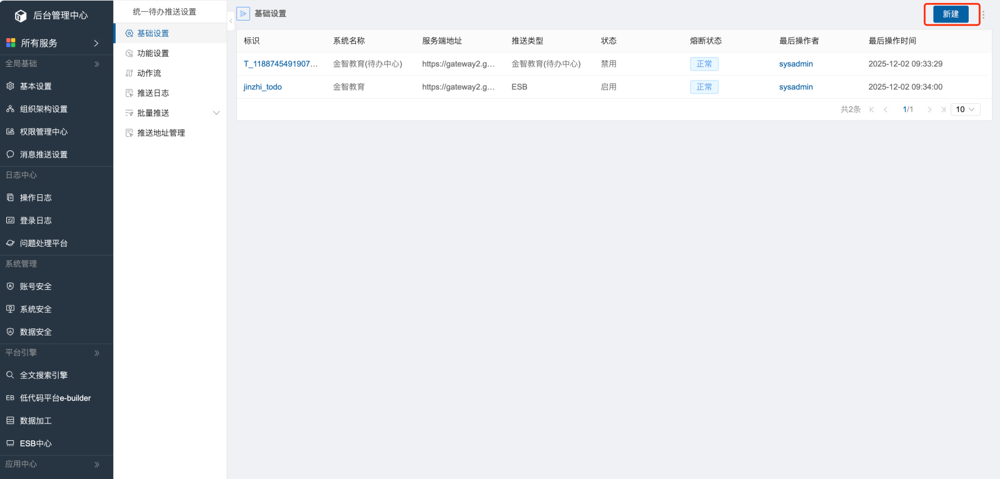

- 服务端地址填写金智开放接口地址
- 推送类型选ESB
- ESB动作流选导入的动作流

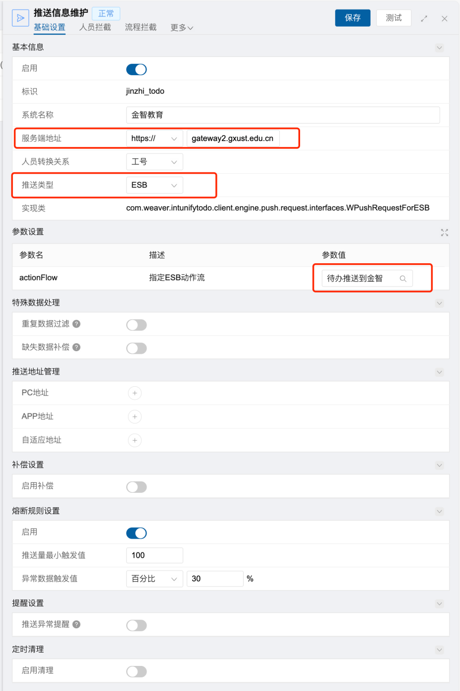

你可以在流程拦截中配置只推送哪些流程，添加白名单即可，或者添加黑名单，不需要推送哪些流程。
