# 案例-柳州城市职业学院金智消息推送和流程待办推送案例分享
## 前言

以前做过柳州城市职业学院的金智集成，包含了流程消息推送和流程待办推送到金智，通过分享这个案例，希望能帮助到有相同需求的同事。

此开发适用于金智接口 3.6.1.Beta2+ 版本，此为最新版本，如果接口版本太老可能不适用。

本案例提供了开发包和源码，可进行复用

## 金智消息推送

### 需求

需要将OA流程提醒推送到金智，比如流程到达提醒

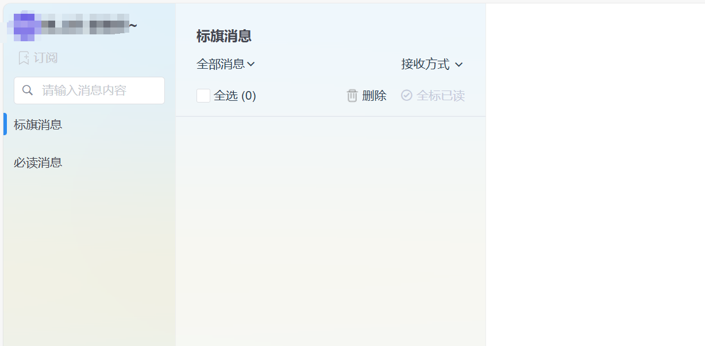

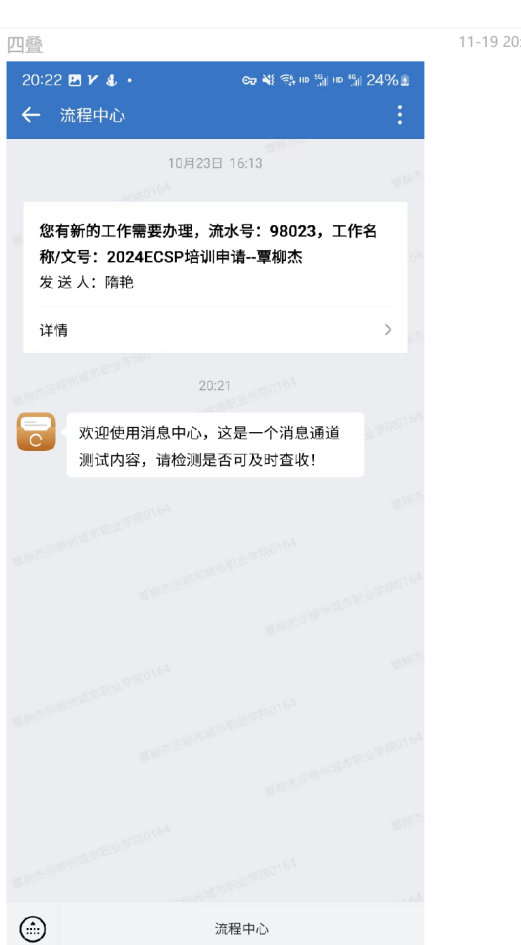

### 开发方案

使用消息订阅功能，推送方式选择标准扩展类推送，金智的接口参数在消息订阅中添加，方便以后进行修改，对于参数中的加密和转换，可通过开发处理。开发处理消息推送逻辑。

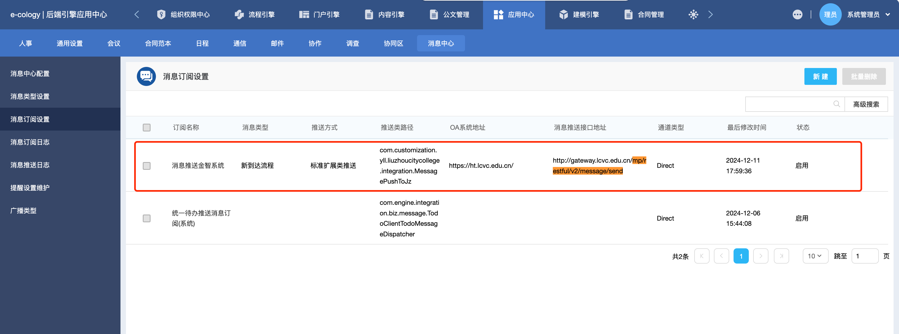

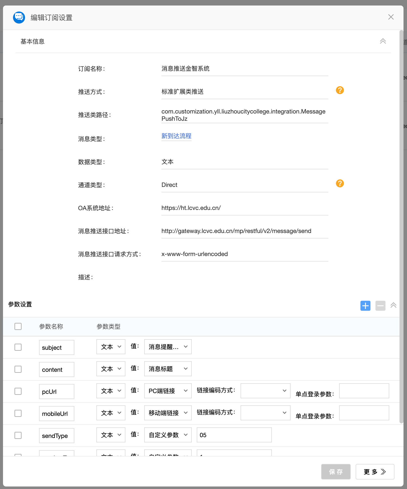

### 开发步骤

消息推送接口地址：消息发送接口2.0 | OpenApi

- 新建消息订阅，推送方式选择标准扩展类推送，推送类路径为开发的消息推送类，消息推送接口地址为金智消息推送接口地址，参数为金智接口的参数，参数说明可查看金智接口文档，如下图所示，可以根据实际情况进行修改

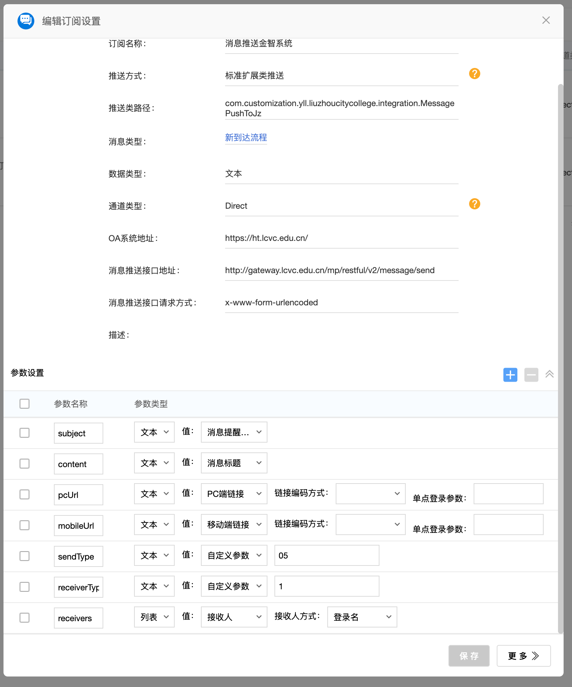

- 新建消息推送类，继承 StandardSub 类
- 重写 getSubMsgParams() 方法，修改原始参数 ，因为金智的 receivers 参数是一个`List<Receiver>` 类型，而消息订阅中传入的 receivers 参数是一个字符串类型，该参数为接收人列表，使用了逗号分隔每个登陆名，需要转成金智的 List 类型。

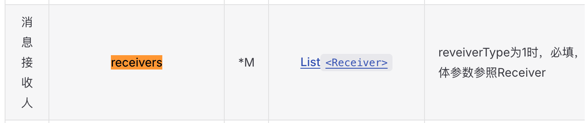

- sign 参数需要进行加密，生成签名，无法通过消息订阅中配置，需要在开发中添加该参数

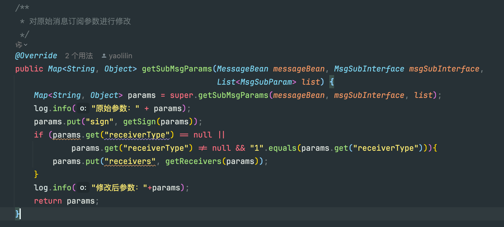

- 重写doSub 方法，调用金智消息推送接口将消息推送到金智

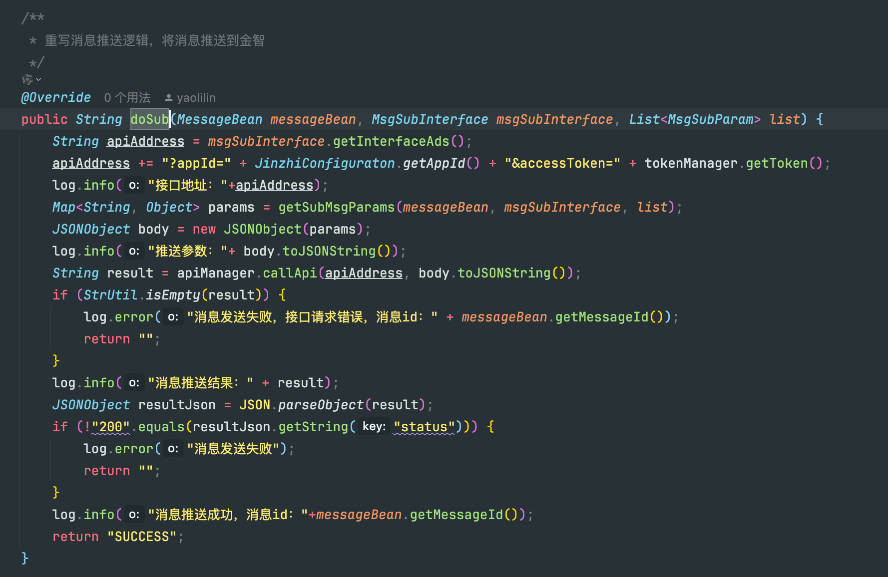

## 流程待办推送

### 需求

将OA流程待办和已办推送到金智

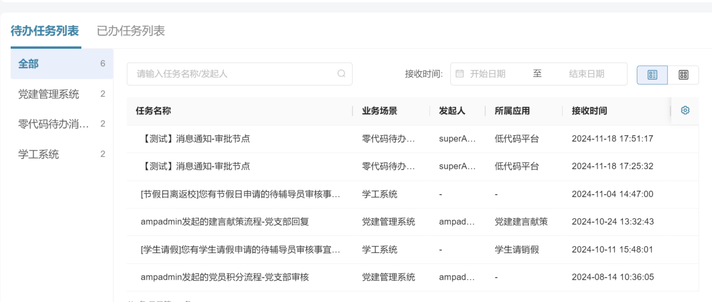

### 开发方案

使用统一待办推送功能，通过开发新建推送类，实现流程待办和已办推送到金智

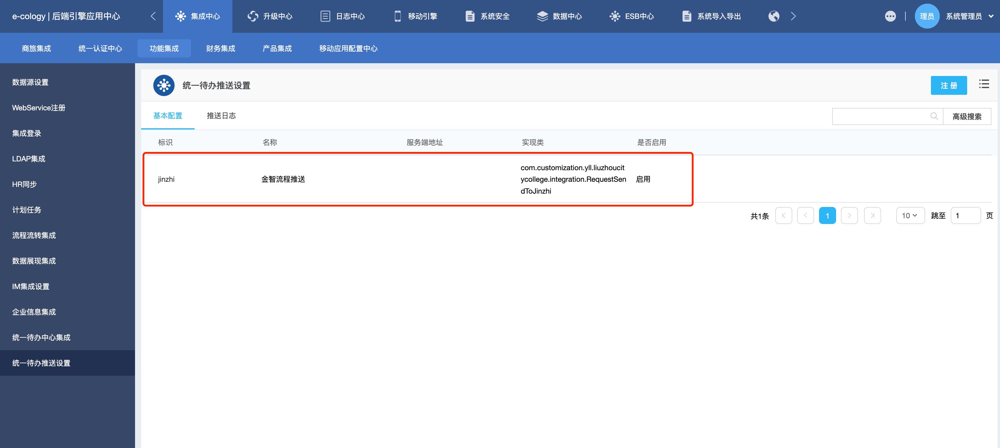

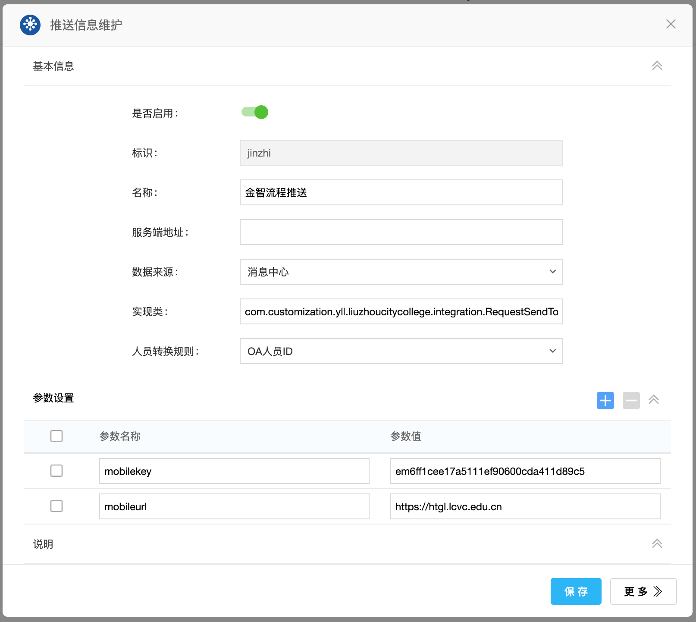

### 准备知识

开发需要知道的一些知识

***金智流程展示形式：***

在第三方系统中点击待办会跳到OA流程页面，由于已经使用了统一认证所以无需做单点登陆处理
#### 接口参数说明

见：[金智任务接口说明](金智任务接口说明.md)
#### OA统一待办推送逻辑

***接收流程数据：***

OA系统会将流程数据（待办、已办、删除等）传入到开发好的实现类，由实现类处理待办推送

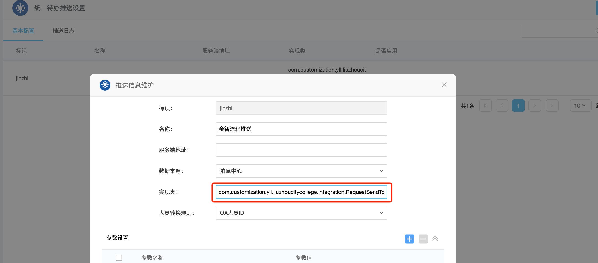

流程数据会传入到 SendRequestStatusData() 方法的参数中，该参数是一个List列表，需要遍历处理

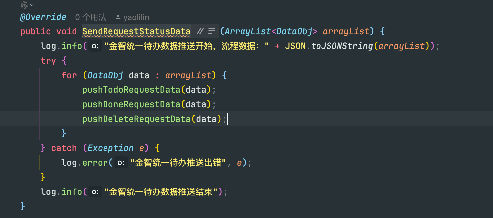

列表的元素类型为DataObj，该对象存储了待办、已办和删除流程数据，这3个list中的每个元素就是为一条流程数据，在推送中可以从RequestStatusObj 对象中获取到流程数据。

每当用户有1条待办流程到达时，将会传入到实现类，可以从DataObj的 tododatas 中获取，如果用户提交了流程，流程变为了已办，则已办流程数据可以从 donedatas 中获取，如果用户删除了流程（强制收回也会触发），则删除流程数据可以从 deldatas 中获取。

我们不用去区分哪条是待办哪条是已办，下面这3个列表已经明确类型了，只要从列表里取到数据然后推送到金智

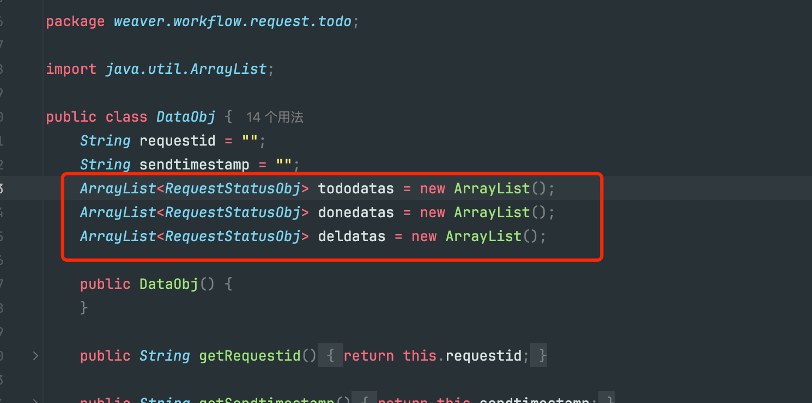

***获取用户和流程白名单***

实现类中的 getWorkflowwhitelist() 和 getUserwhitelist() 可以获取流程白名单和人员白名单，但需要重写，手动查询数据库获取

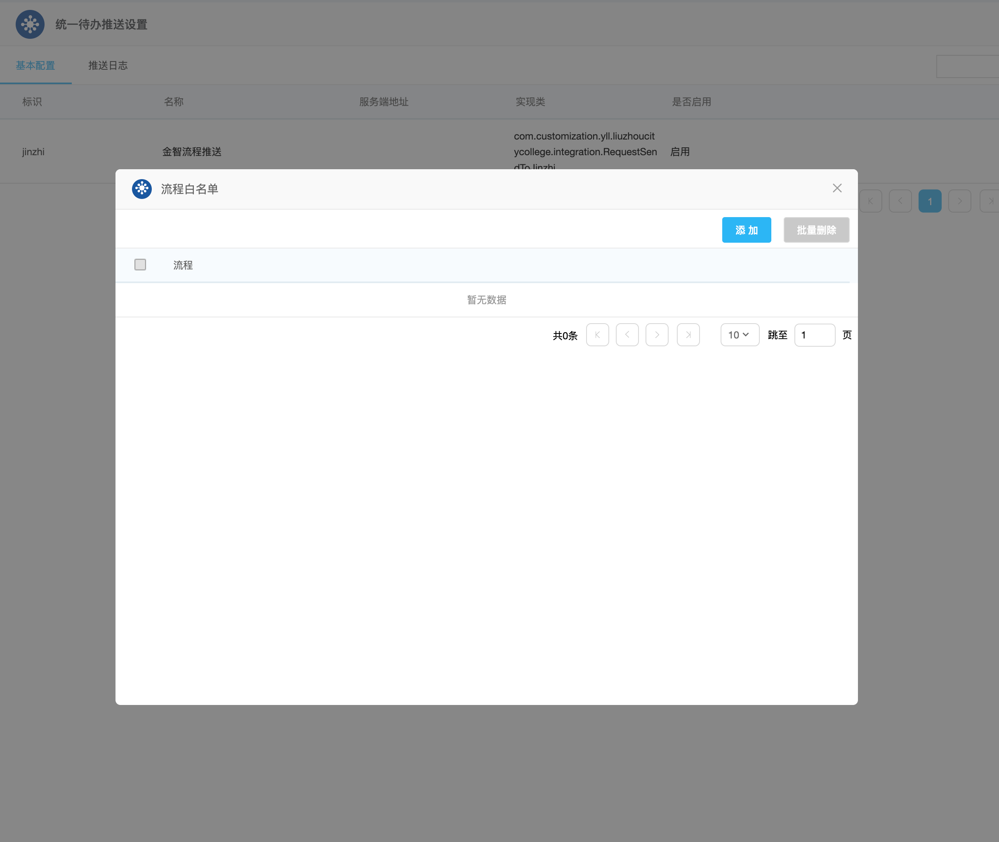

### 开发步骤

- 创建待办推送记录建模表，推送时可读取该建模表来判断此流程数据有没有推送过，来决定是使用接口的updateModel还是insertModel参数，如果没有推送过就表示金智系统不存在该流程数据，需要使用insertModel参数，否则使用updateModel参数

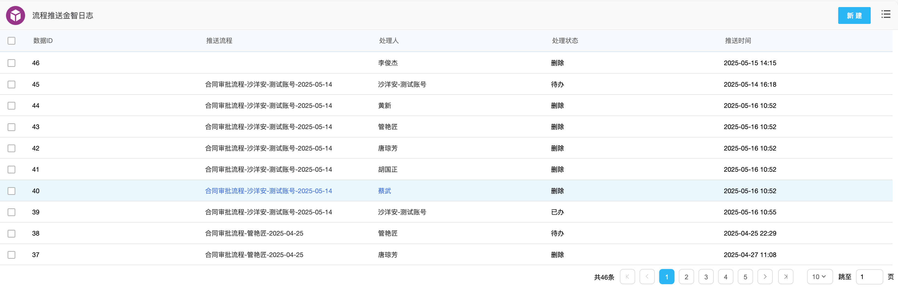

- 创建待办推送实现类，并继承 SendRequestStatusDataInterfaces 类
- 实现 SendRequestStatusData() 方法，遍历 arrayList 参数，分别推送待办、已办、流程删除数据

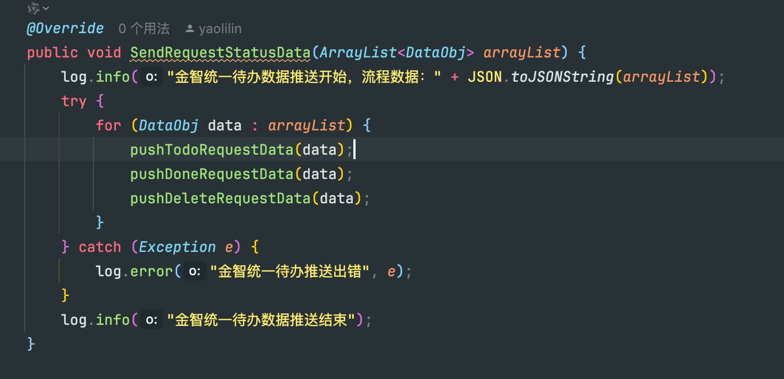

- 调用金智接口时使用金智提供的SDK进行调用
- 具体推送逻辑可以查看源码

## 金智集成开发包部署说明

### 开发包部署

1. 将开发包内的建模导入到系统中
1. 编辑开发包内的 ecology/WEB-INF/prop/FW20241129-jinzhi.properties文件，配置金智的appId和appSecret等信息
1. 将ecology文件夹上传到服务器，然后重启系统

### 消息推送配置

在消息订阅中新建消息订阅

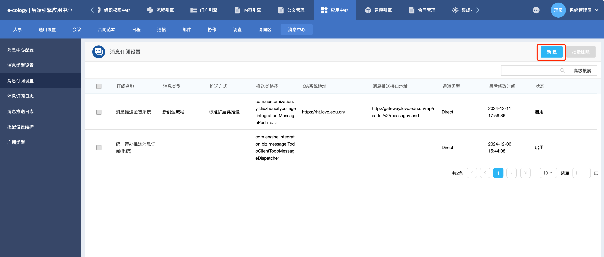

配置如下面所示，参数可按实际情况进行修改

推送实现类为：  
com.customization.yll.liuzhoucitycollege.integration.MessagePushToJz

### 统一待办配置

在统一待办推送设置中注册

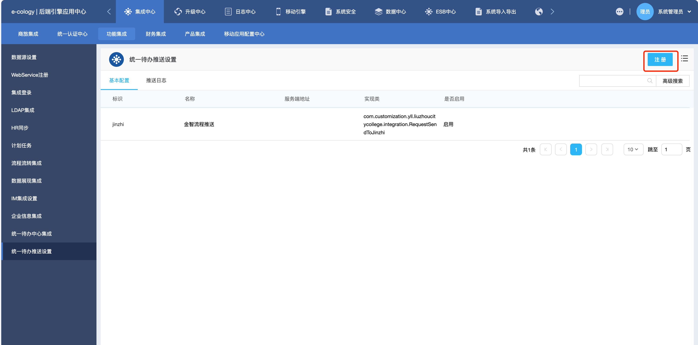

配置如下，实现类为：com.customization.yll.liuzhoucitycollege.integration.RequestSendToJinzhi

Mobilekey 参数不用添加

Mobileurl 参数填写移动端的域名或ip地址

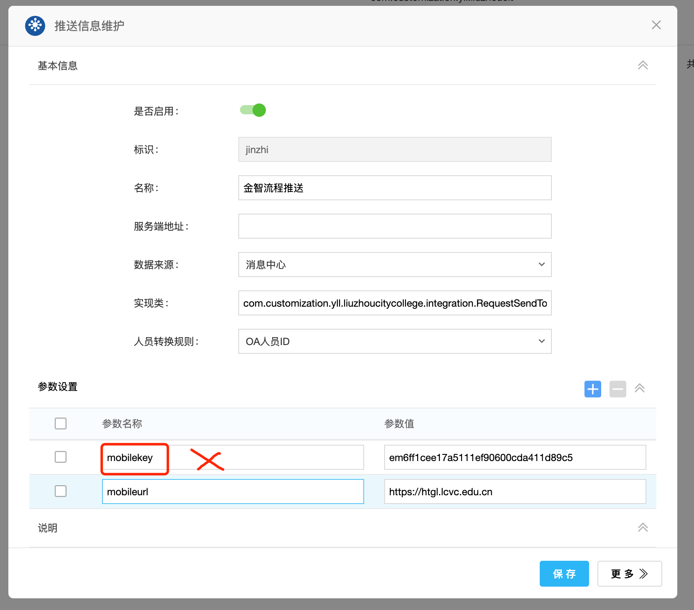

## 开发包

## 问题

- 之前遇到过统一待办推送强制收回后提交后不会推送已办，这个是标准产品的问题，可直接联系上海处理

## 后言

如果遇到问题或有不懂的请找我
